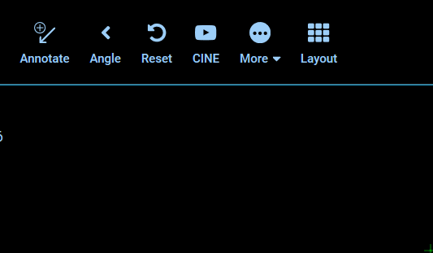

# UI Dialog Service

Dialogs have similar characteristics to that of Modals, but often with a
streamlined focus. They can be helpful when:

- We need to grab the user's attention
- We need user input
- We need to show additional information

If you're curious about the DOs and DON'Ts of dialogs and modals, check out this
article: ["Best Practices for Modals / Overlays / Dialog Windows"][ux-article]

<!-- 

  
  
<i>GIF showing successful call of UIDialogService from an extension.</i>

 -->

## Interface

For a more detailed look on the options and return values each of these methods
is expected to support, [check out it's interface in `@ohif/core`][interface]

| API Member     | Description                                            |
| -------------- | ------------------------------------------------------ |
| `create()`     | Creates a new Dialog that is displayed until dismissed |
| `dismiss()`    | Dismisses the specified dialog                         |
| `dismissAll()` | Dismisses all dialogs                                  |

## Implementations

| Implementation                       | Consumer                   |
| ------------------------------------ | -------------------------- |
| [Dialog Provider][dialog-provider]\* | Baked into Dialog Provider |

`*` - Denotes maintained by OHIF

> 3rd Party implementers may be added to this table via pull requests.

<!--
  LINKS
-->

<!-- prettier-ignore-start -->
[interface]: https://github.com/OHIF/Viewers/blob/master/platform/core/src/services/UIDialogService/index.js
[dialog-provider]: https://github.com/OHIF/Viewers/blob/master/platform/ui/src/contextProviders/DialogProvider.js
[ux-article]: https://uxplanet.org/best-practices-for-modals-overlays-dialog-windows-c00c66cddd8c
<!-- prettier-ignore-end -->
