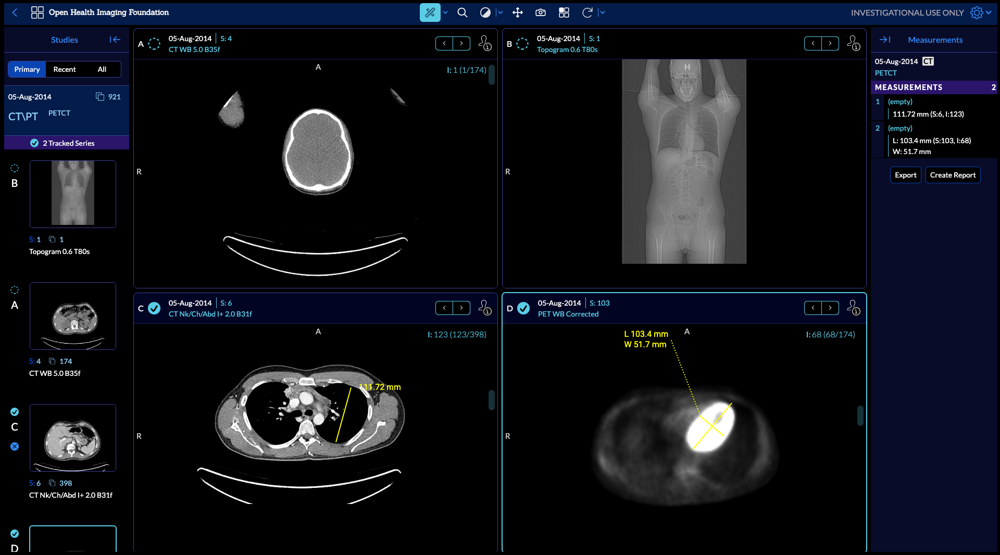

The [Open Health Imaging Foundation][ohif-org] (OHIF) Viewer is an open source,
web-based, medical imaging platform. It aims to provide a core framework for
building complex imaging applications.

Key features:

- Designed to load large radiology studies as quickly as possible. Retrieves
  metadata ahead of time and streams in imaging pixel data as needed.
- Leverages [Cornerstone.js](https://cornerstonejs.org/) for decoding,
  rendering, and annotating medical images.
- Works out-of-the-box with Image Archives that support [DICOMWeb][dicom-web].
  Offers a Data Source API for communicating with archives over proprietary API
  formats.
- Provides a plugin framework for creating task-based workflow modes which can
  re-use core functionality.
- Beautiful user interface (UI) designed with extensibility in mind. UI
  components available in a reusable component library built with React.js and
  Tailwind CSS

    

        <a className='button button--primary' href="https://viewer.ohif.org/">Try the demo</a>
        <a className='button button--primary' href="./release-notes">Release Notes</a>
    

## Where to next?

The Open Health Imaging Foundation intends to provide an imaging viewer
framework which can be easily extended for specific uses. If you find yourself
unable to extend the viewer for your purposes, please reach out via our [GitHub
issues][gh-issues]. We are actively seeking feedback on ways to improve our
integration and extension points.

Check out these helpful links:

- Ready to dive into some code? Check out our
  [Getting Started Guide](./development/getting-started.md).
- We're an active, vibrant community.
  [Learn how you can be more involved.](./development/contributing.md)
- Feeling lost? Read our [help page](/help).

## Citing OHIF

To cite the OHIF Viewer in an academic publication, please cite

> _Open Health Imaging Foundation Viewer: An Extensible Open-Source Framework
> for Building Web-Based Imaging Applications to Support Cancer Research_
>
>  Erik Ziegler, Trinity Urban, Danny Brown, James Petts, Steve D. Pieper, Rob
> Lewis, Chris Hafey, and Gordon J. Harris _JCO Clinical Cancer Informatics_, no. 4 (2020), 336-345, DOI:
> [10.1200/CCI.19.00131](https://www.doi.org/10.1200/CCI.19.00131)

This article is freely available on Pubmed Central: https://www.ncbi.nlm.nih.gov/pmc/articles/PMC7259879/

or, for Lesion Tracker of OHIF v1, please cite:

> _LesionTracker: Extensible Open-Source Zero-Footprint Web Viewer for Cancer
> Imaging Research and Clinical Trials_
>
> Trinity Urban, Erik Ziegler, Rob Lewis, Chris Hafey, Cheryl Sadow, Annick D.
> Van den Abbeele and Gordon J. Harris _Cancer Research_, November 1 2017 (77) (21) e119-e122 DOI:
> [10.1158/0008-5472.CAN-17-0334](https://www.doi.org/10.1158/0008-5472.CAN-17-0334)

This article is freely available on Pubmed Central.
https://pubmed.ncbi.nlm.nih.gov/29092955/

**Note:** If you use or find this repository helpful, please take the time to
star this repository on Github. This is an easy way for us to assess adoption,
and it can help us obtain future funding for the project.

## License

MIT © [OHIF](https://github.com/OHIF)

&nbsp;

<!--
  Links
  -->

<!-- prettier-ignore-start -->
[ohif-org]: https://www.ohif.org
[ohif-demo]: http://viewer.ohif.org/
[dicom-web]: https://en.wikipedia.org/wiki/DICOMweb
[gh-issues]: https://github.com/OHIF/Viewers/issues
<!-- prettier-ignore-end -->
