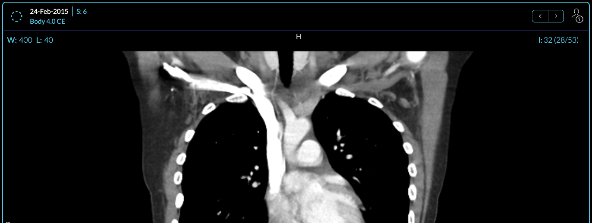
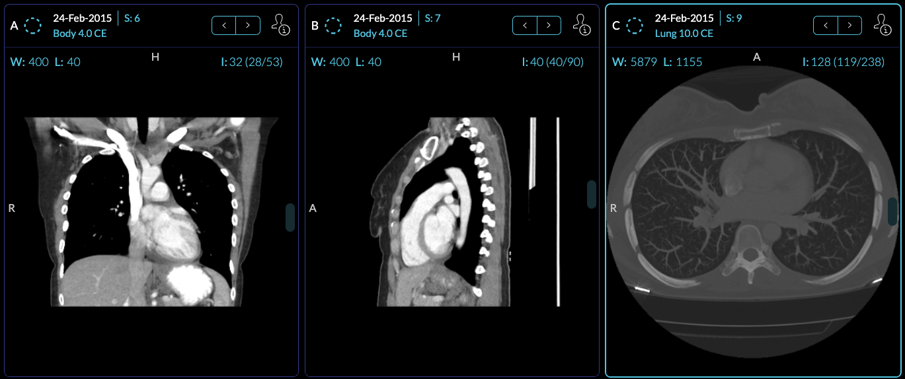

# Module: Viewport

## Overview

Viewports consume a displaySet and display/allow the user to interact with data.
An extension can register a Viewport Module by defining a `getViewportModule`
method that returns a React component. Currently, we use viewport components to
add support for:

- 2D Medical Image Viewing (cornerstone ext.)
- Structured Reports as SR (DICOM SR ext.)
- Structured Reports as HTML (DICOM html ext.)
- Encapsulated PDFs as PDFs (DICOM pdf ext.)
- Whole Slide Microscopy Viewing (whole slide ext.)
- etc.

The general pattern is that a mode can define which `Viewport` to use for which
specific `SOPClassHandlerUID`, so if you want to fork just a single Viewport
component for a specialized mode, this is possible.

```jsx
// displaySet, viewportIndex, dataSource
const getViewportModule = () => {
  const wrappedViewport = props => {
    return (
      <ExampleViewport
        {...props}
        onEvent={data => {
          commandsManager.runCommand('commandName', data);
        }}
      />
    );
  };

  return [{ name: 'example', component: wrappedViewport }];
};
```

## Example Viewport Component

A simplified version of the tracked CornerstoneViewport is shown below, which
creates a cornerstone viewport and action bar on top of it.

```jsx
function TrackedCornerstoneViewport({
  children,
  dataSource,
  displaySet,
  viewportIndex,
  servicesManager,
  extensionManager,
  commandsManager,
}) {
  const renderViewport = () => {
    const { component: Component } = extensionManager.getModuleEntry(
      '@ohif/extension-cornerstone.viewportModule.cornerstone'
    );
    return (
      <Component
        onElementEnabled={onElementEnabled}
        element={element}
        {...props}
      ></Component>
    );
  };

  return (
    <>
      <ViewportActionBar onDoubleClick onArrowsClick />
      <div className="relative flex flex-row w-full h-full overflow-hidden">
        {renderViewport()}
      </div>
    </>
  );
}
```



### `@ohif/viewer`

Viewport components are managed by the `ViewportGrid` Component. Which Viewport
component is used depends on:

- Hanging Protocols
- The Layout Configuration
- Registered SopClassHandlers



<center><i>An example of three cornerstone Viewports</i></center>
