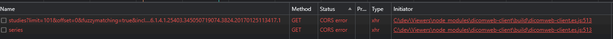

# Cross-Origin Information for OHIF

This document describes various security configurations, settings and environments/contexts needed to fully leverage OHIF’s capabilities. One may need some configurations while others might need ALL of them - it all depends on the environment OHIF is expected to run in.

In particular, three of OHIF’s features depend on these configurations:
- [Embedding OHIF in an iframe](#embedding-ohif-in-an-iframe)
- [XMLHttpRequests to fetch data from data sources](#cors-in-ohif)


## Embedding OHIF in an iframe

As described [here](./iframe.md), there are cases where OHIF will be embedded in an iframe. The following links provide more information for setting up and configuring OHIF to work in an iframe:

- [OHIF iframe documentation](./iframe.md#static-build)
- [OHIF as a Cross-origin Resource in an iframe](#ohif-as-a-cross-origin-resource-in-an-iframe)

## Secure Context

MDN defines a secure context as [“a Window or Worker for which certain minimum standards of authentication and confidentiality are met.“](https://developer.mozilla.org/en-US/docs/Web/Security/Secure_Contexts)

Any local URL is considered secure. The following are some examples of local URLs that are considered secure…
- http://localhost
- http://127.0.0.1:3000

URLs that are NOT local must be delivered over `https://` or `wss://` (i.e. TLS) to be considered secure. See [When is a context considered secure](https://developer.mozilla.org/en-US/docs/Web/Security/Secure_Contexts#when_is_a_context_considered_secure) in MDN for more information.

### iframes

A page embedded in an iframe is considered secure if it itself and every one of its embedding ancestors are delivered securely. Otherwise it is deemed insecure.


### Configuring/setting up a secure context

[Local URLs are considered secure](https://developer.mozilla.org/en-US/docs/Web/Security/Secure_Contexts#when_is_a_context_considered_secure), and as such whenever OHIF is accessed via a local URL (e.g. http://localhost:3000) it is running in a secure context. For example, in a development environment using the default webpack setup, OHIF can be deployed and accessed in a secure context at http://localhost:3000.

The best alternative is to host OHIF over HTTPS.

:::tip
OHIF can be served over HTTPS in a variety of ways (these are just some examples).
- Website hosting services that offer HTTPS deployment (e.g,. Netlify) or offer HTTPS load balancers (AWS, Google Cloud etc.)
- Setting up a reverse proxy (e.g. `nginx`) with a self-signed certificate that forwards requests to the OHIF server
    - [An OHIF Docker image can be set up this way](./docker/docker.md#ssl).
:::

## Origin Definition

According to [MDN](https://developer.mozilla.org/en-US/docs/Glossary/Origin), a Web content’s origin is defined by the scheme (protocol), hostname (domain), and port of the URL used to access it. Two objects have the same origin only when the scheme, hostname, and port all match.

## CORS - Cross-Origin Resource Sharing

A cross-origin resource is a resource (e.g. image, JSON, etc) that is served by one origin and used/referenced by a different origin.

CORS is the protocol utilized by web servers and browsers whereby a server of one origin identifies and/or restricts which of its resources that other origins (i.e. other than its own) a browser should allow access to. By default a browser does not permit cross-origin resource sharing.

The CORS mechanism relies on the HTTP response headers from the server to indicate if a resource can be shared with a different origin.

See the [MDN CORS article](https://developer.mozilla.org/en-US/docs/Web/HTTP/CORS) for more information.

### CORS HTTP Headers

The header that mostly concerns OHIF is listed below and should be configured accordingly on the DICOMweb server or any data source that OHIF would make XMLHttpRequests to for its data.

```http
Access-Control-Allow-Origin: `<origin>` | *
```

:::tip
The `Access-Control-Allow-Origin` header specifies which origins can access the served resource embedded in the response.

Either a single, specific origin (i.e. `<origin>`) can be specified or ALL origins (i.e. *)

See [MDN](https://developer.mozilla.org/en-US/docs/Web/HTTP/CORS#access-control-allow-origin) for more information.
:::

### CORS in OHIF

OHIF fetches and displays data and images from data sources. It invokes XMLHttpRequests to some data sources such as DICOMweb data sources to fetch the information to render. Typically, a DICOMweb server is hosted on a completely different origin than the one serving OHIF. As such, those XMLHttpRequests use CORS.

### Troubleshooting CORS in OHIF

The following is an example screenshot of the browser console when one of OHIF’s DICOMweb data source servers is not configured for CORS.


And the following is what is in the accompanying network tab.



:::info
Setting the appropriate CORS header varies per server or service that is hosting the data source. What follows below is just one example to remedy the problem.
:::

:::tip
If Orthanc is the data source running in a Docker container composed with/behind nginx. And OHIF is being served at localhost:3000. The issue can be remedied by adding either of the following to Orthanc’s Docker container nginx.conf file.

```nginx
add_header 'Access-Control-Allow-Origin' 'http://localhost:3000' always;
```

Or

```nginx
add_header 'Access-Control-Allow-Origin' '*' always;
```
:::


### Header Values (see [MDN](https://developer.mozilla.org/en-US/docs/Web/HTTP/Cross-Origin_Resource_Policy#usage) for more information)

|Value|Description|
|-----|-----------|
|same-site|Only requests from the same site can read the resource.|
|same-origin|Only requests from the same origin can read the resource.|
|cross-origin|Requests from any origin can read the resource. The value is useful and [exists](https://developer.mozilla.org/en-US/docs/Web/HTTP/Cross-Origin_Resource_Policy#relationship_to_cross-origin_embedder_policy_coep) primarily for letting documents with the [COEP require-corp value](#header-values-pertinent-to-ohif-see-mdn-for-more-information-1) know that the resource is ok to be embedded|

### OHIF and CORP


#### PDF from a Cross Origin DICOMweb Data Source

There are some DICOMweb data sources (e.g. dcm4chee) whereby OHIF uses the data source’s `/rendered` endpoint to embed a DICOM PDF document in the OHIF DOM using an `<object>` tag.

As specified for the [COEP require-corp value](#header-values-pertinent-to-ohif-see-mdn-for-more-information-1), a page like OHIF with COEP header `require-corp` can embed cross-origin resources in DOM elements that have the [`crossorigin` attribute](https://developer.mozilla.org/en-US/docs/Web/HTML/Attributes/crossorigin) OR the resource is delivered with an appropriate CORP header. The `<object>` tag does NOT support the `crossorigin` attribute. As such, the PDF must be delivered with a CORP header.

:::tip
Setting the CORP header varies per server or service that is hosting the data source. The following is just one example.

For a dcm4chee DICOMweb data source composed in Docker behind nginx, the CORP header can be configured in the nginx.conf file as such:

```nginx
add_header 'Cross-Origin-Resource-Policy' 'cross-origin' always;
```

If the dcm4chee server and the OHIF server are hosted on the same site, then the following would also work:
```nginx
add_header 'Cross-Origin-Resource-Policy' 'same-site' always;
```
:::
