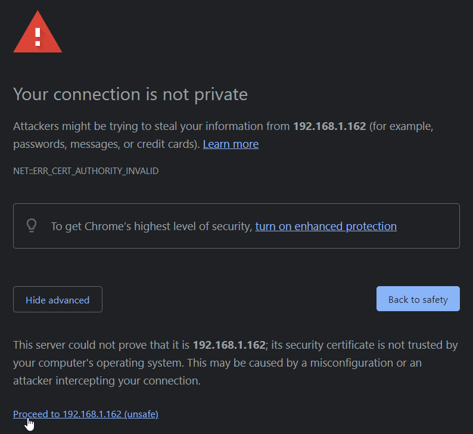

# SSL

:::caution
We make no claims or guarantees regarding this section concerning security. If in doubt, enlist the help of an expert and conduct proper audits.
:::


If OHIF is not deployed over SSL, this means information transferred to/from OHIF is not encrypted. Consideration must be given as to whether OHIF should be deployed in a secure context over SSL.

### Specifying the SSL Port, Certificate and Private Key

For convenience, the [built Docker image](#building-the-docker-image) can be run over SSL by
- setting the `{SSL_PORT}` environment variable
- volume mounting the SSL certificate
- volume mounting the SSL private key

:::info
The volume mounted SSL certificate and private key are mapped to the [`ssl_certificate`](http://nginx.org/en/docs/http/ngx_http_ssl_module.html#ssl_certificate) and [`ssl_certificate_key`](http://nginx.org/en/docs/http/ngx_http_ssl_module.html#ssl_certificate_key) `nginx` directives respectively.
:::

Similar to the [`nginx` listen port](#configuring-the-nginx-listen-port), the `{SSL_PORT}` environment variable is the internal port that `nginx` listens on to serve the OHIF web server over SSL and has to be likewise published via the `-p` switch.

The following is an example command running the Docker container over SSL. Note that depending on the version of Docker, an absolute path to the certificate and private key files might be required.

```sh
docker run -d -e SSL_PORT=443 -p 3003:443/tcp -v /path/to/certificate:/etc/ssl/certs/ssl-certificate.crt -v /path/to/private/key:/etc/ssl/private/ssl-private-key.key --name ohif-viewer-container ohif-viewer-image
```

:::caution
The above deploys OHIF over SSL using `nginx`'s default SSL configuration. For further OHIF server hardening and security configuration, consider enlisting an expert and then editing OHIF's `nginx` [SSL template configuration file](https://github.com/OHIF/Viewers/blob/8a8ae237d26faf123abeb073cbf0cd426c3e9ef2/.docker/Viewer-v3.x/default.ssl.conf.template) with further [security settings](https://nginx.org/en/docs/http/ngx_http_ssl_module.html) and [tweaks](http://nginx.org/en/docs/http/configuring_https_servers.html) and then [build a new Docker image](#building-the-docker-image) from there.
:::

:::caution
The private key is a secure entity and should have restricted access. Keep it safe!
:::

:::caution
The presence of the `{SSL_PORT}` environment variable is used to trigger to deploy over SSL as opposed to HTTP. If `{SSL_PORT}` is NOT defined, then HTTP is used even if the certificate and private key volumes are mounted.
:::

:::tip
The read and write permissions of the source, mounted volumes are preserved in the Docker container. The volume mounted certificate and private key require read permission.

One way to ensure both are readable is to issue the following on the host system terminal prior to running the Docker container and mounting the certificate and private key volumes.

```sh
sudo chmod 644 /path/to/certificate /path/to/private/key
```
:::

:::tip
The SSL certificate and private key can be either [CA issued](#ca-signed-certificates) or [self-signed](#self-signed-certificates).
:::


### CA Signed Certificates

According to [SSL.com](https://www.ssl.com/faqs/what-is-a-certificate-authority/), a global certificate authority (CA) is a trusted authority and organization that guarantees the identity of other, third-party entities and guarantees the integrity of the electronic information (e.g. web site data) those third-party entities provide and deliver.

There are many globally trusted CAs. Below is a non-exhaustive list of some CAs including links to some documentation for creating and installing certificates and keys from those authorities to be used with `nginx`.
- [GoDaddy](https://ca.godaddy.com/help/nginx-install-a-certificate-6722)
- [Let's Encrypt](https://www.nginx.com/blog/using-free-ssltls-certificates-from-lets-encrypt-with-nginx/)
- [digicert](https://www.digicert.com/kb/csr-ssl-installation/nginx-openssl.htm)


### Self-Signed Certificates

According to [Entrust](https://www.entrust.com/resources/faq/what-is-a-self-signed-certificate), a self-signed certificate is one that is NOT signed by a trusted, public [CA authority](#ca-signed-certificates), but instead (typically) signed by the developer or individual or organization responsible for a web site.

Browsers will treat self-signed certificates as not secure because the signer is not publicly recognized and trusted. When visiting a site encrypted with a self-signed certificate, the browser will present a screen similar to the following warning about the potential risk.


For a self-signed certificate this is normal and expected. Clicking the `Advanced` button displays further information as well as a link for proceeding to site that the certificate is encrypting.




Self-signed certificates might be appropriate for testing or perhaps deploying a site within an organization's internal LAN. In any case, consult an expert prior to deploying OHIF over SSL.

:::tip
A self-signed certificate can be generated using [`openssl`](https://www.openssl.org/) on the command line.
:::

To create a self-signed certificate:
1. Open a command prompt.
2. Issue the following command:
    ```sh
    sudo openssl req -x509 -nodes -days 365 -newkey rsa:2048 -keyout /desired/key/directory/self-signed-private.key -out /desired/cert/directory/self-signed.crt
    ```

    The chart below describes each of the items in the command.

    |Command Item|Description|
    |------------|-----------|
    |sudo|temporarily grant access as the root/super user to run the `openssl` command|
    |openssl|the command line tool for creating and managing certificates and keys|
    |req|this together with the subsequent `-x509` indicates to request to generate a self-signed certificate|
    |-x509|this together with the `req` indicates to request to generate a self-signed certificate|
    |-nodes|skip the option to secure the certificate with a passphrase; this allows `nginx` to start up with without intervention to enter a passphrase each time|
    |-days 365|the number of days the certificate will be valid for|
    |-newkey rsa:2048|create the a new certificate and key together and make an RSA key that is 2048 bits long|
    |-keyout|the path and file name where the private key will be written to|
    |-out|the path and file name where the certificate will be written to|

3. Answer the prompts that follow. The table below lists the various prompts. The default value for each prompt is shown within the square brackets. The most important prompt is `Common Name (e.g. server FQDN or YOUR name)`. For this enter the IP address of the OHIF server being secured.

    |Prompt|
    |------|
    |Country Name (2 letter code) [AU]|
    |State or Province Name (full name) [Some-State]|
    |Locality Name (eg, city) []|
    |Organization Name (eg, company) [Internet Widgets Pty Ltd]|
    |Organizational Unit Name (eg, section) []|
    |Common Name (e.g. server FQDN or YOUR name) []|
    |Email Address []|

4. Once completed, the self-signed certificate and private key will be in the locations specified by the `-keyout` and `-out` flags and can be [volume mounted](#specifying-the-ssl-port-certificate-and-private-key) accordingly to the OHIF Docker container.

:::tip
Windows' users can access `openssl` using [Windows Subsystem for Linux (WSL)](https://learn.microsoft.com/en-us/windows/wsl/).
:::
