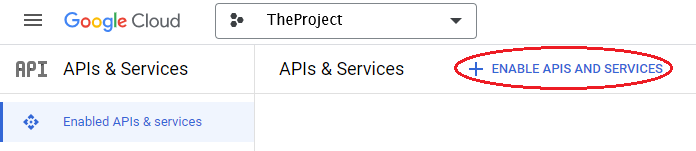
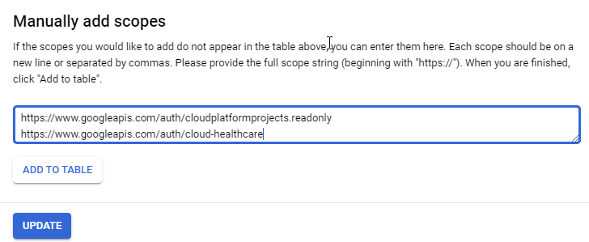
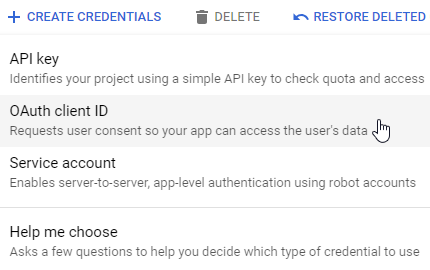
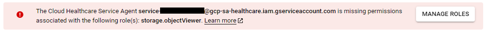
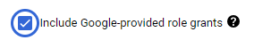

# Google Cloud Healthcare

> The [Google Cloud Healthcare API](https://cloud.google.com/healthcare/) is a
> powerful option for storing medical imaging data in the cloud.

An alternative to deploying your own PACS is to use a software-as-a-service
provider such as Google Cloud. The Cloud Healthcare API promises to be a
scalable, secure, cost effective image storage solution for those willing to
store their data in the cloud. It offers an
[almost-entirely complete DICOMWeb API](https://cloud.google.com/healthcare/docs/dicom)
which requires tokens generated via the
[OAuth 2.0 Sign In flow](https://developers.google.com/identity/protocols/oauth2).
Images can even be transcoded on the fly if this is desired.

## Setup a Google Cloud Healthcare Project

1. Create a Google Cloud account
2. Create a project in Google Cloud

    A project in Google Cloud can be created by clicking the projects drop down box.

    

    And then clicking the `NEW PROJECT` button in the top-right corner of the
    dialogue that is displayed.

3. Enable the [Cloud Healthcare API](https://cloud.google.com/healthcare/) for your project

   :::tip
   An API can be enabled through the `APIs & Services > Enabled APIs & Services`
   console and clicking the `+ ENABLE APIS AND SERVICES` button.

   
   :::

   :::tip
   The principal (i.e. account) that is enabling the Cloud Healthcare API will require
   the following roles that can be set in the `IAM & Admin > IAM` console for the
   desired project.
    - Service Usage Viewer
    - Service Usage Admin
   :::

   :::tip
   Roles can be added to a principal in the `IAM & Admin > IAM` console by clicking
   the `Edit principal` (i.e. pencil) icon to the right of a principal or by clicking the
   `GRANT ACCESS` button at the top of the list of principals. The `GRANT ACCESS`
   button is particularly useful if the `Edit principal` icon is disabled.
   :::

4. (Optional): Create a Dataset and DICOM Data Store for storing your DICOM data

    :::tip
    To both list existing datasets as well as create a new dataset for your project,
    the principal (i.e. account) must have the following roles enabled
    in the `IAM & Admin > IAM` console.

    - Editor

    :::

5. Enable the [Cloud Resource Manager API](https://cloud.google.com/resource-manager/) for your project.

   _Note:_ If you are having trouble finding the APIs, use the search box at
    the top of the Cloud console.

6. Go to APIs & Services > OAuth Consent Screen to create an OAuth Consent screen and fill in your application details.

   - Run through the three step process of adding an OAuth Consent Screen, clicking `SAVE AND CONTINUE` at the end of each step.

      
   - For the Scopes step, for Google APIs, click the `ADD OR REMOVE SCOPES` button.
   - In the `Update selected scopes` dialogue that flies in from the right, add the
   following scopes to the `Manually add scopes` text box.
     - `https://www.googleapis.com/auth/cloudplatformprojects.readonly`
     - `https://www.googleapis.com/auth/cloud-healthcare`

      

   - Click `ADD TO TABLE` and then click `UPDATE`


7. Go to APIs & Services > Credentials to create a new set of credentials:

    - Click `+ CREATE CREDENTIALS` and from the drop down select `OAuth Client ID`.
    See [OAuth 2.0 Client ID](https://developers.google.com/identity/protocols/oauth2/) for more information.

      

    - Choose the "Web Application" type
    - Add your domain (e.g. `http://localhost:3000`) to the Authorized JavaScript
    origins.
    - Add your domain, plus `callback` (e.g. `http://localhost:3000/callback`) to the Authorized Redirect URIs.
    - Save your Client ID for later.

8. (Optional): Create a bucket containing DICOM files and import it into a Data Store

    - When importing a bucket into a Data Store, the following warning might be
      displayed indicating that the Cloud Healthcare Service Agent service account associated with the
      project does not have the `Storage Object Viewer` role.

      

    - The Cloud Healthcare Service Agent service account can be displayed in the
    `IAM & Admin > IAM` console by checking the `Include Google-provided role grants` checkbox.
    The `Storage Object Viewer` role can then be granted to the Cloud Healthcare Service Agent service account.

      

    - More information regarding the Cloud Healthcare Service Agent service account can
    be found at https://cloud.google.com/healthcare-api/docs/permissions-healthcare-api-gcp-products

9. (Optional): Enable Public Datasets that are being hosted by Google:
  https://cloud.google.com/healthcare/docs/resources/public-datasets/

## Run the viewer with your OAuth Client ID

1. Open the `config/google.js` file and change `YOURCLIENTID` to your Client ID
   value.
1. Run the OHIF Viewer using the config/google.js configuration file

```bash
cd OHIFViewer
yarn install
APP_CONFIG=config/google.js yarn run dev
```

## Configuring Google Cloud Healthcare as a datasource in OHIF

A Google Cloud Healthcare DICOM store can be configured as a DICOMweb datasource
in OHIF. A full or partial path is permitted in the configuration file. For
partial paths, the [data source configuration UI](../configuration/dataSources/configuration-ui.md)
will assist in filling in the missing pieces. For example, a configuration with
empty `wadoUriRoot`, `qidoRoot` and `wadoRoot` will prompt for the entire path
step-by-step starting with the project.
