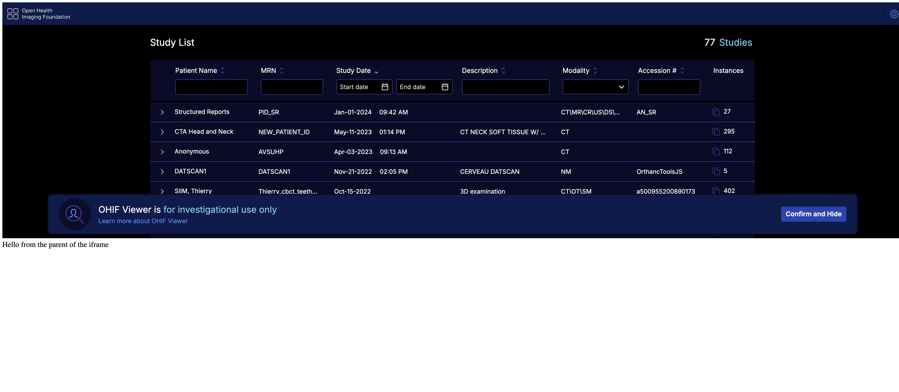

# iframe

With the transition to more advanced visualization, loading, and rendering techniques using WebWorkers, WASM, and WebGL, the script tag usage of the OHIF viewer v3 has been deprecated.
An alternative option for script tag usage is to employ an iframe. You can utilize the iframe element to load the OHIF viewer and establish communication with it using the postMessage API if needed.

We recommend utilizing modern development practices and incorporating OHIF viewer within your application using a more modular and integrated approach, such as leveraging bundlers, other UI
components, and frameworks.

## Static Build

You can use the iframe element to load the OHIF viewer as a child element of your application if you need the
viewer to be embedded within your application. The iframe element can be used as follows (use your own custom styles)

```html
<iframe src="./path-to-ohif-build" style="width: 100%; height: 500px; border: none"/>
```

The important thing to note here is that the iframe element is loading the OHIF viewer from the `./path-to-ohif-build`. This path can be
named anything you want, but it should be the path to the OHIF viewer build directory. The build directory is the directory that
contains the `index.html` file (See [build for production](./build-for-production.md) for more information).

It is also required that the PUBLIC_URL environment variable is set to the same path. For example, if the iframe is
`<iframe src="./ohif" />` (which means there is a `ohif` folder containing the build in your main app), then you need to:

1. use a config (e.g. config/myConfig.js) file that is using the `routerBasename` of `/ohif` (note the one / - it is not /ohif/).
2. build the viewer with `PUBLIC_URL=/ohif/ APP_CONFIG=config/myConfig.js yarn build` (note the two / - it is not /ohif).

:::tip
Check to make sure the `app-config.js` in the build is reflecting the correct routerBasename.
:::

:::tip
The PUBLIC_URL tells the application where to find the static assets and the routerBasename will tell the application how to handle the rouets
:::

### Try it locally

Download the index.html and the build (against the /ohif/ path) from [here](https://ohif-assets-new.s3.us-east-1.amazonaws.com/iframe-basic/Archive.zip)

Then run the

```bash
npx http-server unzipped-folder

# you can use npx serve ./dist -c ../public/serve.json as an alternative to http-server
```

You should be able to see


