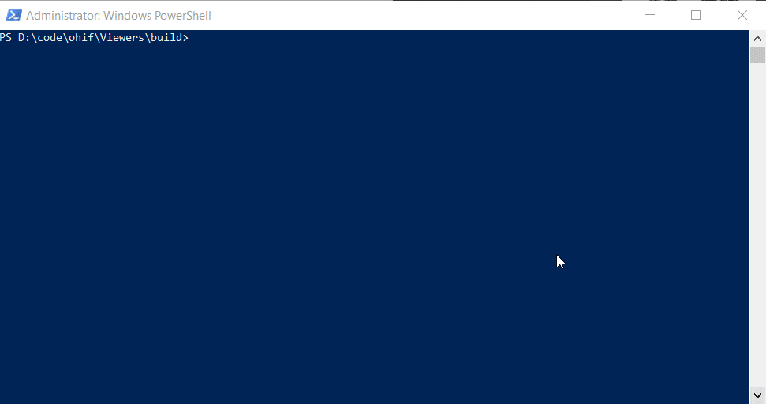

# Deploy Static Assets

> WARNING! All of these solutions stand-up a publicly accessible web viewer. Do
> not hook your hosted viewer up to a sensitive source of data without
> implementing authentication.

There are a lot of options for deploying static assets. Some services, like
`netlify` and `surge.sh`, specialize in static websites. You'll notice that
deploying with them requires much less time and effort, but comes at the cost of
less product offerings.

While not required, it can simplify things to host your Web Viewer alongside
your image archive. Services with more robust product offerings, like
`Google Cloud`, `Microsoft's Azure`, and `Amazon Web Services (AWS)`, are able
to accommodate this setup.

_Drag-n-drop_

- [Netlify: Drop](#netlify-drop)

_Easy_

- [Surge.sh](#surgesh)
- [GitHub Pages](#github-pages)

_Advanced_

- [Deploy Static Assets](#deploy-static-assets)
  - [Drag-n-drop](#drag-n-drop)
    - [Netlify Drop](#netlify-drop)
  - [Easy](#easy)
    - [Surge.sh](#surgesh)
    - [GitHub Pages](#github-pages)
  - [Advanced](#advanced)
    - [AWS S3 + Cloudfront](#aws-s3--cloudfront)
    - [GCP + Cloudflare](#gcp--cloudflare)
    - [Azure](#azure)

## Drag-n-drop

### Netlify Drop


<div style={{padding:"56.25% 0 0 0", position:"relative"}}>
    <iframe src="https://player.vimeo.com/video/843233793?badge=0&amp;autopause=0&amp;player_id=0&amp;app_id=58479"  frameBorder="0" allow="autoplay; fullscreen; picture-in-picture" allowFullScreen style= {{ position:"absolute",top:0,left:0,width:"100%",height:"100%"}} title="measurement-report"></iframe>
</div>


_GIF demonstrating deployment with Netlify Drop_

1. https://app.netlify.com/drop
2. Drag your `build/` folder on to the drop target
3. ...
4. _annnd you're done_

**Features:**

- Custom domains & HTTPS
- Instant Git integration
- Continuous deployment
- Deploy previews
- Access to add-ons

(Non-free tiers include identity, FaaS, Forms, etc.)

Learn more about [Netlify on their website](https://www.netlify.com/)

## Easy

### Surge.sh

> Static web publishing for Front-End Developers. Simple, single-command web
> publishing. Publish HTML, CSS, and JS for free, without leaving the command
> line.



_GIF demonstrating deployment with surge_

```shell
# Add surge command
yarn global add surge

# In the build directory
surge
```

**Features:**

- Free custom domain support
- Free SSL for surge.sh subdomains
- pushState support for single page apps
- Custom 404.html pages
- Barrier-free deployment through the CLI
- Easy integration into your Grunt toolchain
- Cross-origin resource support
- And more…

Learn more about [surge.sh on their website](https://surge.sh/)

### GitHub Pages

> WARNING! While great for project sites and light use, it is not advised to use
> GitHub Pages for production workloads. Please consider using a different
> service for mission critical applications.

> Websites for you and your projects. Hosted directly from your GitHub
> repository. Just edit, push, and your changes are live.

This deployment strategy makes more sense if you intend to maintain your project in
a GitHub repository. It allows you to specify a `branch` or `folder` as the
target for a GitHub Page's website. As you push code changes, the hosted content
updates to reflect those changes.

1. Head over to GitHub.com and create a new repository, or go to an existing
   one. Click on the Settings tab.
2. Scroll down to the GitHub Pages section. Choose the `branch` or `folder` you
   would like as the "root" of your website.
3. Fire up a browser and go to `http://username.github.io/repository`

Configuring Your Site:

- [Setting up a custom domain](https://help.github.com/en/articles/using-a-custom-domain-with-github-pages)
- [Setting up SSL](https://help.github.com/en/articles/securing-your-github-pages-site-with-https)

Learn more about [GitHub Pages on its website](https://pages.github.com/)

## Advanced

All of these options, while using providers with more service offerings,
demonstrate how to host the viewer with their respective file storage and CDN
offerings. While you can serve your static assets this way, if you're going
through the trouble of using AWS/GCP/Azure, it's more likely you're doing so to
avoid using a proxy or to simplify authentication.

If that is the case, check out some of our more advanced `docker` deployments
that target these providers from the left-hand sidepanel.

These guides can be a bit longer and an update more frequently. To provide
accurate documentation, we will link to each provider's own recommended steps:

### AWS S3 + Cloudfront

- [Host a Static Website](https://docs.aws.amazon.com/AmazonS3/latest/dev/website-hosting-custom-domain-walkthrough.html)
- [Speed Up Your Website with Cloudfront](https://docs.aws.amazon.com/AmazonS3/latest/dev/website-hosting-cloudfront-walkthrough.html)

### GCP + Cloudflare

- [Things to Know Before Getting Started](https://code.luasoftware.com/tutorials/google-cloud-storage/things-to-know-before-hosting-static-website-on-google-cloud-storage/)
- [Hosting a Static Website on GCP](https://cloud.google.com/storage/docs/hosting-static-website)

### Azure

 - Deploying viewer to Azure blob storage as a static website:
    Refer to [Host a static website](https://docs.microsoft.com/en-us/azure/storage/blobs/storage-blob-static-website)
    High level steps :
        1.	Go to Azure portal and create a storage account.
        2.   Under Overview->Capabilities, select Static website.
        3.	Enable Static website. Set the index document as ‘index.html’.
        4.	Copy the primary endpoint. This will serve as the root URL for the viewer.
        5.	Save. A new container named ‘$web’ will be created.
        6.	Copy OHIF viewer’s build output from ‘platform\app\dist’ folder to the ‘$web’ container.
        7.	Open browser and navigate to the viewer root URL copied in the step above. It should display OHIF viewer with data from default data source.

       
    Special consideration while accessing DicomJson data source :
      • Due to the way routing is handled in react, it may error out in production when trying to display data through dicomJson data source. E.g. https://[Static Website endpoint]/viewer/dicomjson?url= https://ohif-dicom-json-example.s3.amazonaws.com/LIDC-IDRI-0001.json
      •	Resolution to this is to set error page to ‘index.html’ at the website level. This will ensure that all errors are redirected to root and requests are further served from root path.
       

- [Add SSL Support](https://docs.microsoft.com/en-us/azure/storage/blobs/storage-https-custom-domain-cdn)
- [Configure a Custom Domain](https://docs.microsoft.com/en-us/azure/storage/blobs/storage-custom-domain-name)
