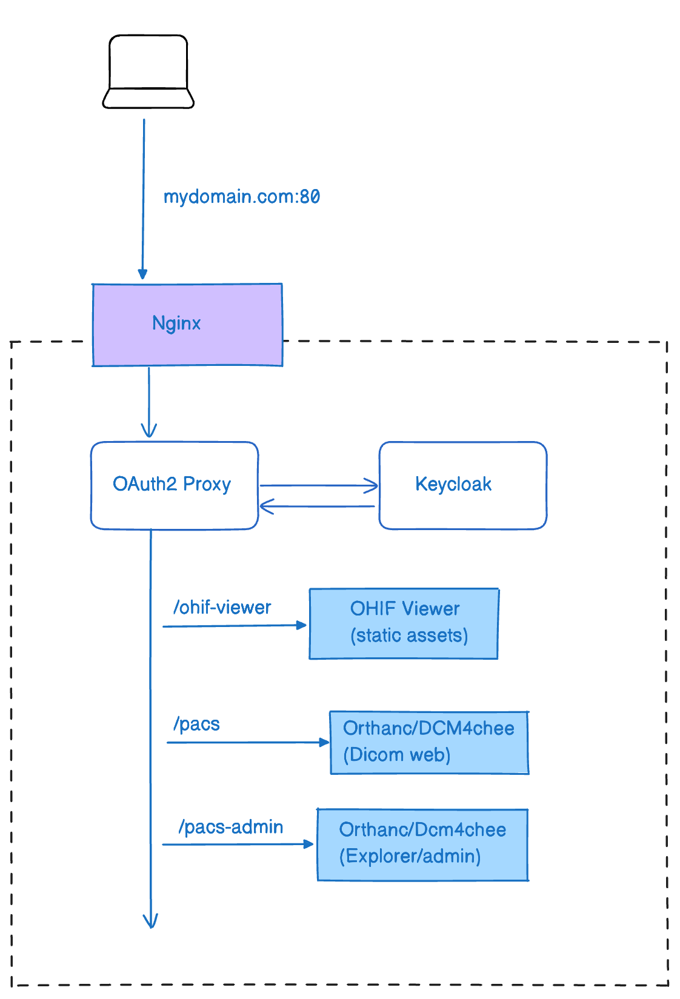
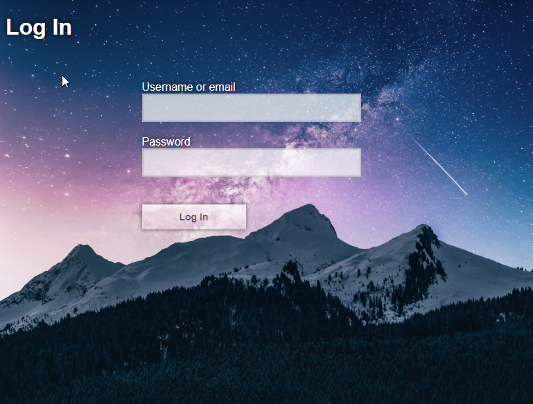

# User Account Control


:::danger
DISCLAIMER: We make no claims or guarantees regarding the security of this approach. If you have any doubts, please consult an expert and conduct thorough audits.
:::

Making a viewer and its medical imaging data accessible on the open web can
provide a lot of benefits, but requires additional security to make sure
sensitive information can only be viewed by authorized individuals. Most image
archives are equipped with basic security measures, but they are not
robust/secure enough for the open web.

This guide covers one of many potential production setups that secure our
sensitive data.

## Overview

This guide builds on top of our
[Nginx + Image Archive guide](./nginx--image-archive.md),
wherein we used a [`reverse proxy`](https://en.wikipedia.org/wiki/Reverse_proxy)
to retrieve resources from our image archive (Orthanc).

To add support for "User Account Control" we introduce
[Keycloak](https://www.keycloak.org/about.html). Keycloak is an open source
Identity and Access Management solution that makes it easy to secure
applications and services with little to no code. We improve upon our
`reverse proxy` setup by integrating Keycloak and Nginx to create an
`authenticating reverse proxy`.

> An authenticating reverse proxy is a reverse proxy that only retrieves the
> resources on behalf of a client if the client has been authenticated. If a
> client is not authenticated they can be redirected to a login page.

This setup allows us to create a setup similar to the one pictured below:




**Nginx:**

- Acts as a reverse proxy server that handles incoming requests to the domain (mydomain.com:80) and forwards them to the appropriate backend services.
- It also ensures that all requests go through the OAuth2 Proxy for authentication.


**OAuth2 Proxy:**

- Serves as an intermediary that authenticates users via OAuth2.
- Works in conjunction with Keycloak to manage user sessions and authentication tokens.
- Once the user is authenticated, it allows access to specific routes (/ohif-viewer, /pacs, /pacs-admin).

**Keycloak:**

- An open-source identity and access management solution.
- Manages user identities, including authentication and authorization.
- Communicates with the OAuth2 Proxy to validate user credentials and provide tokens for authenticated sessions.

**OHIF Viewer:**

- Hosted under the route /ohif-viewer, which serves the static assets of the OHIF Viewer.

**Orthanc/DCM4chee:**

- PACS (Picture Archiving and Communication System) for managing medical imaging data.
Exposes two routes:
- /pacs: Accesses the DICOM web services.
- /pacs-admin: Provides administrative and explorer interfaces.


## Getting Started - Orthanc


### Requirements

- Docker
  - [Docker for Mac](https://docs.docker.com/docker-for-mac/)
  - [Docker for Windows](https://docs.docker.com/docker-for-windows/)

_Not sure if you have `docker` installed already? Try running `docker --version`
in command prompt or terminal_

### Setup 1 - Trying Locally

Navigate to the Orthanc Keycloak configuration directory:

`cd platform\app\.recipes\Nginx-Orthanc-Keycloak`

Due to the increased complexity of this setup, we've introduced a magic word `YOUR_DOMAIN`. Replace this word with your project IP address to follow along more easily.

Since we are running this locally, we will use `127.0.0.1` as our IP address.

In the `docker-compose.yml` file, replace `YOUR_DOMAIN` with `127.0.0.1`.

In the Keycloak service:


Before:

```
KC_HOSTNAME_ADMIN_URL: http://YOUR_DOMAIN/keycloak/
KC_HOSTNAME_URL: http://YOUR_DOMAIN/keycloak/
```


After

```
KC_HOSTNAME_ADMIN_URL: http://127.0.0.1/keycloak/
KC_HOSTNAME_URL: http://127.0.0.1/keycloak/
```

In the Keycloak healthcheck, replace `YOUR_DOMAIN` with `localhost`.

In the Nginx config, change:

```
server_name YOUR_DOMAIN;
```

to:

```
server_name 127.0.0.1;
```

Since we're not using SSL, remove the following lines from the Nginx config file and create one server instead of two:

Before (two servers one for http and one for https):

```
server {
    listen 80;
    server_name YOUR_DOMAIN;

    location /.well-known/acme-challenge/ {
        root /var/www/certbot;
    }

    location / {
        return 301 https://$host$request_uri;
    }
}

server {
    listen 443 ssl;
    server_name YOUR_DOMAIN;

    ssl_certificate /etc/letsencrypt/live/ohifviewer.duckdns.org/fullchain.pem;
    ssl_certificate_key /etc/letsencrypt/live/ohifviewer.duckdns.org/privkey.pem;

    root /var/www/html;
```

After (merging both servers into one only http server):

```
server {
  listen 80;
  server_name 127.0.0.1;

  location /.well-known/acme-challenge/ {
      root /var/www/certbot;
  }

  root /var/www/html;
```

In OAuth2-proxy configuration at `oauth2-proxy.cfg`

Before:

```
redirect_url="http://YOUR_DOMAIN/oauth2/callback"
oidc_issuer_url="http://YOUR_DOMAIN/keycloak/realms/ohif"
```

After:

```
redirect_url="http://127.0.0.1/oauth2/callback"
oidc_issuer_url="http://127.0.0.1/keycloak/realms/ohif"
```

Finally, in the docker-nginx-orthanc-keycloak config file that lives in `platform/app/public/config/docker-nginx-orthanc-keycloak.js`, replace `YOUR_DOMAIN` with

Before:

```
wadoUriRoot: 'http://YOUR_DOMAIN/pacs',
qidoRoot: 'http://YOUR_DOMAIN/pacs',
wadoRoot: 'http://YOUR_DOMAIN/pacs',
```

After:

```
wadoUriRoot: 'http://127.0.0.1/pacs',
qidoRoot: 'http://127.0.0.1/pacs',
wadoRoot: 'http://127.0.0.1/pacs',
```

:::note
This is the config that is used inside the dockerfile to build the viewer, look at dockerfile

`ENV APP_CONFIG=config/docker-nginx-orthanc-keycloak.js`
:::

Run the following command to start the services:

```
docker-compose up --build
```


You can watch the following video, which will guide you through the process of setting up Orthanc with keycloak and OHIF locally.

We have set up two predefined users in Keycloak:

- `user: admin password: admin` - Has access to keycloak portal for managing users and clients
- `user: viewer password: viewer` - Has access to the OHIF Viewer but not the pacs-admin
- `user: pacsadmin password: pacsadmin` - Has access to both the pacs-admin for uploading and the OHIF Viewer

You can navigate to:

- `http://127.0.0.1` - This will redirect you to `http://127.0.0.1/ohif-viewer`, prompting you to log in with Keycloak using either user
- `http://127.0.0.1/pacs-admin` - Only the `pacsadmin` user can access this route, while the `viewer` user cannot
-

<div style={{padding:"56.25% 0 0 0", position:"relative"}}>
    <iframe src="https://player.vimeo.com/video/981362196?badge=0&amp;autopause=0&amp;player_id=0&amp;app_id=58479"  frameBorder="0" allow="autoplay; fullscreen; picture-in-picture" allowFullScreen style= {{ position:"absolute",top:0,left:0,width:"100%",height:"100%"}} title="measurement-report"></iframe>
</div>


### Step 2 - Trying via a Server

Now that you have successfully set up Orthanc with Keycloak and OHIF locally, you can deploy it to a server. While you can rent a server from any provider, this tutorial will demonstrate the process using Linode as an example.

You can watch the following video, which will guide you through the process.

Some notes:

- Since this is a remote machine we need to clone the repo
- Typically a Linux machine, you need to download and install Docker on it
- Use the Visual Studio Code Remote SSH extension to connect to the server
- Use docker extension in Visual Studio Code to manage the containers
- The public IP address of the server now becomes the YOUR_DOMAIN and is used in the configuration files.

Still we have not set up SSL, so we will use HTTP instead of HTTPS.

We should use the same one server configuration as we did locally for Nginx (but with the new server IP address)

:::info
Don't forget to change the `docker-ngix-orthanc-keycloak.js` file to use the new server IP address.
:::

After you run `docker compose up --build` you can navigate to the server IP address and see the viewer will not work...

We have encountered some strange  issues with the Keycloak service not allowing non-HTTPS connections (around 10:00). To resolve this, we need to modify the Keycloak configuration to permit HTTPS. This requires accessing the container and making the necessary changes.

After accessing the container shell

```
cd /opt/keycloak/bin

./kcadm.sh config credentials --server http://localhost:8080 --realm master --user admin
./kcadm.sh update realms/master -s sslRequired=NONE
```

After we need to change some configurations in the Keycloak UI to enable the connection in the server

Navigate to

```
http://IP_ADDRESS/keycloak
```

which will redirect you to the Keycloak login page

0. login with the admin user `admin` and password `admin`
1. From the top left drop down menu, select `ohif` realm
2. Go to `Clients` and select `ohif_viewer`
3. In the `Access Settings` change all instances of `http://127.0.0.1` to `http://IP_ADDRESS`
   1. Root URL:  `http://IP_ADDRESS`
   2. Home URL:  `http://IP_ADDRESS`
   3. Valid Redirect URIs: `http://IP_ADDRESS/oauth2/callback`
   4. Valid post logout URIs: `*`
   5. Web Origins: `http://IP_ADDRESS`
   6. Admin URL: `http://IP_ADDRESS`

Now if you navigate to the IP address it should work !!


<div style={{padding:"56.25% 0 0 0", position:"relative"}}>
    <iframe src="https://player.vimeo.com/video/981362334?badge=0&amp;autopause=0&amp;player_id=0&amp;app_id=58479"  frameBorder="0" allow="autoplay; fullscreen; picture-in-picture" allowFullScreen style= {{ position:"absolute",top:0,left:0,width:"100%",height:"100%"}} title="measurement-report"></iframe>
</div>

### Step 3 - Adding SSL and Deploying to Production

Now we'll add an SSL certificate to our server to enable HTTPS. We'll use Let's Encrypt to generate the SSL certificate.

Let's Encrypt requires a domain name, so we'll use a free domain name service like DuckDNS (duckdns.org). Follow these steps:

1. Visit https://www.duckdns.org/ and create an account.
2. Create a free domain name and point it to your server's IP address.

You can watch a video guide for this process if needed.

Replace `YOUR_DOMAIN` with your new domain name in the `docker-compose.yml` file and all other config files, as we did previously.

Next, we'll add HTTPS support. Add the following lines to the Nginx config file:

(Note: We'll have both HTTP and HTTPS servers, and the server IP will use HTTPS)
```
server {
    listen 80;
    server_name https://IP_ADDRESS;

    location /.well-known/acme-challenge/ {
        root /var/www/certbot;
    }

    location / {
        return 301 https://$host$request_uri;
    }
}

server {
    listen 443 ssl;
    server_name https://IP_ADDRESS;

    ssl_certificate /etc/letsencrypt/live/ohifviewer.duckdns.org/fullchain.pem;
    ssl_certificate_key /etc/letsencrypt/live/ohifviewer.duckdns.org/privkey.pem;

    root /var/www/html;
```

Don't forget to replace `YOUR_DOMAIN` with the new domain name in the `docker-nginx-orthanc-keycloak.js` file.

:::info
Remember to include `https://` when adding the domain name to the configurations.
:::

Now, we need to add a certificate. Let's assume we have the domain name `hospital.duckdns.org` and the email we registered with DuckDNS is `your_email@example.com`.

```
 docker run -it --rm --name certbot \
  -v ./config/letsencrypt:/etc/letsencrypt \
  -v ./config/certbot:/var/www/certbot \
  -p 80:80 \
  certbot/certbot certonly \
  --standalone \
  --preferred-challenges http \
  --email your_email@example.com \
  --agree-tos \
  --no-eff-email \
  -d hospital.duckdns.org
```

:::note
Replace "hospital.duckdns.org" with your domain name and update the email address accordingly.
:::

:::warning
DuckDNS is suitable for testing and demonstration purposes only. For production environments, use a proper domain name and SSL certificate to ensure security.
:::

If you follow these steps, you'll encounter the error `invalid parameter: redirect_uri` when attempting to log in to Keycloak. This occurs because the redirect URL isn't set up correctly in the Keycloak client configuration. To resolve this, we need to log in and adjust these settings.

Navigate to:

```
http://IP_ADDRESS/keycloak
```

Log in using the admin credentials:
- Username: `admin`
- Password: `admin`

Replace all IP addresses with the new domain name, using HTTPS.

<div style={{padding:"56.25% 0 0 0", position:"relative"}}>
    <iframe src="https://player.vimeo.com/video/981362676?badge=0&amp;autopause=0&amp;player_id=0&amp;app_id=58479"  frameBorder="0" allow="autoplay; fullscreen; picture-in-picture" allowFullScreen style= {{ position:"absolute",top:0,left:0,width:"100%",height:"100%"}} title="measurement-report"></iframe>
</div>


## Getting Started - DCM4CHEE


You can follow the same steps as above to set up DCM4CHEE. The only difference is that you need to navigate to the correct directory. `platform\app\.recipes\Nginx-Dcm4chee-Keycloak`

You can watch the following video, which will guide you through the process of setting up DCM4CHEE.


<div style={{padding:"56.25% 0 0 0", position:"relative"}}>
    <iframe src="https://player.vimeo.com/video/981362509?badge=0&amp;autopause=0&amp;player_id=0&amp;app_id=58479"  frameBorder="0" allow="autoplay; fullscreen; picture-in-picture" allowFullScreen style= {{ position:"absolute",top:0,left:0,width:"100%",height:"100%"}} title="measurement-report"></iframe>
</div>


## Troubleshooting


_invalid parameter: redirect_uri_

This means the redirect URL isn't set up correctly in the Keycloak client configuration. To resolve this, log in to Keycloak and adjust the settings in the correct client (ohif_viewer) and correct realm (ohif).

_Exit code 137_

This means Docker ran out of memory. Open Docker Desktop, go to the `advanced`
tab, and increase the amount of Memory available.

_Cannot create container for service X_

Use this one with caution: `docker system prune`

_X is already running_

Stop running all containers:

- Win: `docker ps -a -q | ForEach { docker stop $_ }`
- Linux: `docker stop $(docker ps -a -q)`


#### OHIF Viewer

The OHIF Viewer's configuration is imported from a static `.js` file. The
configuration we use is set to a specific file when we build the viewer, and
determined by the env variable: `APP_CONFIG`. You can see where we set its value
in the `dockerfile` for this solution:

`ENV APP_CONFIG=config/docker-nginx-orthanc-keycloak.js`

You can find the configuration we're using here:
`/public/config/docker-nginx-orthanc-keycloak.js`

To rebuild the `webapp` image created by our `dockerfile` after updating the
Viewer's configuration, you can run:

- `docker-compose build` OR
- `docker-compose up --build`


## Next Steps

### Keycloak Theming

The `Login` screen for the `ohif-viewer` client is using a Custom Keycloak
theme. You can find the source files for it in
`platform/app/.recipes/deprecated-recipes/OpenResty-Orthanc-Keycloak/volumes/keycloak-themes`. You can see how
we add it to Keycloak in the `docker-compose` file, and you can read up on how
to leverage custom themes in
[Keycloak's own docs](https://www.keycloak.org/docs/latest/server_development/index.html#_themes).

| Default Theme                                                          | OHIF Theme                                                       |
| ---------------------------------------------------------------------- | ---------------------------------------------------------------- |
|  |  |


## Resources

### Referenced Articles

The inspiration for our setup was driven largely by these articles:

- [Securing Nginx with Keycloak](https://edhull.co.uk/blog/2018-06-06/keycloak-nginx)
- [Authenticating Reverse Proxy with Keycloak](https://eclipsesource.com/blogs/2018/01/11/authenticating-reverse-proxy-with-keycloak/)
- [Securing APIs with Kong and Keycloak](https://www.jerney.io/secure-apis-kong-keycloak-1/)

For more documentation on the software we've chosen to use, you may find the
following resources helpful:

- [Orthanc for Docker](http://book.orthanc-server.com/users/docker.html)
- [OpenResty Guide](http://www.staticshin.com/programming/definitely-an-open-resty-guide/)
- [Lua Ngx API](https://openresty-reference.readthedocs.io/en/latest/Lua_Nginx_API/)
- [Auth0: Picking a Grant Type](https://auth0.com/docs/api-auth/which-oauth-flow-to-use)

We chose to use a generic OpenID Connect library on the client, but it's worth
noting that Keycloak comes packaged with its own:

- [oidc-client-js](https://github.com/IdentityModel/oidc-client-js/wiki)
- [Keycloak JavaScript Adapter](https://www.keycloak.org/docs/latest/securing_apps/index.html#_javascript_adapter)

If you're not already drowning in links, here are some good security resources
for OAuth:

- [Diagrams of OpenID Connect Flows](https://medium.com/@darutk/diagrams-of-all-the-openid-connect-flows-6968e3990660)
- [KeyCloak: OpenID Connect Flows](https://www.keycloak.org/docs/latest/securing_apps/index.html#authorization-code)

For a different take on this setup, check out the repositories our community
members put together:

- [mjstealey/ohif-orthanc-dimse-docker](https://github.com/mjstealey/ohif-orthanc-dimse-docker)
- [trypag/ohif-orthanc-postgres-docker](https://github.com/trypag/ohif-orthanc-postgres-docker)

<!--
  Links
  -->

<!-- prettier-ignore-start -->
<!-- DOCS -->
[orthanc-docs]: http://book.orthanc-server.com/users/configuration.html#configuration
[lua-resty-openidc-docs]: https://github.com/zmartzone/lua-resty-openidc
<!-- SRC -->
[config]: https://github.com/OHIF/Viewers/blob/master/platform/viewer/src/config.js
[dockerfile]: https://github.com/OHIF/Viewers/blob/master/platform/viewer/.recipes/OpenResty-Orthanc-Keycloak/dockerfile
[config-nginx]: https://github.com/OHIF/Viewers/blob/master/platform/viewer/.recipes/OpenResty-Orthanc-Keycloak/config/nginx.conf
[config-orthanc]: https://github.com/OHIF/Viewers/blob/master/platform/viewer/.recipes/OpenResty-Orthanc-Keycloak/config/orthanc.json
[config-keycloak]: https://github.com/OHIF/Viewers/blob/master/platform/viewer/.recipes/OpenResty-Orthanc-Keycloak/config/ohif-keycloak-realm.json
<!-- prettier-ignore-end -->
