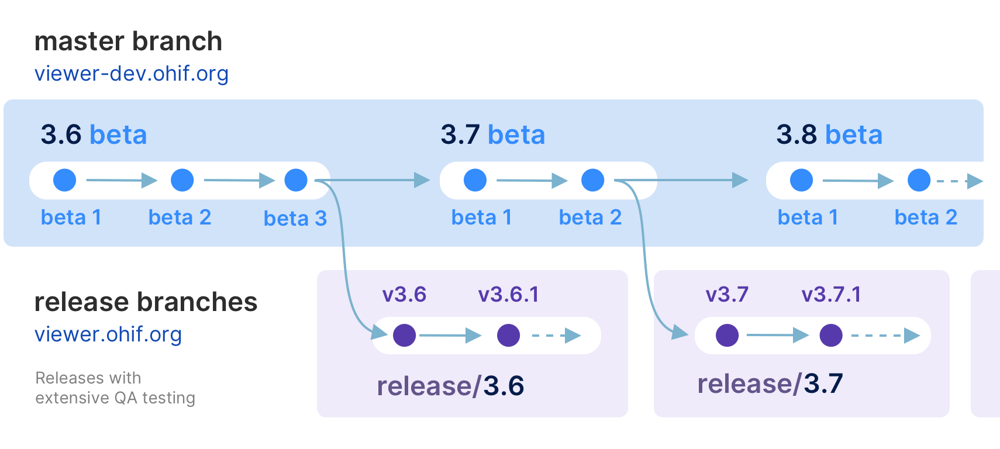

# Getting Started

## Setup

### Fork & Clone

If you intend to contribute back changes, or if you would like to pull updates
we make to the OHIF Viewer, then follow these steps:

- [Fork][fork-a-repo] the [OHIF/Viewers][ohif-viewers-repo] repository
- [Create a local clone][clone-a-repo] of your fork
  - `git clone https://github.com/YOUR-USERNAME/Viewers`
- Add OHIF/Viewers as a [remote repository][add-remote-repo] labeled `upstream`
  - Navigate to the cloned project's directory
  - `git remote add upstream https://github.com/OHIF/Viewers.git`

With this setup, you can now [sync your fork][sync-changes] to keep it
up-to-date with the upstream (original) repository. This is called a "Triangular
Workflow" and is common for Open Source projects. The GitHub blog has a [good
graphic that illustrates this setup][triangular-workflow].


### Private

Alternatively, if you intend to use the OHIF Viewer as a starting point, and you
aren't as concerned with syncing updates, then follow these steps:

1. Navigate to the [OHIF/Viewers][ohif-viewers] repository
2. Click `Clone or download`, and then `Download ZIP`
3. Use the contents of the `.zip` file as a starting point for your viewer

> NOTE: It is still possible to sync changes using this approach. However,
> submitting pull requests for fixes and features are best done with the
> separate, forked repository setup described in "Fork & Clone"

## Developing


### Branches

#### `master` branch - The latest dev (beta) release

- `master` - The latest dev release

This is typically where the latest development happens. Code that is in the master branch has passed code reviews and automated tests, but it may not be deemed ready for production. This branch usually contains the most recent changes and features being worked on by the development team. It's often the starting point for creating feature branches (where new features are developed) and hotfix branches (for urgent fixes).

Each package is tagged with beta version numbers, and published to npm such as `@ohif/ui@3.6.0-beta.1`

### `release/*` branches - The latest stable releases
Once the `master` branch code reaches a stable, release-ready state, we conduct a comprehensive code review and QA testing. Upon approval, we create a new release branch from `master`. These branches represent the latest stable version considered ready for production.

For example, `release/3.5` is the branch for version 3.5.0, and `release/3.6` is for version 3.6.0. After each release, we wait a few days to ensure no critical bugs. If any are found, we fix them in the release branch and create a new release with a minor version bump, e.g., 3.5.1 in the `release/3.5` branch.

Each package is tagged with version numbers and published to npm, such as `@ohif/ui@3.5.0`. Note that `master` is always ahead of the `release` branch. We publish docker builds for both beta and stable releases.

Here is a schematic representation of our development workflow:




### Requirements

- [Node.js & NPM](https://nodejs.org/en/)
- [Yarn](https://yarnpkg.com/en/)
- Yarn workspaces should be enabled:
  - `yarn config set workspaces-experimental true`

### Kick the tires

Navigate to the root of the project's directory in your terminal and run the
following commands:

```bash
# Restore dependencies
yarn install

# Start local development server
yarn run dev
```

You should see the following output:

```bash
@ohif/app: i ｢wds｣: Project is running at http://localhost:3000/
@ohif/app: i ｢wds｣: webpack output is served from /
@ohif/app: i ｢wds｣: Content not from webpack is served from D:\code\ohif\Viewers\platform\viewer
@ohif/app: i ｢wds｣: 404s will fallback to /index.html

# And a list of all generated files
```

### 🎉 Celebrate 🎉

<div style={{padding:"56.25% 0 0 0", position:"relative"}}>
    <iframe src="https://player.vimeo.com/video/843233770?badge=0&amp;autopause=0&amp;player_id=0&amp;app_id=58479" frameBorder="0" allow="autoplay; fullscreen; picture-in-picture" allowFullScreen style= {{ position:"absolute",top:0,left:0,width:"100%",height:"100%"}} title="measurement-report"></iframe>
</div>

### Building for Production

> More comprehensive guides for building and publishing can be found in our
> [deployment docs](./../deployment/index.md)

```bash
# Build static assets to host a PWA
yarn run build
```

## Troubleshooting

- If you receive a _"No Studies Found"_ message and do not see your studies, try
  changing the Study Date filters to a wider range.
- If you see a 'Loading' message which never resolves, check your browser's
  JavaScript console inside the Developer Tools to identify any errors.

<!--
  Links
  -->

<!-- prettier-ignore-start -->
[fork-a-repo]: https://help.github.com/en/articles/fork-a-repo
[clone-a-repo]: https://help.github.com/en/articles/fork-a-repo#step-2-create-a-local-clone-of-your-fork
[add-remote-repo]: https://help.github.com/en/articles/fork-a-repo#step-3-configure-git-to-sync-your-fork-with-the-original-spoon-knife-repository
[sync-changes]: https://help.github.com/en/articles/syncing-a-fork
[triangular-workflow]: https://github.blog/2015-07-29-git-2-5-including-multiple-worktrees-and-triangular-workflows/#improved-support-for-triangular-workflows
[ohif-viewers-repo]: https://github.com/OHIF/Viewers/
[ohif-viewers]: https://github.com/OHIF/Viewers
<!-- prettier-ignore-end -->
