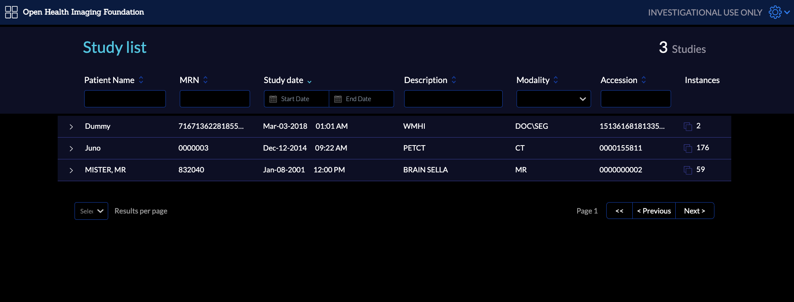
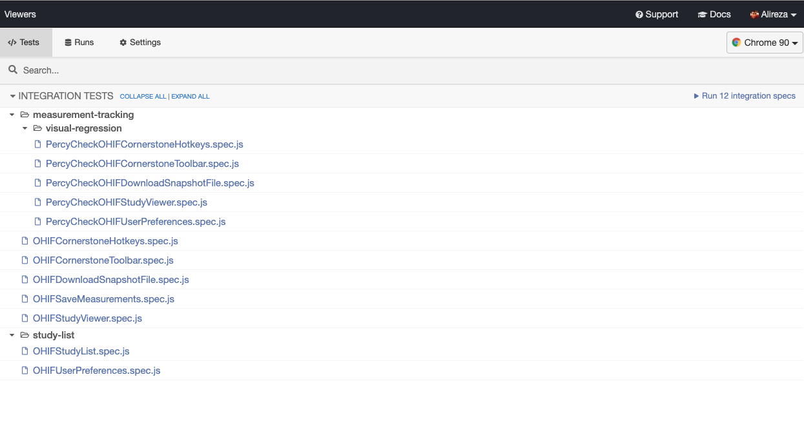
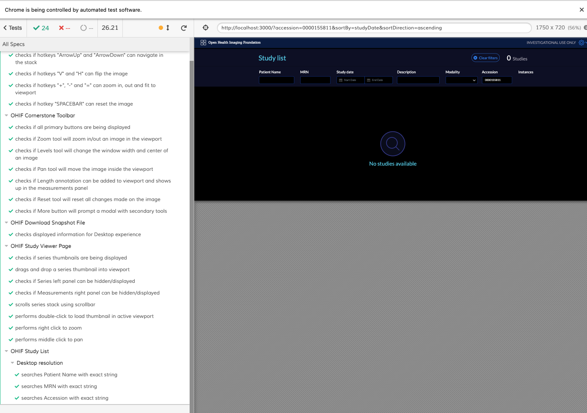

# Running Tests for OHIF

We introduce here various test types that is available for OHIF, and how to run
each test in order to make sure your contribution hasn't broken any existing
functionalities. Idea and philosophy of each testing category is discussed in
the second part of this page.

## Unit test

To run the unit test:

```bash
yarn run test:unit:ci
```

Note: You should have already installed all the packages with `yarn install`.

Running unit test will generate a report at the end showing the successful and
unsuccessful tests with detailed explanations.

## End-to-end test
For running the OHIF e2e test you need to run the following steps:

- Open a new terminal, and from the root of the OHIF mono repo, run the following command:

  ```bash
  yarn test:data
  ```

  This will download the required data to run the e2e tests (it might take a while).
  The `test:data` only needs to be run once and checks the data out. Read more about
  test data [below](#test-data).

- Run the viewer with e2e config

  ```bash
  APP_CONFIG=config/e2e.js yarn start
  ```

  You should be able to see test studies in the study list

  

- Open a new terminal inside the OHIF project, and run the e2e cypress test

  ```bash
  yarn test:e2e
  ```

  You should be able to see the cypress window open

  

  Run the tests by clicking on the `Run #number integration tests` .

  A new window will open, and you will see e2e tests being executed one after
  each other.

  

  ## Test Data
  The testing data is stored in two OHIF repositories.  The first contains the
  binary DICOM data, at [viewer-testdata](https://github.com/OHIF/viewer-testdata.git)
  while the second module contains data in the DICOMweb format, installed as a submodule
  into OHIF in the `testdata` directory.  This is retrieved via the command
  ```bash
  yarn test:data
  ```
  or the equivalent command `git submodule update --init`
  When adding new data, run:
  ```
  npm install -g dicomp10-to-dicomweb
  mkdicomweb -d dicomweb dcm
  ```
  to update the local dicomweb submodule in viewer-testdata.  Then, commit
  that data and update the submodules used in OHIF and in the viewer-testdata
  parent modules.

  All data MUST be fully anonymized and allowed to be used for open access.
  Any attributions should be included in the DCM directory.

## Testing Philosophy

> Testing is an opinionated topic. Here is a rough overview of our testing
> philosophy. See something you want to discuss or think should be changed? Open
> a PR and let's discuss.

You're an engineer. You know how to write code, and writing tests isn't all that
different. But do you know why we write tests? Do you know when to write one, or
what kind of test to write? How do you know if a test is a _"good"_ test? This
document's goal is to give you the tools you need to make those determinations.

Okay. So why do we write tests? To increase our... **CONFIDENCE**

- If I do a large refactor, does everything still work?
- If I changed some critical piece of code, is it safe to push to production?

Gaining the confidence we need to answer these questions after every change is
costly. Good tests allow us to answer them without manual regression testing.
What and how we choose to test to increase that confidence is nuanced.

## Further Reading: Kinds of Tests

Test's buy us confidence, but not all tests are created equal. Each kind of test
has a different cost to write and maintain. An expensive test is worth it if it
gives us confidence that a payment is processed, but it may not be the best
choice for asserting an element's border color.

| Test Type   | Example                                                                  | Speed            | Cost                                                                     |
| ----------- | ------------------------------------------------------------------------ | ---------------- | ------------------------------------------------------------------------ |
| Static      | `addNums(1, '2')` called with `string`, expected `int`.                  | :rocket: Instant | :money_with_wings:                                                       |
| Unit        | `addNums(1, 2)` returns expected result `3`                              | :airplane: Fast  | :money_with_wings::money_with_wings:                                     |
| Integration | Clicking "Sign In", navigates to the dashboard (mocked network requests) | :running: Okay   | :money_with_wings::money_with_wings::money_with_wings:                   |
| End-to-end  | Clicking "Sign In", navigates to the dashboard (no mocks)                | :turtle: Slow    | :money_with_wings::money_with_wings::money_with_wings::money_with_wings: |

- :rocket: Speed: How quickly tests run
- :money_with_wings: Cost: Time to write, and to debug when broken (more points
  of failure)

### Static Code Analysis

Modern tooling gives us this "for free". It can catch invalid regular
expressions, unused variables, and guarantee we're calling methods/functions
with the expected parameter types.

Example Tooling:

- [ESLint][eslint-rules]
- [TypeScript][typescript-docs] or [Flow][flow-org]

### Unit Tests

The building blocks of our libraries and applications. For these, you'll often
be testing a single function or method. Conceptually, this equates to:

_Pure Function Test:_

- If I call `sum(2, 2)`, I expect the output to be `4`

_Side Effect Test:_

- If I call `resetViewport(viewport)`, I expect `cornerstone.reset` to be called
  with `viewport`

#### When to use

Anything that is exposed as public API should have unit tests.

#### When to avoid

You're actually testing implementation details. You're testing implementation
details if:

- Your test does something that the consumer of your code would never do.
  - IE. Using a private function
- A refactor can break your tests

### Integration Tests

We write integration tests to gain confidence that several units work together.
Generally, we want to mock as little as possible for these tests. In practice,
this means only mocking network requests.

### End-to-End Tests

These are the most expensive tests to write and maintain. Largely because, when
they fail, they have the largest number of potential points of failure. So why
do we write them? Because they also buy us the most confidence.

#### When to use

Mission critical features and functionality, or to cover a large breadth of
functionality until unit tests catch up. Unsure if we should have a test for
feature `X` or scenario `Y`? Open an issue and let's discuss.

### General

- [Assert(js) Conf 2018 Talks][assert-js-talks]
  - [Write tests. Not too many. Mostly integration.][kent-talk] - Kent C. Dodds
  - [I see your point, but…][gleb-talk] - Gleb Bahmutov
- [Static vs Unit vs Integration vs E2E Testing][kent-blog] - Kent C. Dodds
  (Blog)

### End-to-end Testing w/ Cypress

- [Getting Started](https://docs.cypress.io/guides/overview/why-cypress.html)
  - Be sure to check out `Getting Started` and `Core Concepts`
- [Best Practices](https://docs.cypress.io/guides/references/best-practices.html)
- [Example Recipes](https://docs.cypress.io/examples/examples/recipes.html)

<!--
  Links
  -->

<!-- prettier-ignore-start -->
[eslint-rules]: https://eslint.org/docs/rules/
[mini-pacs]: https://github.com/OHIF/viewer-testdata
[typescript-docs]: https://www.typescriptlang.org/docs/home.html
[flow-org]: https://flow.org/
<!-- Talks -->
[assert-js-talks]: https://www.youtube.com/playlist?list=PLZ66c9_z3umNSrKSb5cmpxdXZcIPNvKGw
[kent-talk]: https://www.youtube.com/watch?v=Fha2bVoC8SE
[gleb-talk]: https://www.youtube.com/watch?v=5FnalKRjpZk
[kent-blog]: https://kentcdodds.com/blog/unit-vs-integration-vs-e2e-tests
<!-- Images -->
[testing-trophy]: https://twitter.com/kentcdodds/status/960723172591992832?ref_src=twsrc%5Etfw%7Ctwcamp%5Etweetembed%7Ctwterm%5E960723172591992832&ref_url=https%3A%2F%2Fkentcdodds.com%2Fblog%2Fwrite-tests
[aaron-square]: https://twitter.com/Carofine247/status/966727489274961920
[gleb-pyramid]: https://twitter.com/Carofine247/status/966764532046684160/photo/3
[testing-pyramid]: https://dojo.ministryoftesting.com/dojo/lessons/the-mobile-test-pyramid
[testing-dorito]: https://twitter.com/denvercoder/status/960752578198843392
[testing-dorito-img]: https://pbs.twimg.com/media/DVVHXycUMAAcN-F?format=jpg&name=4096x4096
<!-- prettier-ignore-end -->
