# Technical FAQ

* [How to add a custom icon to the viewport corners](./add-viewport-icon.md)


## Viewer opens but does not show any thumbnails

Thumbnails may not appear in your DICOMWeb application for various reasons. This guide focuses on one primary scenario, which is you are using
the `supportsWildcard: true` in your configuration file while your sever does not support it.
One

For instance for the following filtering in the worklist tab we send this request

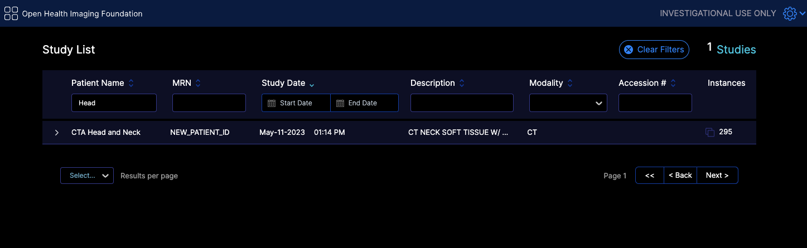

`https://d33do7qe4w26qo.cloudfront.net/dicomweb/studies?PatientName=*Head*&limit=101&offset=0&fuzzymatching=false&includefield=00081030%2C00080060`

Which our server can respond properly. If your server does not support this type of filtering, you can disable it by setting `supportsWildcard: false` in your configuration file,
or edit your server code to support it for instance something like

```js
Pseudocode:
For each filter in filters:
    if filter.value contains "*":
        Convert "*" to SQL LIKE wildcard ("%")
        Add "metadataField LIKE ?" to query
    else:
        Add "metadataField = ?" to query
```


## What are the list of required metadata for the OHIF Viewer to work?


### Mandatory

**All Modalities**

- `StudyInstanceUID`, `SeriesInstanceUID`, `SOPInstanceUID`: Unique identifiers for the study, series, and object.
- `PhotometricInterpretation`: Describes the color space of the image.
- `Rows`, `Columns`: Image dimensions.
- `PixelRepresentation`: Indicates how pixel data should be interpreted.
- `Modality`: Type of modality (e.g., CT, MR, etc.).
- `PixelSpacing`: Spacing between pixels.
- `BitsAllocated`: Number of bits allocated for each pixel sample.
- `SOPClassUID`: Specifies the DICOM service class of the object (though you might be able to render without it for most regular images datasets, but it is pretty normal to have it)

**Rendering**

You need to have the following tags for the viewer to render the image properly, otherwise you should
use the windowing tools to adjust the image to your liking:

- `RescaleIntercept`, `RescaleSlope`: Values used for rescaling pixel values for visualization.
- `WindowCenter`, `WindowWidth`: Windowing parameters for display.

**Some Datasets**

- `InstanceNumber`: Useful for sorting instances (without it the instances might be out of order)

**For MPR (Multi-Planar Reformatting) rendering and tools**

- `ImagePositionPatient`, `ImageOrientationPatient`: Position and orientation of the image in the patient.

**SEG (Segmentation)**

- `FrameOfReferenceUID` for handling segmentation layers.
- sequences
  - `ReferencedSeriesSequence`
  - `SharedFunctionalGroupsSequence`
  - `PerFrameFunctionalGroupsSequence`

**RTSTRUCT (Radiotherapy Structure)**

- `FrameOfReferenceUID` for handling segmentation layers.
- sequences
  - `ROIContourSequence`
  - `StructureSetROISequence`
  - `ReferencedFrameOfReferenceSequence`

**US (Ultrasound)**

- `NumberOfFrames`: Number of frames in a multi-frame image.
- `SequenceOfUltrasoundRegions`: For measurements.
- `FrameTime`: Time between frames if specified.

**SR (Structured Reporting)**

- Various sequences for encoding the report content and template.
  - `ConceptNameCodeSequence`
  - `ContentSequence`
  - `ContentTemplateSequence`
  - `CurrentRequestedProcedureEvidenceSequence`
  - `ContentTemplateSequence`
  - `CodingSchemeIdentificationSequence`

**PT with SUV Correction (Positron Tomography Standardized Uptake Value)**

- Sequences and tags related to radiopharmaceuticals, units, corrections, and timing.
  - `RadiopharmaceuticalInformationSequence`
  - `SeriesDate`
  - `SeriesTime`
  - `CorrectedImage`
  - `Units`
  - `DecayCorrection`
  - `AcquisitionDate`
  - `AcquisitionTime`
  - `PatientWeight`

**PDF**

- `EncapsulatedDocument`: Contains the PDF document.

**Video**

- `NumberOfFrames`: Video frame count .


### Optional
There are various other optional tags that will add to the viewer experience, but are not required for basic functionality. These include:
Patient Information, Study Information, Series Information, Instance Information, and Frame Information.


## How do I handle large volumes for MPR and Volume Rendering

Currently there are two ways to handle large volumes for MPR and Volume Rendering if that does not
fit in the memory of the client machine.

### `useNorm16Texture`

WebGL officially supports only 8-bit and 32-bit data types. For most images, 8 bits are not enough, and 32 bits are too much. However, we have to use the 32-bit data type for volume rendering and MPR, which results in suboptimal memory consumption for the application.

Through [EXT_texture_norm16](https://registry.khronos.org/webgl/extensions/EXT_texture_norm16/) , WebGL can support 16 bit data type which is ideal
for most images. You can look into the [webgl report](https://webglreport.com/?v=2) to check if you have that extension enabled.

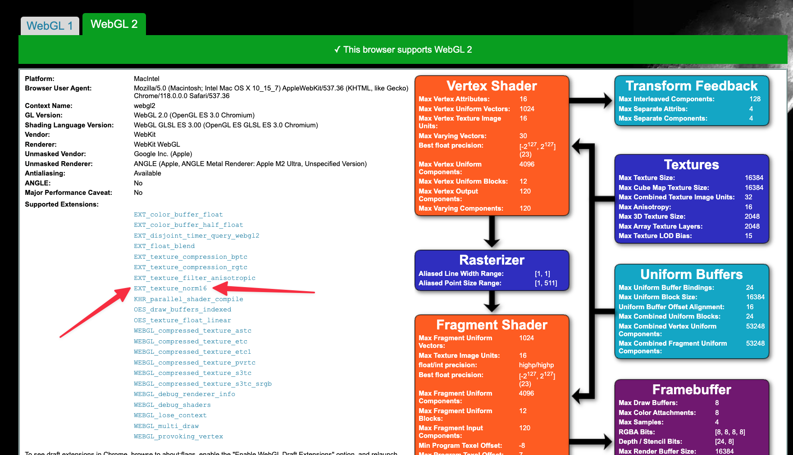


This is a flag that you can set in your [configuration file](../configuration/configurationFiles.md) to force usage of 16 bit data type for the volume rendering and MPR. This will reduce the memory usage by half.


For instance for a large pt/ct study

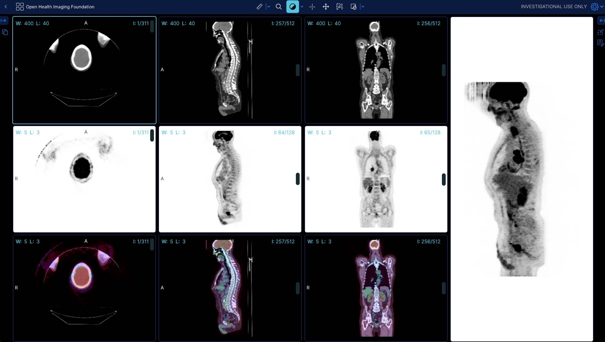

Before (without the flag) the app shows 399 MB of memory usage

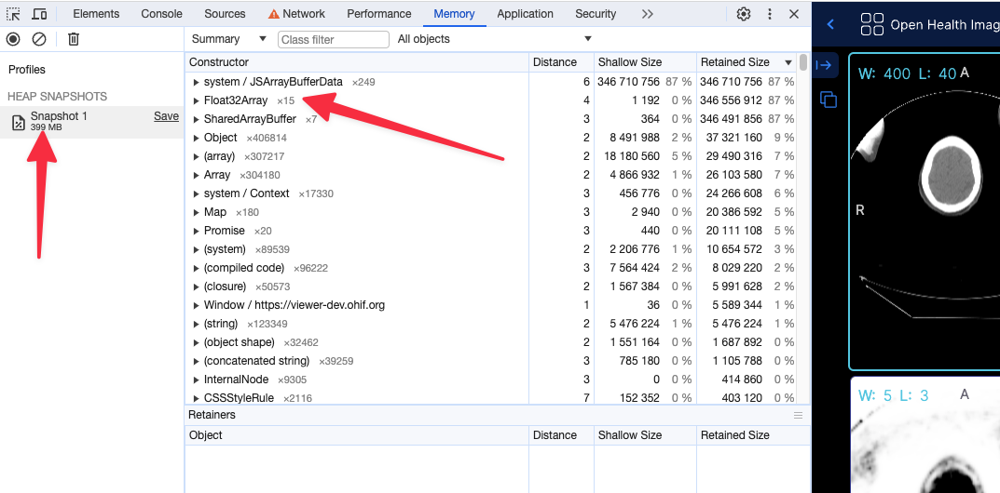


After (with flag, running locally) the app shows 249 MB of memory usage


:::note
Using the 16 bit texture (if supported) will not have any effect in the rendering what so ever, and pixelData
would be exactly shown as it is. For datasets that cannot be represented with 16 bit data type, the flag will be ignored
and the 32 bit data type will be used.


Read more about these discussions in our PRs
- https://github.com/Kitware/vtk-js/pull/2058
:::


:::warning
Although the support for 16 bit data type is available in WebGL, in some settings (e.g., Intel-based Macos) there seems
to be still some issues with it. You can read and track bugs below.

- https://bugs.chromium.org/p/chromium/issues/detail?id=1246379
- https://bugs.chromium.org/p/chromium/issues/detail?id=1408247
:::

### `preferSizeOverAccuracy`

This is another flag that you can set in your [configuration file](../configuration/configurationFiles.md) to force the usage of the `half_float` data type for volume rendering and MPR. The main reason to choose this option over `useNorm16Texture` is its broader support across hardware and browsers. However, it is less accurate than the 16-bit data type and may lead to some rendering artifacts.

```js
Integers between 0 and 2048 can be exactly represented (and also between −2048 and 0)
Integers between 2048 and 4096 round to a multiple of 2 (even number)
Integers between 4096 and 8192 round to a multiple of 4
Integers between 8192 and 16384 round to a multiple of 8
Integers between 16384 and 32768 round to a multiple of 16
Integers between 32768 and 65519 round to a multiple of 32
```

As you see in the ranges above 2048 there will be inaccuracies in the rendering.

Memory snapshot after enabling `preferSizeOverAccuracy` for the same study as above

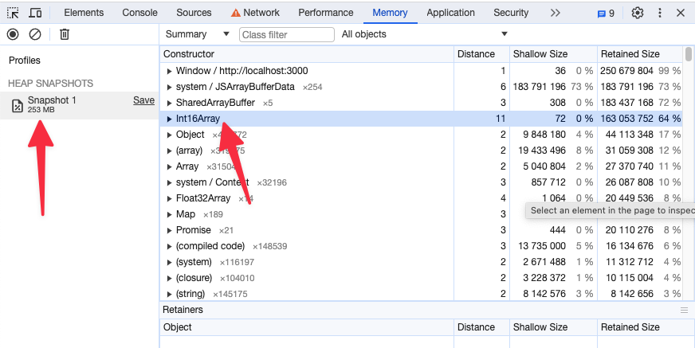


## How to dynamically load a measurement

You can dynamically load a measurement by using a combination of `MeasurementService` and `CornerstoneTools` Annotation API. Here, we will demonstrate this with an example of loading a `Rectangle` measurement.

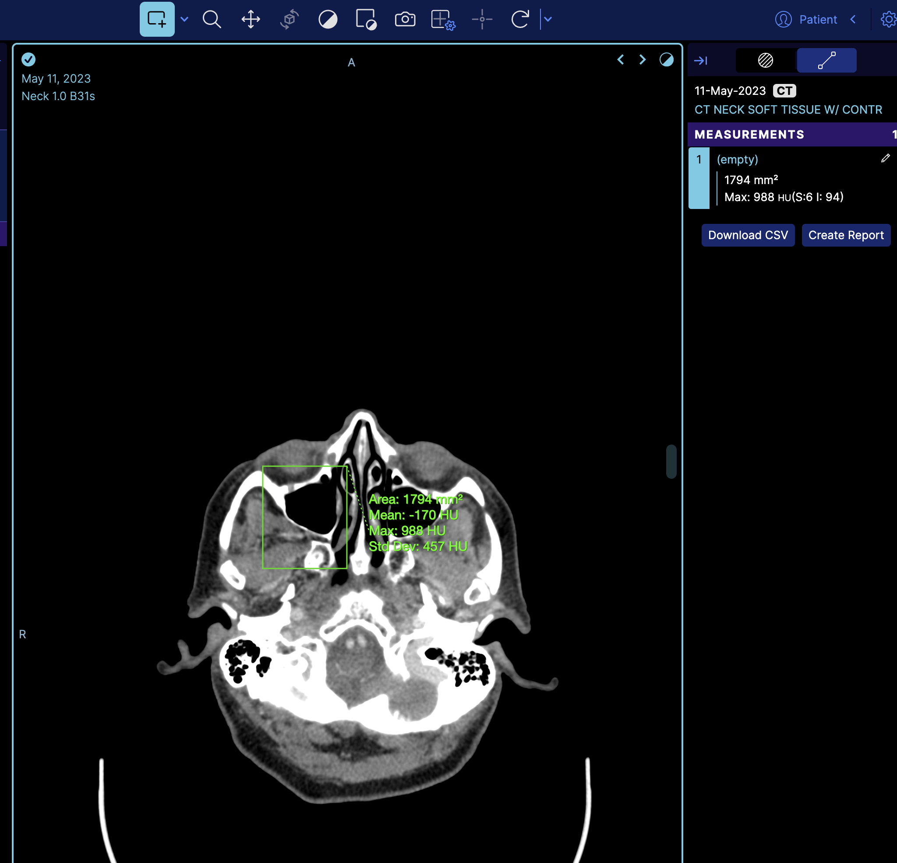

So if we look at the terminal and get the measurement service we can see there is one measurement

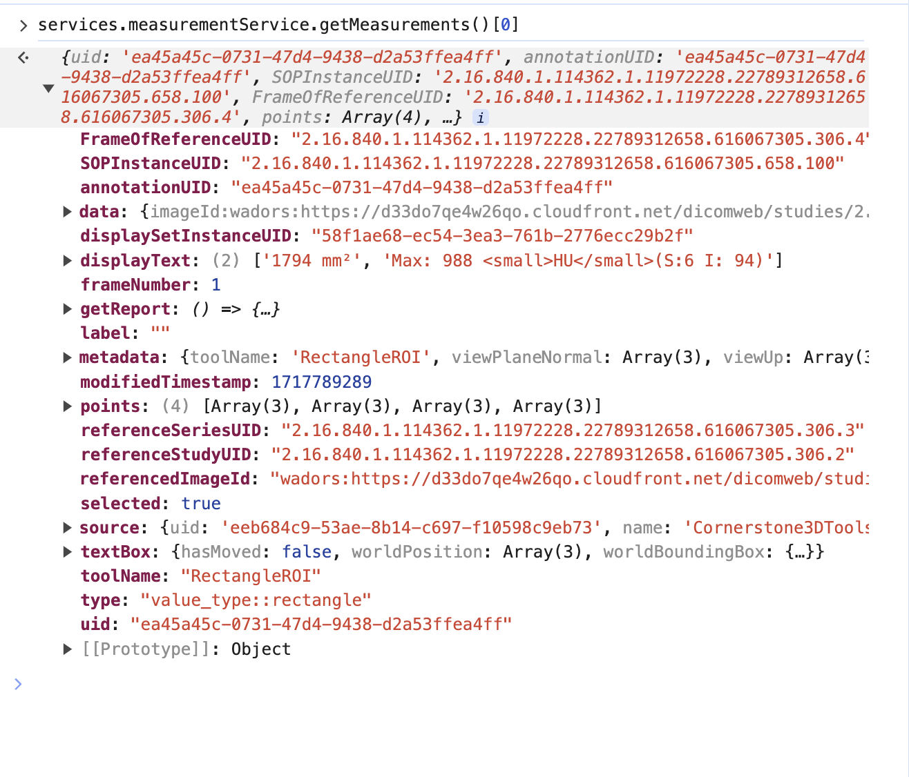

However, this is the `mapped` cornerstone measurement inside OHIF, and it has additional information such as `geReport` and `source`, which are internal details of OHIF Viewers that you don't need to worry about.

we can call the `cornerstoneTools` api to grab the raw annotation data with the `uid`

`cornerstoneTools.annotation.state.getAnnotation("ea45a45c-0731-47d4-9438-d2a53ffea4ff")`

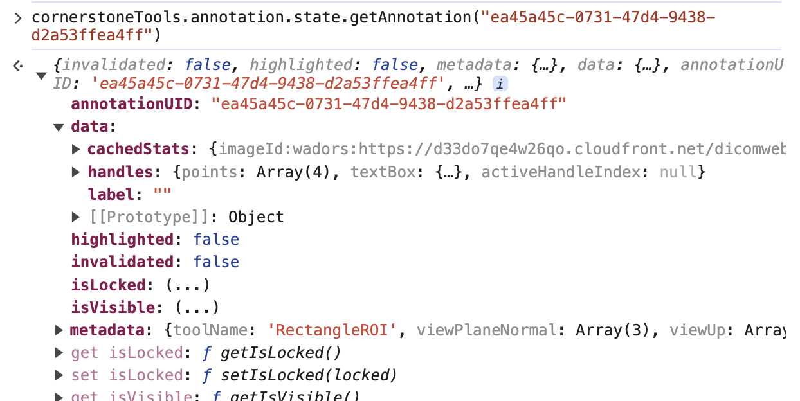


:::note
Note: There is a `pointsInShape` attribute inside the data that stores the points within the annotation for some tools like `Rectangle` and `EllipticalRoi`. However, you can remove that attribute as well.
:::

For the sake of this example, I have extracted those keys and uploaded them to our server for fetching.

`
https://ohif-assets.s3.us-east-2.amazonaws.com/ohif-faq/rectangle-roi.json
`

Now, let's discuss how to load this measurement dynamically and programmatically.

There are numerous places in OHIF where you can add annotations, but we always recommend having your own extensions and modes to maintain full control over your custom API.

For this example, I will add the logic in the `longitudinal` mode. However, as mentioned, you can create your own extension and mode, and either use `onModeEnter` or other lifecycle hooks to add annotations. Learn more about lifecycle hooks [here](../platform/extensions/lifecycle.md).


Of course, you need to load the appropriate measurement for each study. However, for simplicity's sake, I will hardcode the URL in this example.

```js
import * as cs3dTools from '@cornerstonejs/tools';

onModeEnter: function ({ servicesManager, extensionManager, commandsManager }: withAppTypes) {
  // rest of logic

  const annotationResponse = await fetch(
    'https://ohif-assets.s3.us-east-2.amazonaws.com/ohif-faq/rectangle-roi.json'
  );

  const annotationData = await annotationResponse.json();

  cs3dTools.annotation.state.addAnnotation(annotationData);
},
```

As you can see, we use the CornerstoneTools API to add the annotation. Since OHIF has mappers set up for CornerstoneTools (`extensions/cornerstone/src/utils/measurementServiceMappings/measurementServiceMappingsFactory.ts`), it will automatically map the annotation to the OHIF measurement service.

If you refresh the viewer, you'll see the measurement loaded on the image.

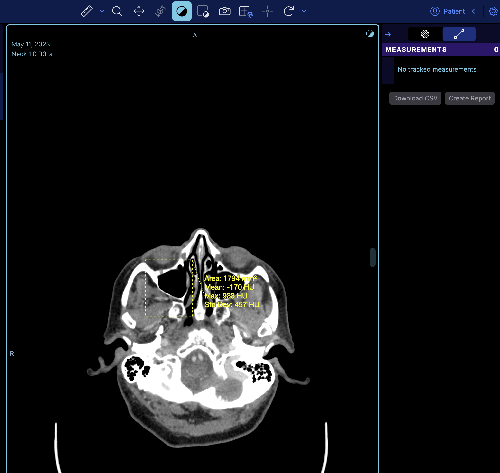

But if you notice it does not appear on the right panel, the reason is that the right panel is the tracking measurement panel. You can switch to a non-tracking measurement by changing

`rightPanels: [dicomSeg.panel, tracked.measurements],`

to

`rightPanels: [dicomSeg.panel, '@ohif/extension-default.panelModule.measure'],`

which then it will look like

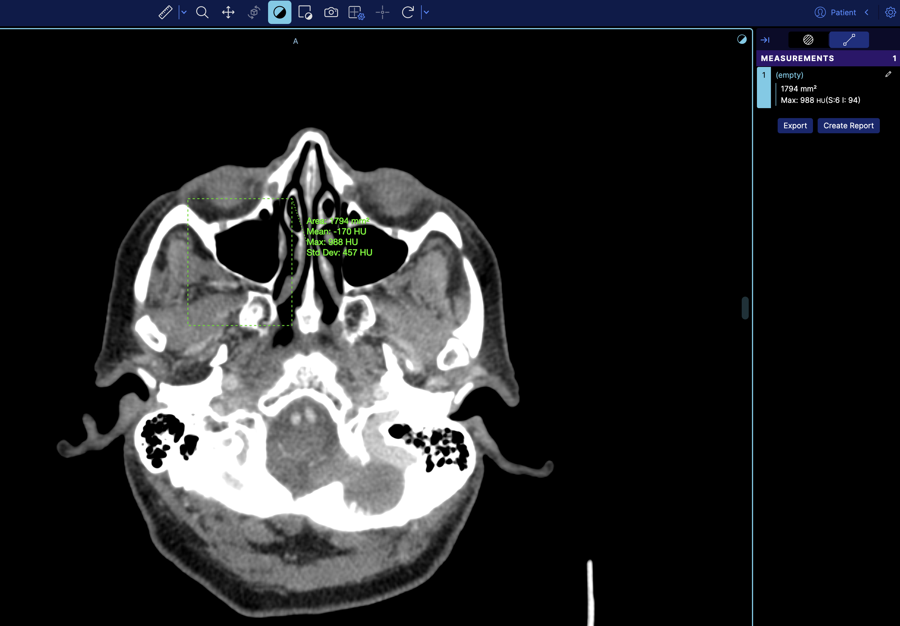


:::info
There is also dedicated example for this in the [cornerstone3D examples](https://www.cornerstonejs.org/live-examples/dynamicallyaddannotations).
:::


## How do I sort the series in the study panel by a specific value

You need to enable the experimental StudyBrowserSort component by setting the `experimentalStudyBrowserSort` to true in your config file. This will add a dropdown in the study panel to sort the series by a specific value. This component is experimental
since we are re-deigning the study panel and it might change in the future, but the functionality will remain the same.

```js
{
  experimentalStudyBrowserSort: true,
}
```
The component will appear in the study panel and will allow you to sort the series by a specific value. It comes with 3 default sorting functions, Series Number, Series Image Count, and Series Date.

You can sort the series in the study panel by a specific value by adding a custom sorting function in the customizationModule, you can use the existing customizationModule in `extensions/default/src/getCustomizationModule.tsx` or create your own in your extension.

The value to be used for the entry is `studyBrowser.sortFunctions` and should be under the `default` key.

### Example

```js
export default function getCustomizationModule({ servicesManager, extensionManager }) {
  return [
    {
      name: 'default',
      value: [

        {
          id: 'studyBrowser.sortFunctions',
          values: [
            {
              label: 'Series Number',
              sortFunction: (a, b) => {
                return a?.SeriesNumber - b?.SeriesNumber;
              },
            },
            // Add more sort functions as needed
          ],
        },
      ],
    },
  ];
}
```

### Explanation
This function will be retrieved by the StudyBrowserSort component and will be used to sort all displaySets, it will reflect in all parts of the app since it works at the displaySetService level, which means the thumbnails in the study panel will also be sorted by the desired value.
You can define multiple functions and pick which sort to use via the dropdown in the StudyBrowserSort component that appears in the study panel.


## How can i change the sorting of the thumbnail / study panel / study browser
We are currently redesigning the study panel and the study browser. During this process, you can enable our undesigned component via the `experimentalStudyBrowserSort` flag. This will look like:

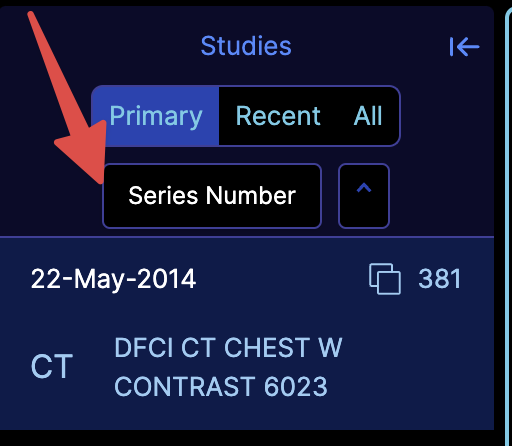

You can also add your own sorting functions by utilizing the `customizationService` and adding the `studyBrowser.sortFunctions` key, as shown below:

```
customizationService.addModeCustomizations([
  {
    id: 'studyBrowser.sortFunctions',
    values: [{
      label: 'Series Images',
      sortFunction: (a, b) => {
        return a?.numImageFrames - b?.numImageFrames;
      },
    }],
  },
]);
```

:::note
Notice the arrays and objects, the values are arrays
:::


## How do I change the cine auto mount behavior

You can change the cine auto mount behavior by adding the `autoCineModalities` mode customization, the value is an array of modalities that should be mounted with cine.

By default the viewer will mount with cine enabled for `OT` and `US` modalities.

```js
customizationService.addModeCustomizations([
  {
    id: 'autoCineModalities',
    modalities: ['OT', 'US'],
  },
]);
```
