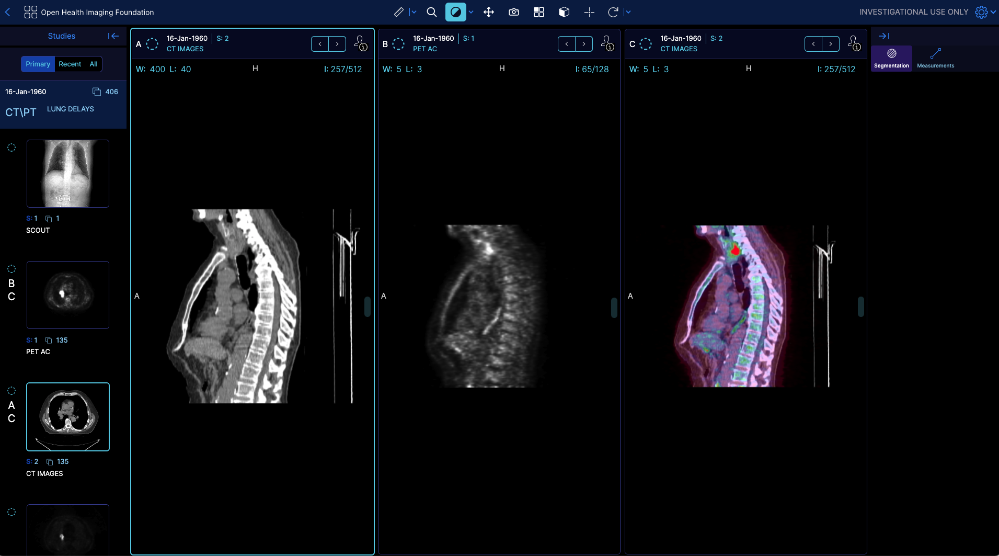

# Module: Hanging Protocol

## Overview

[Hanging protocols](http://dicom.nema.org/dicom/Conf-2005/Day-2_Selected_Papers/B305_Morgan_HangProto_v1.pdf) are an essential part of any radiology viewer.
OHIF uses Hanging Protocols to handle the arrangement of the images in the viewport. In
short, the registered protocols will get matched with the DisplaySets that are
available. Each protocol gets a score, and they are ranked. The
winning protocol (highest score) gets applied and its settings run for the viewports
to be arranged.


In `OHIF-v3` hanging protocols you can:

- Define what layout the viewport should starts with (e.g., 2x2 layout)
- Specify the type of the viewport and its orientation (e.g., stack, volume with Sagittal view)
- Define which displaySets gets displayed in which viewport of the layout (e.g,. displaySet that has modality of 'CT' and 'SeriesDescription' of 'Coronary Arteries' gets displayed in the first viewport of the layout)
- Apply certain initial viewport settings (e.g., inverting the contrast, jumping to a specific slice, etc.)
- Add specific synchronization rules for the viewports (e.g., synchronize the zoom of the viewports of the index 1, 2 OR synchronize the VOI of the viewports of the index 2, 3)


Using `hangingProtocolModule` you can provide/register the protocols for OHIF to
utilize.

Here is an example protocol which if used will hang a 1x3 layout with the first viewport showing a CT image, the second viewport showing a PT image and the third viewport showing their fusion, all in Sagittal orientations to achieve a view of





```js
const oneByThreeProtocol = {
  id: 'oneByThreeProtocol',
  locked: true,
  name: 'Default',
  createdDate: '2021-02-23T19:22:08.894Z',
  modifiedDate: '2022-10-04T19:22:08.894Z',
  availableTo: {},
  editableBy: {},
  imageLoadStrategy: 'interleaveTopToBottom',
  protocolMatchingRules: [
    {
      attribute: 'ModalitiesInStudy',
      constraint: {
        contains: ['CT', 'PT'],
      },
    },
  ],
  displaySetSelectors: {
    ctDisplaySet: {
      seriesMatchingRules: [
        {
          weight: 1,
          attribute: 'Modality',
          constraint: {
            equals: {
              value: 'CT',
            },
          },
          required: true,
        },
        {
          weight: 1,
          attribute: 'isReconstructable',
          constraint: {
            equals: {
              value: true,
            },
          },
          required: true,
        },
      ],
    },
    ptDisplaySet: {
      seriesMatchingRules: [
        {
          attribute: 'Modality',
          constraint: {
            equals: 'PT',
          },
          required: true,
        },
        {
          weight: 1,
          attribute: 'isReconstructable',
          constraint: {
            equals: {
              value: true,
            },
          },
          required: true,
        },
        {
          attribute: 'SeriesDescription',
          constraint: {
            contains: 'Corrected',
          },
        },
      ],
    },
  },
  stages: [
    {
      id: 'hYbmMy3b7pz7GLiaT',
      name: 'default',
      viewportStructure: {
        layoutType: 'grid',
        properties: {
          rows: 1,
          columns: 3,
        },
      },
      viewports: [
        {
          viewportOptions: {
            viewportId: 'ctAXIAL',
            viewportType: 'volume',
            orientation: 'sagittal',
            initialImageOptions: {
              preset: 'middle',
            },
            syncGroups: [
              {
                type: 'voi',
                id: 'ctWLSync',
                source: true,
                target: true,
              },
            ],
          },
          displaySets: [
            {
              id: 'ctDisplaySet',
            },
          ],
        },
        {
          viewportOptions: {
            viewportId: 'ptAXIAL',
            viewportType: 'volume',
            orientation: 'sagittal',
            initialImageOptions: {
              preset: 'middle',
            },
          },
          displaySets: [
            {
              id: 'ptDisplaySet',
            },
          ],
        },
        {
          viewportOptions: {
            viewportId: 'fusionSAGITTAL',
            viewportType: 'volume',
            orientation: 'sagittal',
            initialImageOptions: {
              preset: 'middle',
            },
            syncGroups: [
              {
                type: 'voi',
                id: 'ctWLSync',
                source: false,
                target: true,
              },
            ],
          },
          displaySets: [
            {
              id: 'ctDisplaySet',
            },
            {
              options: {
                colormap: 'hsv',
                voi: {
                  windowWidth: 5,
                  windowCenter: 2.5,
                },
              },
              id: 'ptDisplaySet',
            },
          ],
        },
      ],
      createdDate: '2021-02-23T18:32:42.850Z',
    },
  ],
  numberOfPriorsReferenced: -1,
};


function getHangingProtocolModule() {
  return [
    {
      id: 'oneByThreeProtocol',
      protocol: oneByThreeProtocol,
    },
  ];
}
```


## Skeleton of a Protocol

The skeleton of a hanging protocol is as follows:


### Id
unique identifier for the protocol, this id can be used inside mode configuration
to specify which protocol should be used for a specific mode. A mode can
request a protocol by its id (which makes OHIF to apply the protocol without
matching), or provides an array of ids which will
make the ProtocolEngine to choose the best matching protocol (based on
protocolMatching rules, which is next section).

### imageLoadStrategy
The image load strategy specifies a function (by name) containing logic to re-order
the image load requests.  This allows loading images viewed earlier to be done
sooner than those loaded later.  The available strategies are:

* interleaveTopToBottom to start at the top and work towards the bottom, for all series being loaded
* interleaveCenter is like top to bottom but starts at the center
* nth is a strategy that loads every nth instance, starting with the center
and end points, and then filling in progressively all along the image.  This results in partial
image view very quickly.

### protocolMatchingRules
A list of criteria for the protocol along with the provided points for ranking.

  - `weight`: weight for the matching rule. Eventually, all the registered
    protocols get sorted based on the weights, and the winning protocol gets
    applied to the viewer.
  - `attribute`: tag that needs to be matched against. This can be either
    Study-level metadata or a custom attribute such as "StudyInstanceUID",
    "StudyDescription", "ModalitiesInStudy", "NumberOfStudyRelatedSeries", "NumberOfSeriesRelatedInstances"
    In addition to these tags, you can also use a custom attribute that you have registered before.
    We will learn more about this later.
  - `from`: Indicates the source of the attribute.  This allows getting values
    from other objects such as the `prior` instance object instead of from the
    current one.


  - `constraint`: the constraint that needs to be satisfied for the attribute. It accepts a `validator` which can be
    [`equals`, `doesNotEqual`, `contains`, `doesNotContain`, `startsWith`, `endsWidth`]

 | Rule | Single Value | Array Value | Example |
|------|--------------|-------------|---------|
| equals | &equals;&equals;&equals; | All members are &equals;&equals;&equals; in same order | value &equals; ['abc', 'def', 'GHI']<br/>testValue &equals; 'abc' (Fail)<br/>&equals; ['abc'] (Fail)<br/>&equals; ['abc', 'def', 'GHI'] (Valid)<br/>&equals; ['abc', 'GHI', 'def'] (Fail)<br/>&equals; ['abc', 'def'] (Fail)<br/><br/>value &equals; 'Attenuation Corrected'<br/>testValue &equals; 'Attenuation Corrected' (Valid)<br/>&equals; 'Attenuation' (Fail)<br/><br/>value &equals; ['Attenuation Corrected']<br/>testValue &equals; ['Attenuation Corrected'] (Valid)<br/>&equals; 'Attenuation Corrected' (Valid)<br/>&equals; 'Attenuation' (Fail) |
| doesNotEqual | !&equals;&equals; | Any member is !&equals;&equals; for the array, either in value, order, or length | value &equals; ['abc', 'def', 'GHI']<br/>testValue &equals; 'abc' (Valid)<br/>&equals; ['abc'] (Valid)<br/>&equals; ['abc', 'def', 'GHI'] (Fail)<br/>&equals; ['abc', 'GHI', 'def'] (Valid)<br/>&equals; ['abc', 'def'] (Valid)<br/><br/>value &equals; 'Attenuation Corrected'<br/>testValue &equals; 'Attenuation Corrected' (Fail)<br/>&equals; 'Attenuation' (Valid)<br/><br/>value &equals; ['Attenuation Corrected']<br/>testValue &equals; ['Attenuation Corrected'] (Fail)<br/>&equals; 'Attenuation Corrected' (Fail)<br/>&equals; 'Attenuation' (Fail) |
| includes | Not allowed | Value is equal to one of the values of the array | value &equals; ['abc', 'def', 'GHI']<br/>testValue &equals; ['abc'] (Valid)<br/>&equals; 'abc' (Fail)<br/>&equals; ['abc'] (Fail)<br/>&equals; 'dog' (Fail)<br/>&equals; ['att', 'abc'] (Valid)<br/>&equals; ['abc', 'def', 'dog'] (Valid)<br/>&equals; ['cat', 'dog'] (Fail)<br/><br/>value &equals; 'Attenuation Corrected'<br/>testValue &equals; ['Attenuation Corrected', 'Corrected'] (Valid)<br/>&equals; ['Attenuation', 'Corrected'] (Fail)<br/><br/>value &equals; ['Attenuation Corrected']<br/>testValue &equals; 'Attenuation Corrected' (Fail)<br/>&equals; ['Attenuation Corrected', 'Corrected'] (Valid)<br/>&equals; ['Attenuation', 'Corrected'] (Fail) |
| doesNotInclude | Not allowed | Value is not in one of the values of the array | value &equals; ['abc', 'def', 'GHI']<br/>testValue &equals; 'Corr' (Valid)<br/>&equals; 'abc' (Fail)<br/>&equals; ['att', 'cor'] (Valid)<br/>&equals; ['abc', 'def', 'dog'] (Fail)<br/><br/>value &equals; 'Attenuation Corrected'<br/>testValue &equals; ['Attenuation Corrected', 'Corrected'] (Fail)<br/>&equals; ['Attenuation', 'Corrected'] (Valid)<br/><br/>value &equals; ['Attenuation Corrected']<br/>testValue &equals; 'Attenuation' (Fail)<br/>&equals; ['Attenuation Corrected', 'Corrected'] (Fail)<br/>&equals; ['Attenuation', 'Corrected'] (Valid) |
| containsI | String containment (case insensitive) | String containment (case insensitive) is OK for one of the rule values | value &equals; 'Attenuation Corrected'<br/>testValue &equals; 'Corr' (Valid)<br/>&equals; 'corr' (Valid)<br/>&equals; ['att', 'cor'] (Valid)<br/>&equals; ['Att', 'Wall'] (Valid)<br/>&equals; ['cat', 'dog'] (Fail)<br/><br/>value &equals; ['abc', 'def', 'GHI']<br/>testValue &equals; 'def' (Valid)<br/>&equals; 'dog' (Fail)<br/>&equals; ['gh', 'de'] (Valid)<br/>&equals; ['cat', 'dog'] (Fail) |
| contains | String containment (case sensitive) | String containment (case sensitive) is OK for one of the rule values | value &equals; 'Attenuation Corrected'<br/>testValue &equals; 'Corr' (Valid)<br/>&equals; 'corr' (Fail)<br/>&equals; ['att', 'cor'] (Fail)<br/>&equals; ['Att', 'Wall'] (Valid)<br/>&equals; ['cat', 'dog'] (Fail)<br/><br/>value &equals; ['abc', 'def', 'GHI']<br/>testValue &equals; 'def' (Valid)<br/>&equals; 'dog' (Fail)<br/>&equals; ['cat', 'de'] (Valid)<br/>&equals; ['cat', 'dog'] (Fail) |
| doesNotContain | String containment is false | String containment is false for all values of the array | value &equals; 'Attenuation Corrected'<br/>testValue &equals; 'Corr' (Fail)<br/>&equals; 'corr' (Valid)<br/>&equals; ['att', 'cor'] (Valid)<br/>&equals; ['Att', 'Wall'] (Fail)<br/>&equals; ['cat', 'dog'] (Valid)<br/><br/>value &equals; ['abc', 'def', 'GHI']<br/>testValue &equals; 'def' (Fail)<br/>&equals; 'dog' (Valid)<br/>&equals; ['cat', 'de'] (Fail)<br/>&equals; ['cat', 'dog'] (Valid) |
| doesNotContainI | String containment is false (case insensitive) | String containment (case insensitive) is false for all values of the array | value &equals; 'Attenuation Corrected'<br/>testValue &equals; 'Corr' (Fail)<br/>&equals; 'corr' (Fail)<br/>&equals; ['att', 'cor'] (Fail)<br/>&equals; ['Att', 'Wall'] (Fail)<br/>&equals; ['cat', 'dog'] (Valid)<br/><br/>value &equals; ['abc', 'def', 'GHI']<br/>testValue &equals; 'DEF' (Fail)<br/>&equals; 'dog' (Valid)<br/>&equals; ['cat', 'gh'] (Fail)<br/>&equals; ['cat', 'dog'] (Valid) |
| startsWith | Value begins with characters | Starts with one of the values of the array | value &equals; 'Attenuation Corrected'<br/>testValue &equals; 'Corr' (Fail)<br/>&equals; 'Att' (Fail)<br/>&equals; ['cat', 'dog', 'Att'] (Valid)<br/>&equals; ['cat', 'dog'] (Fail)<br/><br/>value &equals; ['abc', 'def', 'GHI']<br/>testValue &equals; 'deg' (Valid)<br/>&equals; ['cat', 'GH'] (Valid)<br/>&equals; ['cat', 'gh'] (Fail)<br/>&equals; ['cat', 'dog'] (Fail) |
| endsWith | Value ends with characters | ends with one of the value of the array | value &equals; 'Attenuation Corrected'<br/>testValue &equals; 'TED' (Fail)<br/>&equals; 'ted' (Valid)<br/>&equals; ['cat', 'dog', 'ted'] (Valid)<br/>&equals; ['cat', 'dog'] (Fail)<br/><br/>value &equals; ['abc', 'def', 'GHI']<br/>testValue &equals; 'deg' (Valid)<br/>&equals; ['cat', 'HI'] (Valid)<br/>&equals; ['cat', 'hi'] (Fail)<br/>&equals; ['cat', 'dog'] (Fail) |
| greaterThan | value is &gt;&equals; to rule | Not applicable | value &equals; 30<br/>testValue &equals; 20 (Valid)<br/>&equals; 40 (Fail) |
| lessThan | value is &lt;&equals; to rule | Not applicable | value &equals; 30<br/>testValue &equals; 40 (Valid)<br/>&equals; 20 (Fail) |
| range | Not applicable | 2 value requested (min and max) | value &equals; 50<br/>testValue &equals; [10,60] (Valid)<br/>&equals; [60, 10] (Valid)<br/>&equals; [0, 10] (Fail)<br/>&equals; [70, 80] (Fail)<br/>&equals; 45 (Fail)<br/>&equals; [45] (Fail) |
| notNull | Not Applicable | Not Applicable | No value |                                                                                                                                                                                                                                                                                                                                                                                                                                                                                                                                                                                              |
    A sample of the matching rule is above which matches against the study description to be PETCT

    ```js
    {
      id: 'wauZK2QNEfDPwcAQo',
      weight: 1,
      attribute: 'StudyDescription',
      constraint: {
        contains: {
          value: 'PETCT',
        },
      },
      required: false,
    },
    ```

### `from` attribute (optional)
The `from` attribute allows you to retrieve the attribute to test from another object, such as the previous study, the overall list of studies, or another provided value from a module.

The values provided by OHIF which you can use are:

-  `activeStudy`: to use the metadata of the active study to match
-  `studies`: to use the metadata of the list of studies (all studies) to match
-  `allDisplaySets`: all available display sets
-  `displaySets`: if the selector has matched a study, these are the display sets for that study
-  `prior`: the metadata of the first study in the list of studies that is not the active study
-  `options`: during matching, we also provide an options object with the following information that you can use as the `from` value:
  - `studyInstanceUIDsIndex`: the index of the study in the list of studies
  - `instance`: the metadata of the instance being matched, which is exactly the displaySet.instance metadata.


### displaySetSelectors (mandatory)
Defines the display sets that the protocol will use for arrangement.

```js
  displaySetSelectors: {
    ctDisplaySet: {
      seriesMatchingRules: [
        {
          weight: 1,
          attribute: 'Modality',
          constraint: {
            equals: {
              value: 'CT',
            },
          },
          required: true,
        },
        {
          weight: 1,
          attribute: 'isReconstructable',
          constraint: {
            equals: {
              value: true,
            },
          },
          required: true,
        },
      ],
    },
    ptDisplaySet: {
      seriesMatchingRules: [
        {
          attribute: 'Modality',
          constraint: {
            equals: 'PT',
          },
          required: true,
        },
        {
          weight: 1,
          attribute: 'isReconstructable',
          constraint: {
            equals: {
              value: true,
            },
          },
          required: true,
        },
        {
          attribute: 'SeriesDescription',
          constraint: {
            contains: 'Corrected',
          },
        },
      ],
    },
  }
```

As you see above we have specified two displaysets: 1) ctDisplaySet , 2) ptDisplaySet
The ctDisplaySet will match against all the series that are CT and reconstructable
The ptDisplaySet will match against all the series that are PT and reconstructable.

As you see each selector is composed of an `id` as the key and a set of `seriesMatchingRules` (displaySetMatchingRules) which gives score to the displaySet
based on the matching rules. The displaySet with the highest score will be used for the `id`.

### stages
Each protocol can define one or more stages. Each stage defines a certain layout and viewport rules. Therefore, the `stages` property is an array of objects, each object being one stage.

### viewportStructure
Defines the layout of the viewer. You can define the number of `rows` and `columns`. There should be `rows * columns` number of
viewport configuration in the `viewports` property. Note that order of viewports are rows first then columns.

```js
viewportStructure: {
    type: 'grid',
    properties: {
      rows: 1,
      columns: 2,
      viewportOptions: [],
    },
},
```

In addition to the equal viewport sizes, you can define viewports to span multiple rows or columns.

```js
viewportStructure: {
    type: 'grid',
    properties: {
      rows: 1,
      columns: 2,
      viewportOptions: [
        {
          x: 0,
          y: 0,
          width: 1 / 4,
          height: 1,
        },
        {
          x: 1 / 4,
          y: 0,
          width: 3 / 4,
          height: 1,
        },
      ],
    },
},

```


### viewports
This field includes the viewports that will get hung on the viewer.

```js
viewports: [
  {
    viewportOptions: {
      viewportId: 'ctAXIAL',
      viewportType: 'volume',
      orientation: 'sagittal',
      initialImageOptions: {
        preset: 'middle',
      },
      syncGroups: [
        {
          type: 'voi',
          id: 'ctWLSync',
          source: true,
          target: true,
        },
      ],
    },
    displaySets: [
      {
        id: 'ctDisplaySet',
      },
    ],
  },
  // the rest
],
```

As you can see in the hanging protocol we defined three viewports (but only showing one of them right above). Each viewport has two properties:

1. `viewportOptions`: defines the viewport properties such as
   - `viewportId`: unique identifier for the viewport (optional)
   - `viewportType`: type of the viewport (optional - options: stack, volume - default is stack
   - `background`: background color of the viewport (optional)
   - `orientation`: orientation of the viewport (optional - if not defined for volume -> acquisition axis)
   - `toolGroupId`: tool group that will be used for the viewport (optional)
   - `initialImageOptions`: initial image options (optional - can be specific imageIndex number or preset (first, middle, last))
   - `syncGroups`: sync groups for the viewport (optional)
   -The `displayArea` parameter refers to the designated area within the viewport where a specific portion of the image can be displayed. This parameter is optional and allows you to choose the location of the image within the viewport. For example, in mammography images, you can display the left breast on the left side of the viewport and the right breast on the right side, with the chest wall positioned in the middle. To understand how to define the display area, you can refer to the live example provided by CornerstoneJS [here](https://www.cornerstonejs.org/live-examples/programaticpanzoom).


2. `displaySets`: defines the display sets that are displayed on a viewport. It is an array of objects, each object being one display set.
   - `id`: id of the display set (required)
   - `options` (optional): options for the display set
        - voi: windowing options for the display set (optional: windowWidth, windowCenter)
        - voiInverted: whether the VOI is inverted or not (optional)
        - colormap: colormap for the display set (optional, it is an object with `{ name }` and optional extra `opacity` property)
        - displayPreset: display preset for the display set (optional, used for 3D volume rendering. e.g., 'CT-Bone')


### Custom attribute
For any matching rules you can specify a custom attribute too. For instance,
if you have a timepoint attribute in for each of your studies, you can use that in the matching rules.

```js
{
  id: 'wauZK2QNEfDPwcAQo',
  weight: 1,
  attribute: 'timepoint',
  constraint: {
    equals: {
      value: 'baseline',
    },
  },
  required: false,
},
```

and then you need to register a callback in the HangingProtocolService to get the value for the attribute.

```js
HangingProtocolService.addCustomAttribute(
  'timepoint', // attributeId
  'addCustomAttribute', // attributeName
  study => { // callback that returns the value for the attribute
    const timePoint = fetchFromMyCustomBackend(study.studyInstanceUid);
    return timePoint;
  }
);
```


## Matching on Prior Study with UID

Often it is desired to match a new study to a prior study (e.g., follow up on
a surgery). Since the hanging protocols run on displaySets we need to have a
way to let OHIF knows that it needs to load the prior study as well. This can
be done by specifying both StudyInstanceUIDs in the URL. The additional studies
are then accessible to the hanging protocol.  Below we are
running OHIF with two studies, and a comparison hanging protocol available by
default.

```bash
https://viewer-dev.ohif.org/viewer?StudyInstanceUIDs=1.3.6.1.4.1.25403.345050719074.3824.20170125095438.5&StudyInstanceUIDs=1.3.6.1.4.1.25403.345050719074.3824.20170125095258.1&hangingprotocolId=@ohif/hpCompare
```

The `&hangingProtocolId` option forces the specific hanging protocol to be
applied, but the mode can also add the hanging protocols to the default set,
and then the best matching hanging protocol will be applied by the run method.

To match any other studies, it is required to enable the prior matching rules
capability using:

```javascript
  // Indicate number of priors used - 0 means any number, -1 means none.
  numberOfPriorsReferenced: 1,
```

The matching rule that allows the hanging protocol to be runnable is:

```javascript
  protocolMatchingRules: [
    {
      id: 'Two Studies',
      weight: 1000,
      // This will generate 1.3.6.1.4.1.25403.345050719074.3824.20170125095722.1
      // since that is study instance UID in the prior from instance.
      attribute: 'StudyInstanceUID',
      // The 'from' attribute says where to get the 'attribute' value from.  In this case
      // prior means the second study in the study list.
      from: 'prior',
      required: true,
      constraint: {
        notNull: true,
      },
    },
  ],
```

The display set selector selecting the specific study to display is included
in the studyMatchingRules.  Note that this rule will cause ONLY the second study
to be matched, so it won't attempt to match anything in other studies.
Additional series level criteria, such as modality rules must be included at the
`seriesMatchingRules`.

```javascript
  studyMatchingRules: [
    {
      // The priorInstance is a study counter that indicates what position this study is in
      // and the value comes from the options parameter.
      attribute: 'studyInstanceUIDsIndex',
      from: 'options',
      required: true,
      constraint: {
        equals: { value: 1 },
      },
    },
  ],
```


## Callbacks


Hanging protocols in `OHIF-v3` provide the flexibility to define various callbacks that allow you to customize the behavior of your viewer when specific events occur during protocol execution. These callbacks are defined in the `ProtocolNotifications` type and can be added to your hanging protocol configuration.

Each callback is an array of commands or actions that are executed when the event occurs.

```js
[
  {
    commandName: 'showDownloadViewportModal',
    commandOptions: {}
  }
]
```


Here, we'll explain the available callbacks and their purposes:

### `onProtocolExit`

The `onProtocolExit` callback is executed after the protocol is exited and the new one is applied. This callback is useful for performing actions or executing commands when switching between hanging protocols.

### `onProtocolEnter`

The `onProtocolEnter` callback is executed after the protocol is entered and applied. You can use this callback to define actions or commands that should run when entering a specific hanging protocol.

### `onLayoutChange`

The `onLayoutChange` callback is executed before the layout change is started. You can use it to apply a specific hanging protocol based on the current layout or other criteria.

### `onViewportDataInitialized`

The `onViewportDataInitialized` callback is executed after the initial viewport grid data is set and all viewport data includes a designated display set. This callback runs during the initial layout setup for each stage. You can use it to perform actions or apply settings to the viewports at the start.

Here is an example of how you can add these callbacks to your hanging protocol configuration:

```javascript
const protocol = {
  id: 'myProtocol',
  name: 'My Protocol',
  // rest of the protocol configuration
  callbacks: {
    onProtocolExit: [
      // Array of commands or actions to execute on protocol exit
    ],
    onProtocolEnter: [
      // Array of commands or actions to execute on protocol enter
    ],
    onLayoutChange: [
      // Array of commands or actions to execute on layout change
    ],
    onViewportDataInitialized: [
      // Array of commands or actions to execute on viewport data initialization
    ],
  },
  // protocolMatchingRules
  // the rest
};
