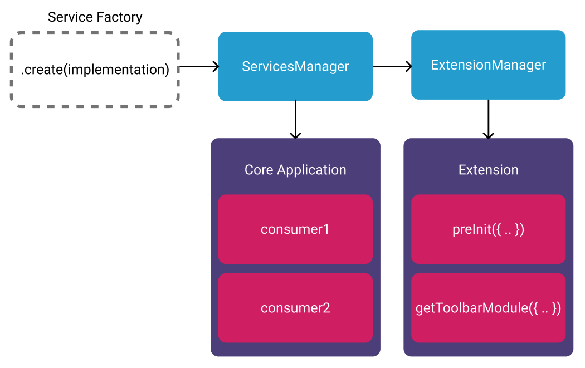

# Overview

Data services are the first category of services which deal with handling non-ui
related state Each service have their own internal state which they handle.

> We have replaced the _redux_ store. Instead, we have introduced various
> services and a pub/sub pattern to subscribe and run, which makes the `OHIF-v3`
> architecture nice and clean.

We maintain the following non-ui Services:

- [DicomMetadata Store](./../data/DicomMetadataStore.md)
- [DisplaySet Service](./../data/DisplaySetService.md)
- [Hanging Protocol Service](../data/HangingProtocolService.md)
- [Toolbar Service](./ToolbarService.md)
- [Measurement Service](../data/MeasurementService.md)
- [Customization Service](./../customization-service/customizationService.md)
- [Panel Service](../data/PanelService.md)

## Service Architecture



> We have explained services and how to create a custom service in the
> [`ServicesManager`](../../managers/service.md) section of the docs

To recap: The simplest service return a new object that has a `name` property,
and `Create` method which instantiate the service class. The "Factory Function"
that creates the service is provided with the implementation (this is slightly
different for UI Services).

```js
// extensions/customExtension/src/services/backEndService/index.js
import backEndService from './backEndService';

export default function WrappedBackEndService(servicesManager) {
  return {
    name: 'myService',
    create: ({ configuration = {} }) => {
      return new backEndService(servicesManager);
    },
  };
}
```

A service, once created, can be registered with the `ServicesManager` to make it
accessible to extensions. Similarly, the application code can access named
services from the `ServicesManager`.

[Read more of how to design a new custom service and register it](../../managers/service.md)
