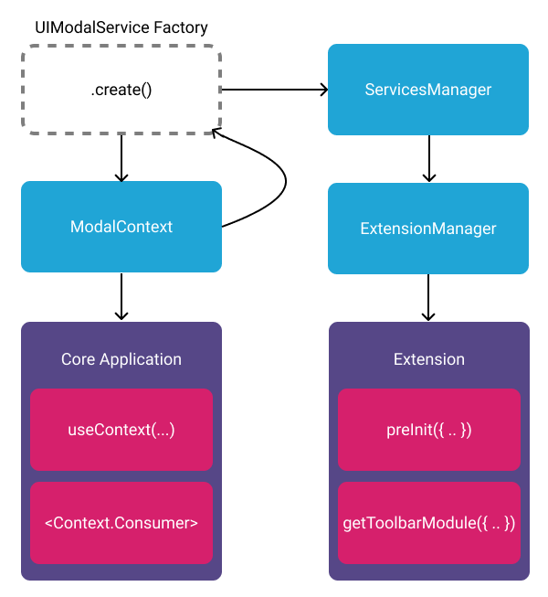

# Overview

<!-- - Consistent look & feel
- Available in and “out” of React
- Supports ad hoc containers
- Exposes “setImplementation” method passed to Context Provider
- May set a default UI component
- API exposes get/set of Context Provider’s state -->

A typical web application will have components and state for common UI like
modals, notifications, dialogs, etc. A UI service makes it possible to leverage
these components from an extension.

We maintain the following UI Services:

- [UI Notification Service](ui-notification-service.md)
- [UI Modal Service](ui-modal-service.md)
- [UI Dialog Service](ui-dialog-service.md)
- [UI Viewport Dialog Service](ui-viewport-dialog-service.md)
- [CINE Service](cine-service.md)
- [Viewport Grid Service](viewport-grid-service.md)

<!-- <div style="text-align: center;">
  <a href="/assets/img/ui-services.png">
    
  </a>
  <div><i>Diagram showing relationship between React Context and UI Service</i></div>
</div> -->



<!-- In `@ohif/core`, we have a collection of service factories. We select one we
would like our application to support, create an instance of it, and pass that
instance to our `ServicesManager` AND to a React component (in this example,
`ModalContext`'s provider).

The `ModalContext`'s provider:

- Exposes context values
- Exposes methods that leverage `useCallback` hooks
- Sets the service's implementation in a `useEffect` hook

The `ServicesManager` is:

- Passed to the `ExtensionManager`
- The `ExtensionManager` makes the `ServicesManager` available to:
  - All of its lifecycle hooks (`preRegistration`)
  - Each "getModuleFunction" (`getToolbarModule`, `getPanelModule`, etc.) -->

## Providers for UI services

**There are several context providers that wraps the application routes. This
makes the context values exposed in the app, and service's `setImplementation`
can get run to override the implementation of the service.**

```js title="platform/app/src/App.jsx"
function App({ config, defaultExtensions }) {
  /**...**/
  /**...**/
  return (
    /**...**/
    <ViewportGridProvider service={ViewportGridService}>
      <ViewportDialogProvider service={UIViewportDialogService}>
        <CineProvider service={CineService}>
          <SnackbarProvider service={UINotificationService}>
            <DialogProvider service={UIDialogService}>
              <ModalProvider modal={Modal} service={UIModalService}>
                {appRoutes}
              </ModalProvider>
            </DialogProvider>
          </SnackbarProvider>
        </CineProvider>
      </ViewportDialogProvider>
    </ViewportGridProvider>
    /**...**/
  );
}
```

## Example

For instance `UIModalService` has the following Public API:

```js title="platform/core/src/services/UIModalService/index.js"
const publicAPI = {
  name,
  hide: _hide,
  show: _show,
  setServiceImplementation,
};

function setServiceImplementation({
  hide: hideImplementation,
  show: showImplementation,
}) {
  /** ... **/
  serviceImplementation._hide = hideImplementation;
  serviceImplementation._show = showImplementation;
  /** ... **/
}

export default {
  name: 'UIModalService',
  create: ({ configuration = {} }) => {
    return publicAPI;
  },
};
```

`UIModalService` implementation can be set (override) in its context provider.
For instance in `ModalProvider` we have:

```js title="platform/ui/src/contextProviders/ModalProvider.jsx"
import { Modal } from '@ohif/ui';

const ModalContext = createContext(null);
const { Provider } = ModalContext;

export const useModal = () => useContext(ModalContext);

const ModalProvider = ({ children, modal: Modal, service }) => {
  const DEFAULT_OPTIONS = {
    content: null,
    contentProps: null,
    shouldCloseOnEsc: true,
    isOpen: true,
    closeButton: true,
    title: null,
    customClassName: '',
  };

  const show = useCallback(props => setOptions({ ...options, ...props }), [
    options,
  ]);

  const hide = useCallback(() => setOptions(DEFAULT_OPTIONS), [
    DEFAULT_OPTIONS,
  ]);

  useEffect(() => {
    if (service) {
      service.setServiceImplementation({ hide, show });
    }
  }, [hide, service, show]);

  const {
    content: ModalContent,
    contentProps,
    isOpen,
    title,
    customClassName,
    shouldCloseOnEsc,
    closeButton,
  } = options;

  return (
    <Provider value={{ show, hide }}>
      {ModalContent && (
        <Modal
          className={classNames(customClassName, ModalContent.className)}
          shouldCloseOnEsc={shouldCloseOnEsc}
          isOpen={isOpen}
          title={title}
          closeButton={closeButton}
          onClose={hide}
        >
          <ModalContent {...contentProps} show={show} hide={hide} />
        </Modal>
      )}
      {children}
    </Provider>
  );
};

export default ModalProvider;

export const ModalConsumer = ModalContext.Consumer;
```

Therefore, anywhere in the app that we have access to react context we can use
it by calling the `useModal` from `@ohif/ui`. As a matter of fact, we are
utilizing the modal for the preference window which shows the hotkeys after
clicking on the gear button on the right side of the header.

A `simplified` code for our worklist is:

```js title="platform/app/src/routes/WorkList/WorkList.jsx"
import { useModal, Header } from '@ohif/ui';

function WorkList({
  history,
  data: studies,
  dataTotal: studiesTotal,
  isLoadingData,
  dataSource,
  hotkeysManager,
}) {
  const { show, hide } = useModal();

  /** ... **/

  const menuOptions = [
    {
      title: t('Header:About'),
      icon: 'info',
      onClick: () => show({ content: AboutModal, title: 'About OHIF Viewer' }),
    },
    {
      title: t('Header:Preferences'),
      icon: 'settings',
      onClick: () =>
        show({
          title: t('UserPreferencesModal:User Preferences'),
          content: UserPreferences,
          contentProps: {
            hotkeyDefaults: hotkeysManager.getValidHotkeyDefinitions(
              hotkeyDefaults
            ),
            hotkeyDefinitions,
            onCancel: hide,
            currentLanguage: currentLanguage(),
            availableLanguages,
            defaultLanguage,
            onSubmit: state => {
              i18n.changeLanguage(state.language.value);
              hotkeysManager.setHotkeys(state.hotkeyDefinitions);
              hide();
            },
            onReset: () => hotkeysManager.restoreDefaultBindings(),
          },
        }),
    },
  ];
  /** ... **/
  return (
    <div>
      /** ... **/
      <Header isSticky menuOptions={menuOptions} isReturnEnabled={false} />
      /** ... **/
    </div>
  );
}
```

<!-- ## Example -->

<!-- That's all fine and good, but it's still a little too abstract. What does this
translate to in practice?

```js
// In the application
import UINotificationService from '@ohif/core';
const servicesManager = new ServicesManager();

servicesManager.registerService(UINotificationService);

// UI Service Provider
useEffect(() => {
  if (service) {
    service.setServiceImplementation({ hide, show });
  }
}, [service, hide, show]);

// In an extension
const { UINotificationService } = servicesManager.services;

if (UINotificationService) {
  UINotificationService.show('Hello from the other side 👋');
}
``` -->

<!-- <div style="text-align: center;">
  <a href="/assets/img/notification-example.gif">
    
  </a>
  <div><i>GIF showing successful call of UINotificationService from an extension.</i></div>
</div> -->

## Tips & Tricks

It's important to remember that all we're doing is making it possible to control
bits of the application's UI from an extension. Here are a few non-obvious
takeaways worth mentioning:

- Your application code should continue to use React context
  (consumers/providers) as it normally would
- You can substitute our "out of the box" UI implementations with your own
- You can create and register your own UI services
- You can choose not to register a service or provide a service implementation
- In extensions, you can provide fallback/alternative behavior if an expected
  service is not registered
  - No `UIModalService`? Use the `UINotificationService` to notify users.
- You can technically register a service in an extension and expose it to the
  core application

> Note: These are recommended patterns, not hard and fast rules. Following them
> will help reduce confusion and interoperability with the larger OHIF
> community, but they're not silver bullets. Please speak up, create an issue,
> if you would like to discuss new services or improvements to this pattern.
