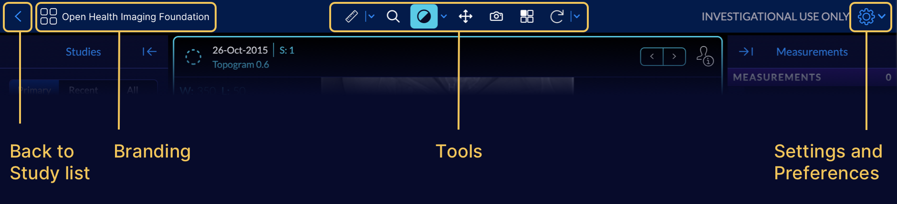
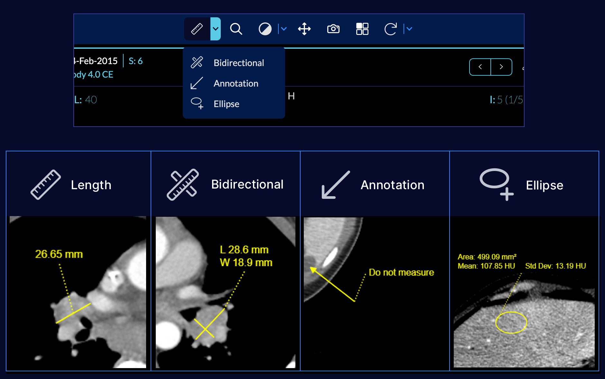
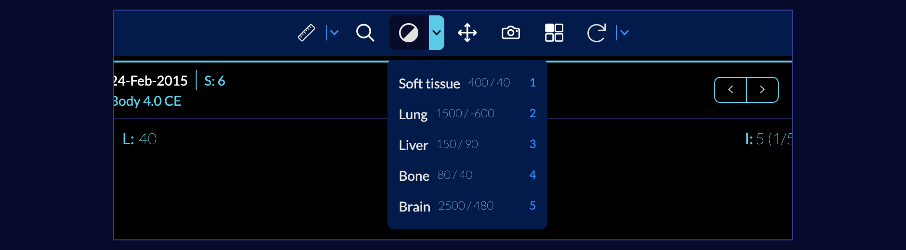
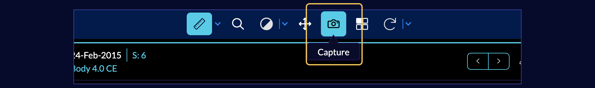
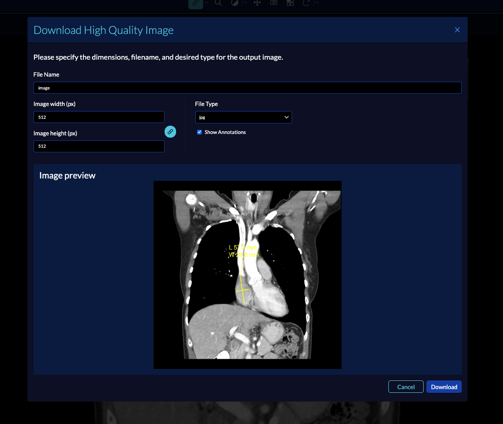

# Toolbar

The four main components of the toolbar are:

- Navigation back to the [Study List](../index.md)
- Logo and white labelling
- [Tools](#tools)
- [Preferences](#preferences)

## Tools
This section displays all the available tools inside the mode.
## Measurement tools
The basic viewer comes with the following default measurement tools:

- Length Tool: Calculates the linear distance between two points in *mm*
- Bidirectional Tool: Creates a measurement of the longest diameter (LD) and longest perpendicular diameter (LPD) in *mm*
- Annotation: Used to create a qualitative marker with a freetext label
- Ellipse: Measures an elliptical area in *mm2* and Hounsfield Units (HU)
- Calibration Tool: Calibrate (or override) the Pixel Spacing Attribute (Physical distance in the patient between the center of each pixel, specified by a numeric pair - adjacent row spacing (delimiter) adjacent column spacing in mm)

When a measurement tool is selected from the toolbar, it becomes the `active` tool. Use the caret to expand the measurement tools and select another tool.
<!-- We should add a smaller screenshot for each measurement tool. Maybe have a matrix with 4 identical sized screenshots in a box? Also we should make sure the screenshots have more realistic measurements -->

## Window/Level
The `Window/Level` tool enables manipulating the window level and window width of the rendered image. Click on the tool to enable freeform adjustment, then click and drag on the viewport to freely adjust the window/level.

Click on the caret to expand the tool and choose from predefined W/L settings for common imaging scenarios.

## Pan and Zoom
With the Zoom tool selected, click and drag the cursor on an image to adjust the zoom. The magnification level is displayed in the viewport.

With the Pan tool selected, click and drag the cursor on an image to adjust the image position.

## Image Capture
Click on the Camera icon to download a high quality image capture using common image formats (png, jpg)

In the opened modal, the filename, image's width and height, and filetype and can be configured before downloading the image to your local computer.

## Layout Selector
Please see the `Viewport` section for details.

## More Tools Menu
- Reset View: Resets all image manipulation such as position, zoom, and W/L
- Rotate Right: Flips the image 90 degrees clockwise
- Flip Horizontally: Flips the image 180 degrees horizontally
- Stack Scroll: Links all viewports containing images to scroll together
- Magnify: Click on an image to magnify a particular area of interest
- Invert: Inverts the color scale
- Cine: Toggles the Cine player control in the currently selected viewport. Click the `x` on the Cine player or click the tool again to toggle off.
- Angle: Measures an adjustable angle on an image
- Probe: Drag the probe to see pixel values
- Rectangle: Measures a rectangular area in mm^2 and HU

When a tool is selected from the `More Tools` menu, it becomes the active tool until it is replaced by clicking on a different tool in the More Tools menu or main toolbar.

<!-- Cine player tool -->
## Overview Video
An overview of tool usage can been seen below:

    <iframe src="https://player.vimeo.com/video/843233686?badge=0&amp;autopause=0&amp;player_id=0&amp;app_id=58479" frameBorder="0" allow="autoplay; fullscreen; picture-in-picture" allowFullScreen style= {{ position:"absolute",top:0,left:0,width:"100%",height:"100%"}} title="measurement-report"></iframe>

