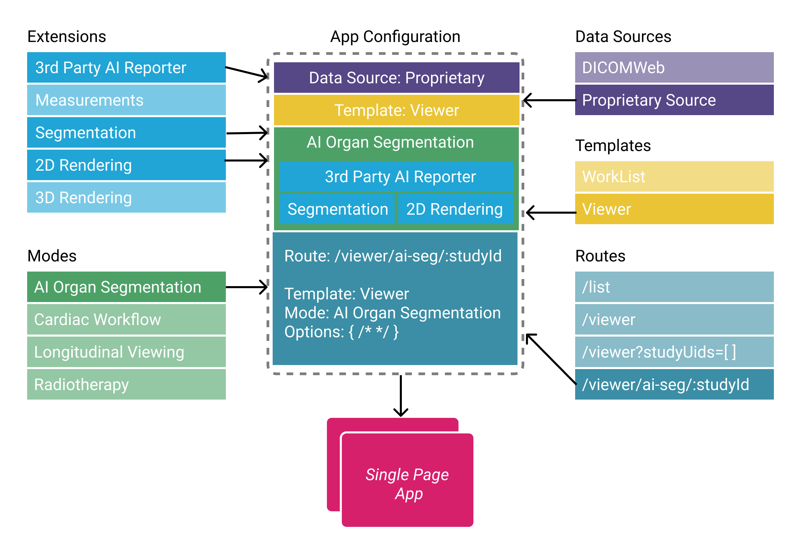

# Architecture

In order to achieve a platform that can support various workflows and be
extensible for the foreseeable future we went through extensive planning of
possible use cases and decided to significantly change and improve the
architecture.

Below, we aim to demystify that complexity by providing insight into how
`OHIF Platform` is architected, and the role each of its dependent libraries
plays.

## Overview

The [OHIF Medical Image Viewing Platform][viewers-project] is maintained as a
[`monorepo`][monorepo]. This means that this repository, instead of containing a
single project, contains many projects. If you explore our project structure,
you'll see the following:

```bash
│
├── extensions
│   ├── default               # default functionalities
│   ├── cornerstone           # 2D/3D images w/ Cornerstonejs
│   ├── cornerstone-dicom-sr  # Structured reports
│   ├── measurement-tracking  # measurement tracking
│   └── dicom-pdf             # View DICOM wrapped PDFs in viewport
|   # and many more ...
│
├── modes
│   └── longitudinal         # longitudinal measurement tracking mode
|   └── basic-dev-mode       # basic viewer with Cornerstone (a developer focused mode)
|   # and many more
│
├── platform
│   ├── core                 # Business Logic
│   ├── i18n                 # Internationalization Support
│   ├── ui                   # React component library
│   └── app               # Connects platform and extension projects
│
├── ...                      # misc. shared configuration
├── lerna.json               # MonoRepo (Lerna) settings
├── package.json             # Shared devDependencies and commands
└── README.md
```

OHIF v3 is composed of the following components, described in detail in further
sections:

- `@ohif/app`: The core framework that controls extension registration, mode
  composition and routing.
- `@ohif/core`: A library of useful and reusable medical imaging functionality
  for the web.
- `@ohif/ui`: A library of reusable components to build OHIF-styled applications
  with.
- `Extensions`: A set of building blocks for building applications. The OHIF org
  maintains a few core libraries.
- `Modes`: Configuration objects that tell @ohif/app how to compose
  extensions to build applications on different routes of the platform.

## Extensions

The `extensions` directory contains many packages that provide essential
functionalities such as rendering, study/series browsers, measurement tracking
that modes can consume to enable a certain workflow. Extensions have had their
behavior changed in `OHIF-v3` and their api is expanded. In summary:

> In `OHIF-v3`, extensions no longer automatically hook themselves to the app.
> Now, registering an extension makes its component available to `modes` that
> wish to use them. Basically, extensions in `OHIF-v3` are **building blocks**
> for building applications.

OHIF team maintains several high value and commonly used functionalities in its
own extensions. For a list of extensions maintained by OHIF,
[check out this helpful table](../platform/extensions/index.md#maintained-extensions).
As an example `default` extension provides a default viewer layout, a
study/series browser and a datasource that maps to a DICOMWeb compliant backend.

[Click here to read more about extensions!](../platform/extensions/index.md)

## Modes

The `modes` directory contains workflows that can be registered with OHIF within
certain `routes`. The mode will get used once the user opens the viewer on the
registered route.

OHIF extensions were designed to provide certain core functionalities for
building your viewer. However, often in medical imaging we face a specific use
case in which we are using some core functionalities, adding our specific UI,
and use it in our workflows. Previously, to achieve this you had to create an
extension to add have such feature. `OHIF-v3` introduces `Modes` to enable
building such workflows by re-using the core functionalities from the
extensions.

Some common workflows may include:

- Measurement tracking for lesions
- Segmentation of brain abnormalities
- AI probe mode for detecting prostate cancer

In the mentioned modes above, they will share the same core rendering module
that the `default` extension provides. However, segmentation mode will require
segmentation tools which is not needed for the other two. As you can see, modes
are a layer on top of extensions, that you can configure in order to achieve
certain workflows.

To summarize the difference between extensions and modes in `OHIF-v3` and
extensions in `OHIF-v2`

> - `Modes` are configuration objects that tell _@ohif/app_ how to compose
>   extensions to build applications on different routes of the platform.
> - In v2 extensions are “plugins” that add functionality to a core viewer.
> - In v3 extensions are building blocks that a mode uses to build an entire
>   viewer layout.

[Click here to read more about modes!](../platform/modes/index.md)

## Platform

### `@ohif/app`

This library is the core library which consumes modes and extensions and builds
an application. Extensions can be passed in as app configuration and will be
consumed and initialized at the appropriate time by the application. Upon
initialization the viewer will consume extensions and modes and build up the
route desired, these can then be accessed via the study list, or directly via
url parameters.

Upon release modes will also be plugged into the app via configuration, but this
is still an area which is under development/discussion, and they are currently
pulled from the window in beta.

Future ideas for this framework involve only adding modes and fetching the
required extension versions at either runtime or build time, but this decision
is still up for discussion.

### `@ohif/core`

OHIF core is a carefully maintained and tested set of web-based medical imaging
functions and classes. This library includes managers and services used from
within the viewer app.

OHIF core is largely similar to the @ohif/core library in v2, however a lot of
logic has been moved to extensions: however all logic about DICOMWeb and other
data fetching mechanisms have been pulled out, as these now live in extensions,
described later.

### `@ohif/ui`

Firstly, a large time-consumer/barrier for entry we discovered was building new
UI in a timely manner that fit OHIF’s theme. For this reason we have built a new
UI component library which contains all the components one needs to build their
own viewer.

These components are presentational only, so you can reuse them with whatever
logic you desire. As the components are presentational, you may swap out
@ohif/ui for a custom UI library with conforming API if you wish to white label
the viewer. The UI library is here to make development easier and quicker, but
it is not mandatory for extension components to use.

[Check out our component library!](https://ui.ohif.org/)

## Overview of the architecture

OHIF-v3 architecture can be seen in the following figure. We will explore each
piece in more detail.



## Common Questions

> Can I create my own Viewer using Vue.js or Angular.js?

You can, but you will not be able to leverage as much of the existing code and
components. `@ohif/core` could still be used for business logic, and to provide
a model for extensions. `@ohif/ui` would then become a guide for the components
you would need to recreate.

> When I want to implement a functionality, should it be in the mode or in an
> extension?

This is a great question. Modes are designed to consume extensions, so you
should implement your functionality in one of the modules of your new extension,
and let the mode consume it. This way, in the future, if you needed another mode
that utilizes the same functionality, you can easily hook the extension to the
new mode as well.

<!--
  Links
  -->

<!-- prettier-ignore-start -->
[monorepo]: https://github.com/OHIF/Viewers/issues/768
[viewers-project]: https://github.com/OHIF/Viewers
[viewer-npm]: https://www.npmjs.com/package/@ohif/app
[pwa]: https://developers.google.com/web/progressive-web-apps/
[configuration]: ../configuration/index.md
[extensions]: ../platform/extensions/index.md
[core-github]: https://github.com/OHIF/viewers/platform/core
[ui-github]: https://github.com/OHIF/Viewers/tree/master/platform/ui
<!-- prettier-ignore-end -->
