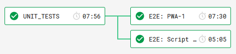
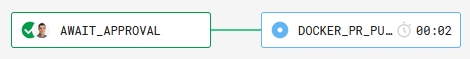
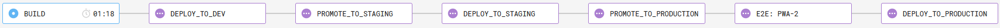
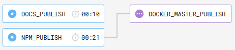

# Continuous Integration (CI)

This repository uses `CircleCI` and `Netlify` for Continuous integration.

## Deploy Previews

[Netlify Deploy previews][deploy-previews] are generated for every pull request.
They allow pull request authors and reviewers to "Preview" the OHIF Viewer as if
the changes had been merged.

Deploy previews can be configured by modifying the `netlify.toml` file in the
root of the repository. Some additional scripts/assets for netlify are included
in the root `.netlify` directory.

## Workflows

[CircleCI Workflows][circleci-workflows] are a set of rules for defining a
collection of jobs and their run order. They are self-documenting and their
configuration can be found in our CircleCI configuration file:
`.circleci/config.yml`.

### Workflow: PR_CHECKS

The PR_CHECKS workflow (Pull Request Checks) runs our automated unit and
end-to-end tests for every code check-in. These tests must all pass before code
can be merged to our `master` branch.

### Workflow: PR_OPTIONAL_DOCKER_PUBLISH

The PR_OPTIONAL_DOCKER_PUBLISH workflow allows for "manual approval" to publish
the pull request as a tagged docker image. This is helpful when changes need to
be tested with the Google Adapter before merging to `master`.

> NOTE: This workflow will fail unless it's for a branch on our `upstream`
> repository. If you need this functionality, but the branch is from a fork,
> merge the changes to a short-lived `feature/` branch on `upstream`

### Workflow: DEPLOY

The DEPLOY workflow deploys the OHIF Viewer when changes are merged to master.
It uses the Netlify CLI to deploy assets created as part of the repository's PWA
Build process (`yarn run build`). The workflow allows for "Manual Approval" to
promote the build to `STAGING` and `PRODUCTION` environments.

| Environment | Description                                                                        | URL                                           |
| ----------- | ---------------------------------------------------------------------------------- | --------------------------------------------- |
| Development | Always reflects latest changes on `master` branch.                                 | [Netlify][netlify-dev] / [OHIF][ohif-dev]     |
| Staging     | For manual testing before promotion to prod. Keeps development workflow unblocked. | [Netlify][netlify-stage] / [OHIF][ohif-stage] |
| Production  | Stable, tested, updated less frequently.                                           | [Netlify][netlify-prod] / [OHIF][ohif-prod]   |

### Workflow: RELEASE

The RELEASE workflow publishes our `npm` packages, updated documentation, and
`docker` image when changes are merged to master. `Lerna` and "Semantic Commit
Syntax" are used to independently version and publish the many packages in our
monorepository. If a new version is cut/released, a Docker image is created.
Documentation is generated with `gitbook` and pushed to our `gh-pages` branch.
GitHub hosts the `gh-pages` branch with GitHub Pages.

- Platform Packages: https://github.com/ohif/viewers/#platform
- Extension Packages: https://github.com/ohif/viewers/#extensions
- Documentation: https://docs.ohif.org/

<!--
  LINKS
-->

<!-- prettier-ignore-start -->
[deploy-previews]: https://www.netlify.com/blog/2016/07/20/introducing-deploy-previews-in-netlify/
[circleci-workflows]: https://circleci.com/docs/2.0/workflows/
[netlify-dev]: https://ohif-dev.netlify.com
[netlify-stage]: https://ohif-stage.netlify.com
[netlify-prod]: https://ohif-prod.netlify.com
[ohif-dev]: https://viewer-dev.ohif.org
[ohif-stage]: https://viewer-stage.ohif.org
[ohif-prod]: https://viewer-prod.ohif.org
<!-- prettier-ignore-end -->
