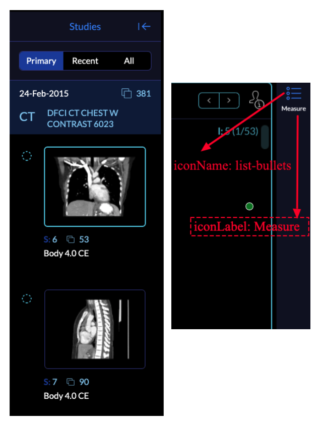

# Module: Panel

## Overview

The default LayoutTemplate has panels on the left and right sides, however one
could make a template with panels at the top or bottom and make extensions with
panels intended for such slots.

An extension can register a Panel Module by defining a `getPanelModule` method.
The panel module provides the ability to define `menuOptions` and `components`
that can be used by the consuming application. `components` are React Components
that can be displayed in the consuming application's "Panel" Component.



The `menuOptions`'s `target` key, points to a registered `components`'s `id`. A
`defaultContext` is applied to all `menuOption`s; however, each `menuOption` can
optionally provide its own `context` value.

The `getPanelModule` receives an object containing the `ExtensionManager`'s
associated `ServicesManager` and `CommandsManager`.

An extension can also trigger to activate/open a panel via the `PanelService` -
either by explicitly calling `PanelService.activatePanel` or triggering panel
activation when some other event fires.

```jsx
import PanelMeasurementTable from './PanelMeasurementTable.js';

function getPanelModule({
  commandsManager,
  extensionManager,
  servicesManager,
}) {
  const wrappedMeasurementPanel = () => {
    return (
      <PanelMeasurementTable
        commandsManager={commandsManager}
        servicesManager={servicesManager}
      />
    );
  };

  return [
    {
      name: 'measure',
      iconName: 'list-bullets',
      iconLabel: 'Measure',
      label: 'Measurements',
      isDisabled: studies => {}, // optional
      component: wrappedMeasurementPanel,
    },
  ];
}
```

## Consuming Panels Inside Modes

As explained earlier, extensions make the functionalities and components
available and `modes` utilize them to build an app. So, as seen above, we are
not actually defining which side the panel should be opened. Our extension is
providing the component with its.

New: You can easily add multiple panels to the left/right side of the viewer
using the mode configuration. As seen below, the `leftPanels` and `rightPanels`
accept an `Array` of the `IDs`. The mode configuration also allows for either (or
both) side panels to be closed by default. In the code below, the right panel
is closed by default. The mode can optionally add event triggers to
the `PanelService` that when fired will cause a side panel that was defaulted
closed to open. In the code below, the right side panel, that contains the
`trackedMeasurements` panel, is triggered to open when a measurement is added.
Note that once a default closed side panel has been opened once,
only a `PanelService.EVENTS.ACTIVATE_PANEL` event with `forceActive === true`
will cause it open (again).

```js

const extensionDependencies = {
  '@ohif/extension-default': '^3.0.0',
  '@ohif/extension-cornerstone': '^3.0.0',
  '@ohif/extension-measurement-tracking': '^3.0.0',
  '@ohif/extension-cornerstone-dicom-sr': '^3.0.0',
};

const id = 'viewer'
const version = '3.0.0

function modeFactory({ modeConfiguration }) {
  let _activatePanelTriggersSubscriptions = [];
  return {
    id,
    routes: [
      {
        path: 'longitudinal',
        layoutTemplate: ({ location, servicesManager }) => {
          return {
            id,
            props: {
              leftPanels: [
                '@ohif/extension-measurement-tracking.panelModule.seriesList',
              ],
              rightPanels: [
                '@ohif/extension-measurement-tracking.panelModule.trackedMeasurements',
              ],
              rightPanelClosed: true,
              viewports,
            },
          };
        },
      },
    ],
    onModeEnter: ({ servicesManager }) => {
      const {
        measurementService,
        panelService,
      } = servicesManager.services;

      _activatePanelTriggersSubscriptions = [
        ...panelService.addActivatePanelTriggers('@ohif/extension-measurement-tracking.panelModule.trackedMeasurements', [
          {
            sourcePubSubService: measurementService,
            sourceEvents: [
              measurementService.EVENTS.MEASUREMENT_ADDED,
              measurementService.EVENTS.RAW_MEASUREMENT_ADDED,
            ],
          },
        ]),
      ];
    },
    onModeExit: () => {
      _activatePanelTriggersSubscriptions.forEach(sub => sub.unsubscribe());
      _activatePanelTriggersSubscriptions = [];
    },
    extensions: extensionDependencies
  };
}

const mode = {
  id,
  modeFactory,
  extensionDependencies,
};

export default mode;
```

:::note
You can stack multiple panel components on top of each other by providing an array of panel components in the `rightPanels` or `leftPanels` properties.

For instance we can use

```
rightPanels: [[dicomSeg.panel, tracked.measurements], [dicomSeg.panel, tracked.measurements]]
```

This will result in two panels, one with `dicomSeg.panel` and `tracked.measurements` and the other with `dicomSeg.panel` and `tracked.measurements` stacked on top of each other.

:::
