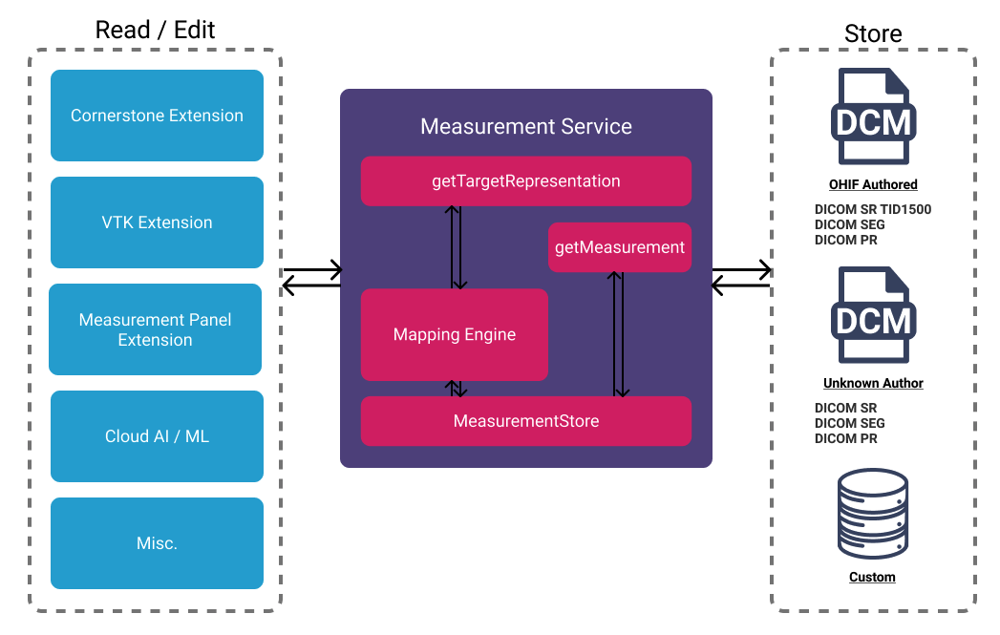

# Measurement Service

## Overview

`MeasurementService` handles the internal measurement representation inside
`OHIF` platform. Developers can add their custom `sources` with `mappers` to
enable adding measurements inside OHIF. Currently, we are maintaining
`CornerstoneTools` annotations and corresponding mappers can be found inside the
`cornerstone` extension. However, `MeasurementService` can be configured to work
with any custom tools given that its `mappers` is added to the
`MeasurementService`. We can see the overall architecture of the
`MeasurementService` below:



## Events

There are seven events that get publish in `MeasurementService`:

| Event                 | Description                                            |
| --------------------- | ------------------------------------------------------ |
| MEASUREMENT_UPDATED   | Fires when a measurement is updated                    |
| MEASUREMENT_ADDED     | Fires when a new measurement is added                  |
| RAW_MEASUREMENT_ADDED | Fires when a raw measurement is added (e.g., dicom-sr) |
| MEASUREMENT_REMOVED   | Fires when a measurement is removed                    |
| MEASUREMENTS_CLEARED  | Fires when all measurements are deleted                |
| JUMP_TO_MEASUREMENT_VIEWPORT   | Fires when a measurement is requested to be jumped to, applying to individual viewports. |
| JUMP_TO_MEASUREMENT_LAYOUT   | Fires when a measurement is requested to be jumped to, applying to the overall layout. |

## API

- `getMeasurements`: returns array of measurements

- `getMeasurement(id)`: returns the corresponding measurement based on the
  provided Id.

- `remove(id, source)`: removes a measurement and broadcasts the
  `MEASUREMENT_REMOVED` event.

- `clearMeasurements`: removes all measurements and broadcasts
  `MEASUREMENTS_CLEARED` event.

- `createSource(name, version)`: creates a new measurement source, generates a
  uid and adds it to the `sources` property of the service.

- `addMapping(source, definition, matchingCriteria, toSourceSchema, toMeasurementSchema)`:
  adds a new measurement matching criteria along with mapping functions. We will
  learn more about [source/mappers below](#source--mappers)

- `update`: updates the measurement details and fires `MEASUREMENT_UPDATED`

- `addRawMeasurement(source,definition,data,toMeasurementSchema,dataSource = {}`
  : adds a raw measurement into a source so that it may be converted to/from
  annotation in the same way. E.g. import serialized data of the same form as
  the measurement source. Fires `MEASUREMENT_UPDATED` or `MEASUREMENT_ADDED`.
  Note that, `MeasurementService` handles finding the correct mapper upon new
  measurements; however, `addRawMeasurement` provides more flexibility. You can
  take a look into its usage in `dicom-sr` extension.

  - `source`: The measurement source instance.
  - `definition`: The source definition you want to add the measurement to.
  - `data`: The data you wish to add to the source.
  - `toMeasurementSchema`: A function to get the `data` into the same shape as
    the source definition.

- `jumpToMeasurement(viewportId, id)`: calls the listeners who have
  subscribed to `JUMP_TO_MEASUREMENT`.

## Source / Mappers

To create a custom measurement source and relevant mappers for each tool, you
can take a look at the `init.js` inside the `cornerstone` extension. In which we
are registering our `CornerstoneTools-v4` measurement source to
MeasurementService. Let's take a peek at the _simplified_ implementation
together. To achieve this, for each tool, we need to provide three mappers:

- `matchingCriteria`: criteria used for finding the correct mapper for the drawn
  tool.
- `toAnnotation`: tbd
- `toMeasurement`: a function that converts the tool data to OHIF internal
  representation of measurement data.

```js title="extensions/cornerstone/src/utils/measurementServiceMappings/Length.js"
function toMeasurement(
  csToolsAnnotation,
  DisplaySetService,
  getValueTypeFromToolType
) {
  const { element, measurementData } = csToolsAnnotation;

  /** ... **/

  const {
    SOPInstanceUID,
    FrameOfReferenceUID,
    SeriesInstanceUID,
    StudyInstanceUID,
  } = getSOPInstanceAttributes(element);

  const displaySet = DisplaySetService.getDisplaySetForSOPInstanceUID(
    SOPInstanceUID,
    SeriesInstanceUID
  );

  /** ... **/
  return {
    id: measurementData.id,
    SOPInstanceUID,
    FrameOfReferenceUID,
    referenceSeriesUID: SeriesInstanceUID,
    referenceStudyUID: StudyInstanceUID,
    displaySetInstanceUID: displaySet.displaySetInstanceUID,
    label: measurementData.label,
    description: measurementData.description,
    unit: measurementData.unit,
    length: measurementData.length,
    type: getValueTypeFromToolType(tool),
    points: getPointsFromHandles(measurementData.handles),
  };
}

//////////////////////////////////////////

// extensions/cornerstone/src/init.js

const Length = {
  toAnnotation,
  toMeasurement,
  matchingCriteria: [
    {
      valueType: MeasurementService.VALUE_TYPES.POLYLINE,
      points: 2,
    },
  ],
};

const _initMeasurementService = (MeasurementService, DisplaySetService) => {
  /** ... **/

  const csToolsVer4MeasurementSource = MeasurementService.createSource(
    'CornerstoneTools',
    '4'
  );

  /* Mappings */
  MeasurementService.addMapping(
    csToolsVer4MeasurementSource,
    'Length',
    Length.matchingCriteria,
    toAnnotation,
    toMeasurement
  );

  /** Other tools **/
  return csToolsVer4MeasurementSource;
};
```


## Auto complete
Use a customization service to add more customizations for measurement labels. Later, when adding a measurement, the user will be prompted to choose from a list of labels.

```js
customizationService.addModeCustomizations([
  {
    id: 'measurementLabels',
    labelOnMeasure: true,
    exclusive: true,
    items: [
      { value: 'Head', label: 'Head' },
      { value: 'Neck', label: 'Neck' },
      { value: 'Knee', label: 'Knee' },
      { value: 'Toe', label: 'Toe' },
    ],
  },
]);
```
