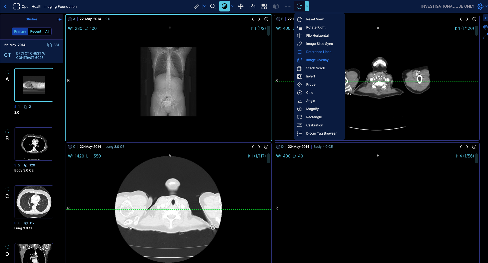

# Tool Group Service

## Overview

The `ToolGroupService` is responsible for managing tool groups in the OHIF Viewer.

:::tip
Read more about toolGroups [here](https://www.cornerstonejs.org/docs/concepts/cornerstone-tools/toolGroups)
:::

It allows you to create, update, and manage tool groups and the tools associated with them. Tool groups are used to organize and control the behavior of various tools in the viewer, such as window level, pan, zoom, measurements, and annotations.

## Events

The `ToolGroupService` emits the following events:

| Event                              | Description                                     |
| ---------------------------------- | ----------------------------------------------- |
| `VIEWPORT_ADDED`                   | Fires when a viewport is added to a tool group |
| `TOOLGROUP_CREATED`                | Fires when a new tool group is created         |

## API

- `getToolGroup(toolGroupId?)`: Retrieves a tool group by its ID. If no ID is provided, it returns the tool group for the active viewport.
- `getToolGroupIds()`: Returns an array of all tool group IDs.
- `getToolGroupForViewport(viewportId)`: Returns the tool group associated with the specified viewport.
- `getActiveToolForViewport(viewportId)`: Returns the active tool for the specified viewport.
- `destroy()`: Destroys all tool groups.
- `destroyToolGroup(toolGroupId)`: Destroys the specified tool group.
- `removeViewportFromToolGroup(viewportId, renderingEngineId, deleteToolGroupIfEmpty?)`: Removes a viewport from a tool group. If `deleteToolGroupIfEmpty` is true and the tool group becomes empty after removing the viewport, it will be destroyed.
- `addViewportToToolGroup(viewportId, renderingEngineId, toolGroupId?)`: Adds a viewport to a tool group. If `toolGroupId` is not provided, the viewport will be added to all tool groups.
- `createToolGroup(toolGroupId)`: Creates a new tool group with the specified ID.
- `addToolsToToolGroup(toolGroupId, tools, configs?)`: Adds tools to the specified tool group with optional configurations.
- `createToolGroupAndAddTools(toolGroupId, tools)`: Creates a new tool group and adds the specified tools to it.
- `getToolConfiguration(toolGroupId, toolName)`: Retrieves the configuration for the specified tool in the given tool group.
- `setToolConfiguration(toolGroupId, toolName, config)`: Sets the configuration for the specified tool in the given tool group.

## Usage

Here's an example of how to create a new tool group and add tools to it in our basic viewer mode (modes/longitudinal/src/initToolGroups.js)

```js
import { initToolGroups } from '@ohif/extension-cornerstone';
import { ToolGroupService } from '@ohif/core';

const toolGroupService = new ToolGroupService();

// Create a new tool group
const defaultToolGroup = toolGroupService.createToolGroup('default');

// Define tools for the tool group
const tools = {
  active: [
    { toolName: 'WindowLevel', bindings: [{ mouseButton: 1 }] },
    { toolName: 'Pan', bindings: [{ mouseButton: 2 }] },
    { toolName: 'Zoom', bindings: [{ mouseButton: 3 }] },
  ],
  passive: [
    { toolName: 'Length' },
    { toolName: 'ArrowAnnotate' },
    { toolName: 'Bidirectional' },
  ],
};

// Add tools to the tool group
toolGroupService.addToolsToToolGroup('default', tools);
```

In this example, we create a new `ToolGroupService` instance and use it to create a new tool group with the ID `'default'`. We then define an object `tools` that contains the active and passive tools we want to add to the tool group. Finally, we call the `addToolsToToolGroup` method to add the tools to the newly created tool group.

:::tip
You can begin the viewer with certain toggle tools already active. For example, if you have your 'referencelines' tool enabled, it will be active when the viewer starts, and the icon state will be correctly set to active as well.
:::

```js
const tools = {
    // the reset
    // enabled
    enabled: [{ toolName: toolNames.ImageOverlayViewer }, { toolName: toolNames.ReferenceLines }],
  };
```



