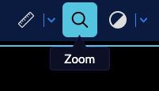
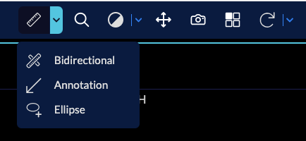

# Toolbar **Service**

## Overview

The `ToolBarService` is a straightforward service designed to handle the toolbar. Its main tasks include adding buttons, configuring them, and organizing button sections. When a button is clicked, it executes the designated commands. In the past, this service was more intricate, managing button states and logic. However, all that functionality has now been transferred to the `ToolBarModule` and evaluators.

<!-- <div style={{padding:"56.25% 0 0 0", position:"relative"}}>
    <iframe src="https://player.vimeo.com/video/547957214?badge=0&amp;autopause=0&amp;player_id=0&amp;app_id=58479"  frameBorder="0" allow="autoplay; fullscreen; picture-in-picture" allowFullScreen style= {{ position:"absolute",top:0,left:0,width:"100%",height:"100%"}} **title**="measurement-report"></iframe>
</div> -->

## Events

| Event                   | Description                                                            |
| ----------------------- | ---------------------------------------------------------------------- |
| TOOL_BAR_MODIFIED       | Fires when a button is added/removed to the toolbar                    |
| TOOL_BAR_STATE_MODIFIED | Fires when an interaction happens and ToolBarService state is modified |

## API

- `createButtonSection(key, buttons)` : creates a section of buttons in the toolbar with the given key and button Ids

- `addButtons`: add the button definition to the service.
  [See below for button definition](#button-definitions).

- `setButtons`: sets the buttons defined in the service. It overrides all the
  previous buttons


## Button Definitions


### Basic

The simplest toolbarButtons definition has the following properties:




```js
{
  id: 'Zoom',
  uiType: 'ohif.radioGroup',
  props: {
    icon: 'tool-zoom',
    label: 'Zoom',
    "commands": [
      {
        "commandName": "setToolActive",
        "commandOptions": {
          "toolName": "Zoom"
        },
        "context": "CORNERSTONE"
      }
    ]
    evaluate: 'evaluate.cornerstoneTool',
  },
},
```

| property         | description                                                       | values                                      |
| ---------------- | ----------------------------------------------------------------- | ------------------------------------------- |
| `id`             | Unique string identifier for the definition                       | \*                                          |
| `icon`           | A string name for an icon supported by the consuming application. | \*                                          |
| `label`          | User/display friendly to show in UI                               | \*                                          |
| `commands`       | (optional) The commands to run when the button is used. It include a commandName, commandOptions, and/or a context            | Any command registered by a `CommandModule` |


### Nested (dropdown)

You can use the `ohif.splitButton` type to build a button with extra tools in
the dropdown.

- First you need to give your `primary` tool definition to the split button
- the `secondary` properties can be a simple arrow down (`chevron-down` icon)
- For adding the extra tools add them to the `items` list.

You can see below how `longitudinal` mode is using the available toolbarModule
to create `MeasurementTools` nested button



```js title="modes/longitudinal/src/toolbarButtons.js"
{
    id: 'MeasurementTools',
    uiType: 'ohif.splitButton',
    props: {
      groupId: 'MeasurementToolsGroupId',
      // group evaluate to determine which item should move to the top
      evaluate: 'evaluate.group.promoteToPrimaryIfCornerstoneToolNotActiveInTheList',
      primary: ToolbarService.createButton({
        id: 'Length',
        icon: 'tool-length',
        label: 'Length',
        tooltip: 'Length Tool',
        commands: _createSetToolActiveCommands('Length'),
        evaluate: 'evaluate.cornerstoneTool',
      }),
      secondary: {
        icon: 'chevron-down',
        tooltip: 'More Measure Tools',
      },
      items: [
        ToolbarService.createButton({
          id: 'Length',
          icon: 'tool-length',
          label: 'Length',
          tooltip: 'Length Tool',
          commands: [
            {
              commandName: 'setToolActive',
              commandOptions: {
                toolName: 'Length',
              },
              context: 'CORNERSTONE',
            },
            {
              commandName: 'setToolActive',
              commandOptions: {
                toolName: 'SRLength',
                toolGroupId: 'SRToolGroup',
              },
              // we can use the setToolActive command for this from Cornerstone commandsModule
              context: 'CORNERSTONE',
            },
          ],
          evaluate: 'evaluate.cornerstoneTool',
        }),
        ToolbarService.createButton({
          id: 'Bidirectional',
          icon: 'tool-bidirectional',
          label: 'Bidirectional',
          tooltip: 'Bidirectional Tool',
          commands: [
            {
              commandName: 'setToolActive',
              commandOptions: {
                toolName: 'Bidirectional',
              },
              context: 'CORNERSTONE',
            },
            {
              commandName: 'setToolActive',
              commandOptions: {
                toolName: 'SRBidirectional',
                toolGroupId: 'SRToolGroup',
              },
              context: 'CORNERSTONE',
            },
          ],
          evaluate: 'evaluate.cornerstoneTool',
        }),
      ],
    },
  },
```

:::tip
split buttons can have a group evaluator (in the above example `evaluate.group.promoteToPrimaryIfCornerstoneToolNotActiveInTheList`) which can decide what happens
when the user interacts with the buttons. In the above example, we are promoting the button to the primary section if the cornerstone tool is not active in the list of buttons.

There are other evaluators for instance `evaluate.group.promoteToPrimary`
which does not care about the cornerstone tool and promotes the button to the primary section anyway
:::

:::tip
If you don't provide a group evaluator nothing would happen and the button will stay in the secondary section.
:::

## Listeners
Sometimes you need a tool to listen to specific events in order to react properly.
You can add `listeners` for this purpose. We use this pattern for referencelineTools
which should set its source of reference upon active viewport change

Currently you can subscribe to the following events:
- `ViewportGridService.EVENTS.ACTIVE_VIEWPORT_ID_CHANGED`: when the active viewport changes
- `ViewportGridService.EVENTS.VIEWPORTS_READY`: when the viewports are ready in the grid


```js

const ReferenceLinesListeners: RunCommand = [
  {
    commandName: 'setSourceViewportForReferenceLinesTool',
    context: 'CORNERSTONE',
  },
];

ToolbarService.createButton({
  id: 'ReferenceLines',
  icon: 'tool-referenceLines',
  label: 'Reference Lines',
  tooltip: 'Show Reference Lines',
  commands: [
    {
      commandName: 'setToolEnabled',
      commandOptions: {
        toolName: 'ReferenceLines',
        toggle: true,
      },
      context: 'CORNERSTONE',
    },
  ],
  listeners: {
    [ViewportGridService.EVENTS.ACTIVE_VIEWPORT_ID_CHANGED]: ReferenceLinesListeners,
    [ViewportGridService.EVENTS.VIEWPORTS_READY]: ReferenceLinesListeners,
  },
  evaluate: 'evaluate.cornerstoneTool.toggle',
}),

```


## Button Sections
In order to organize the buttons, you can create button sections in the toolbar. And
assign buttons to each section separately.

OHIF provides a `primary` section by default. You can add more sections as needed in your UI
and use toolbarService to create and manage them. (You can look at the toolBox implementation
which take advantage of having a dedicated section for the tools with advanced options,
we use that in the segmentation mode).


## Example

For instance in `longitudinal` mode we are using the `onModeEnter` hook to
add the buttons to the toolbarService and assign them to the primary section.

```js title="modes/longitudinal/src/index.js"
toolbarService.addButtons([...toolbarButtons, ...moreTools]);
toolbarService.createButtonSection('primary', [
  'MeasurementTools',
  'Zoom',
  'info',
  'WindowLevel',
  'Pan',
  'Capture',
  'Layout',
  'Crosshairs',
  'MoreTools',
]);
```

as you see we creating the button section and assigning buttons based on their Ids.

:::tip
You can even duplicate the same button in different sections and the button will be
in sync in all sections (thanks to the evaluation system).
:::

:::tip
we will add more section in the toolbar (other than primary) in the future.
:::

:::note
Don't forget to set up your toolGroups to ensure that your buttons function correctly. Buttons serve as a visual interface. When you interact with them, they execute their commands, and evaluators determine their state post-interaction.
:::
