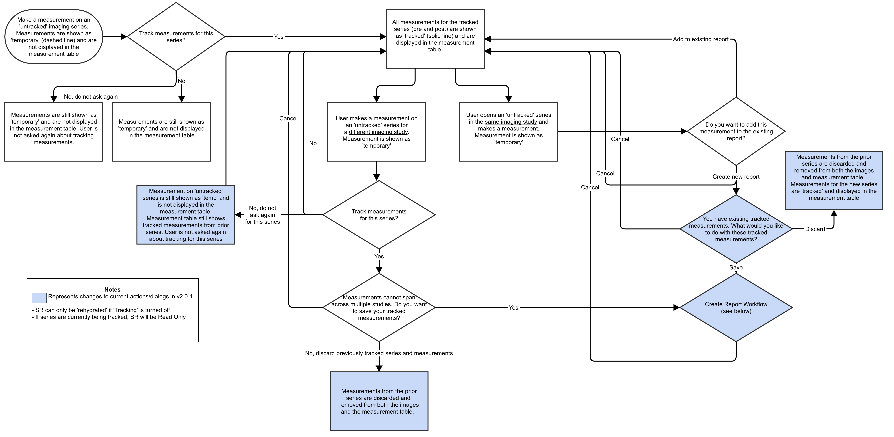
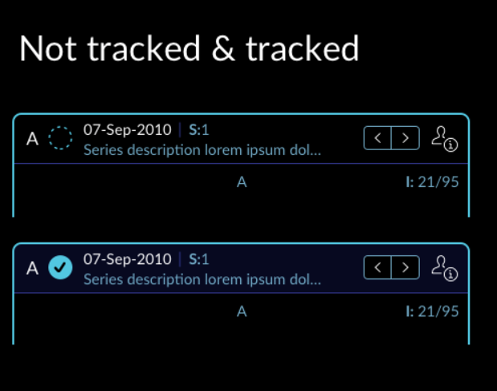
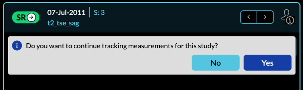
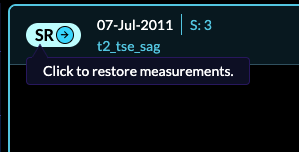
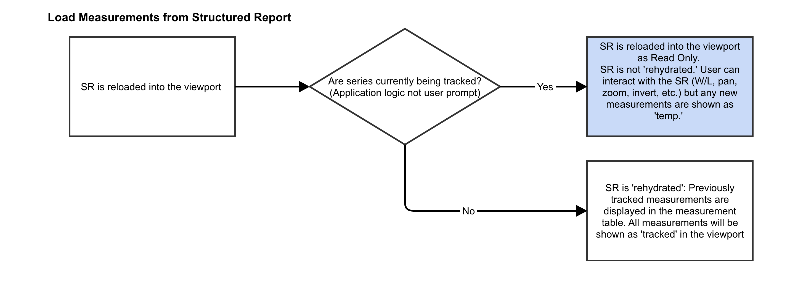
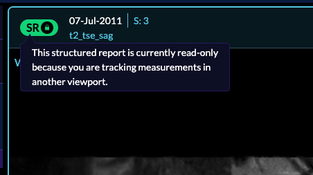

# Measurement Tracking

## Introduction
OHIF-V3's `Basic Viewer` implements a `Measurement Tracking` workflow. Measurement
tracking allows you to:

- Draw annotations and have them shown in the measurement panel
- Create a report from the tracked measurement and export them as DICOM SR
- Use already exported DICOM SR to re-hydrate the measurements in the viewer

## Status Icon
Each viewport has a left icon indicating whether the series within the viewport
contains:

- tracked measurement OR
- untracked measurement OR
- Structured Report OR
- Locked (uneditable) Structured Report

In the following, we will discuss each category.

### Tracked vs Untracked Measurements

`OHIF-v3` implements a workflow for measurement tracking that can be seen below.

In summary, when you create an annotation, a prompt will be shown whether to start tracking or not. If you start the tracking, the annotation style will change to a solid line, and annotation details get displayed on the measurement panel.
On the other hand, if you decline the tracking prompt, the measurement will be considered "temporary," and annotation style remains as a dashed line and not shown on the right panel, and cannot be exported.

Below, you can see different icons that appear for a tracked vs. untracked series in
`OHIF-v3`.

#### Overview video for starting the tracking for measurements:
<!-- trackedMeasurements -->

    <iframe src="https://player.vimeo.com/video/843234022?badge=0&amp;autopause=0&amp;player_id=0&amp;app_id=58479" frameBorder="0" allow="autoplay; fullscreen; picture-in-picture" allowFullScreen style= {{ position:"absolute",top:0,left:0,width:"100%",height:"100%"}} title="measurement-report"></iframe>

  

#### Overview video for not starting tracking for measurements:
<!-- untrackedMeasurements -->

    <iframe src="https://player.vimeo.com/video/843234086?badge=0&amp;autopause=0&amp;player_id=0&amp;app_id=58479" frameBorder="0" allow="autoplay; fullscreen; picture-in-picture" allowFullScreen style= {{ position:"absolute",top:0,left:0,width:"100%",height:"100%"}} title="measurement-report"></iframe>

### Reading and Writing DICOM SR

`OHIF-v3` provides full support for reading, writing and mapping the DICOM Structured
Report (SR) to interactable `Cornerstone Tools`. When you load an already exported
DICOM SR into the viewer, you will be prompted whether to track the measurements
for the series or not.

If you click Yes, DICOM SR measurements gets re-hydrated into the viewer and
the series become a tracked series. However, If you say no and later decide to say track the measurements, you can always click on the SR button that will  prompt you
with the same message again.

The full workflow for saving measurements to SR and loading SR into the viewer is shown below.

#### Overview video for loading DICOM SR and making a tracked series:
<!-- SR Restore and Yes -->

    <iframe src="https://player.vimeo.com/video/843233998?badge=0&amp;autopause=0&amp;player_id=0&amp;app_id=58479" frameBorder="0" allow="autoplay; fullscreen; picture-in-picture" allowFullScreen style= {{ position:"absolute",top:0,left:0,width:"100%",height:"100%"}} title="measurement-report"></iframe>

  

#### Overview video for loading DICOM SR and not making a tracked series:
<!-- SR Restore and No -->
<!-- SR Export and measurement restore -->

    <iframe src="https://player.vimeo.com/video/843233976?badge=0&amp;autopause=0&amp;player_id=0&amp;app_id=58479" frameBorder="0" allow="autoplay; fullscreen; picture-in-picture" allowFullScreen style= {{ position:"absolute",top:0,left:0,width:"100%",height:"100%"}} title="measurement-report"></iframe>

  

    <iframe src="https://player.vimeo.com/video/843233958?badge=0&amp;autopause=0&amp;player_id=0&amp;app_id=58479" frameBorder="0" allow="autoplay; fullscreen; picture-in-picture" allowFullScreen style= {{ position:"absolute",top:0,left:0,width:"100%",height:"100%"}} title="measurement-report"></iframe>

### Loading DICOM SR into an Already Tracked Series

If you have an already tracked series and try to load a DICOM SR measurements,
you will be shown the following lock icon. This means that, you can review the
DICOM SR measurement, manipulate image and draw "temporary" measurements; however,
you cannot edit the DICOM SR measurement.

  

#### Overview video for loading DICOM SR inside an already tracked series:
<!-- DICOMSRLockedTracked -->

    <iframe src="https://player.vimeo.com/video/843233929?badge=0&amp;autopause=0&amp;player_id=0&amp;app_id=58479"  frameBorder="0" allow="autoplay; fullscreen; picture-in-picture" allowFullScreen style= {{ position:"absolute",top:0,left:0,width:"100%",height:"100%"}} title="measurement-report"></iframe>

