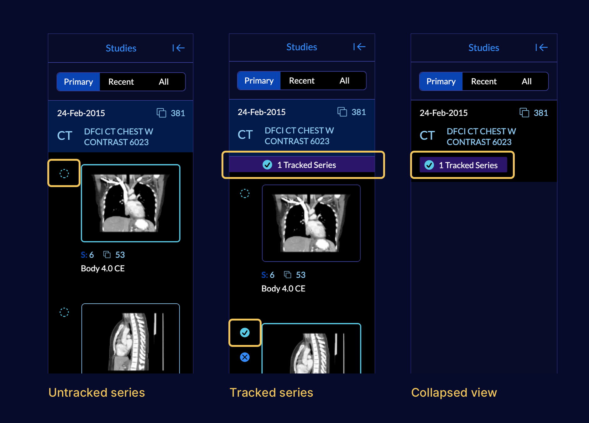

# Study Panel

In `Basic Viewer` mode, the left panel includes Studies related to the current
patient. You can see three main type of studies below

- Primary: The opened study from the study list. This study is always expanded
  by default.
- Recent: All studies for the patient that contain study dates within 1 year of
  the primary study
- All: All studies available for the patient contained within the source
  repository

The `Study Panel` displays the measurement tracking status of each series within
a study. As you can see in the first picture, the dashed circle on the left side
of each series demonstrates whether the series is being tracked for measurement
or not.

<!-- We should resize this screenshot to make it smaller. We might want to add both screenshots in-line to make better use of horizontal space. Let's ask Dan -->

Studies can be expanded or collapsed by clicking on the study information in the
Study Panel. If a series is being tracking within a study, the Measurement Panel
will display this information while the study is collapsed.

<!-- We should link to refer to measurement tracking section -->

<!-- We need to add SR functionality descriptions to this section -->
