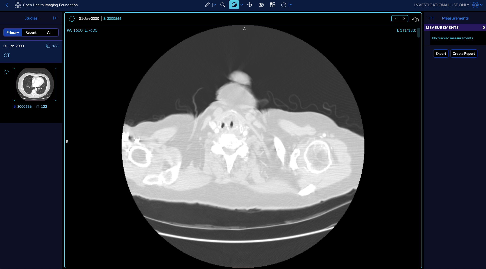
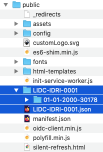

# DICOM JSON

You can launch the OHIF Viewer with a JSON file which points to a DICOMWeb
server as well as a list of study and series instance UIDs along with metadata.

An example would look like

`https://viewer.ohif.org/viewer/dicomjson?url=https://ohif-dicom-json-example.s3.amazonaws.com/LIDC-IDRI-0001.json`

As you can see the url to the location of the JSON file is passed in the query
after the `dicomjson` string, which is
`https://ohif-dicom-json-example.s3.amazonaws.com/LIDC-IDRI-0001.json` (this
json file has been generated by OHIF team and stored in an amazon s3 bucket for
the purpose of the guide).

## DICOM JSON sample

Here we are using the LIDC-IDRI-0001 case which is a sample of the LIDC-IDRI
dataset. Let's have a look at the JSON file:

### Metadata

JSON file stores the metadata for the study level, series level and instance
level. A JSON launch file should follow the same structure as the one below.

:::tip
You can use our script to generate the JSON file from a hosted endpoint. See
`.scripts/dicom-json-generator.js`

You could run it like this:

```bash
node .scripts/dicom-json-generator.js '/path/to/study/folder' 'url/to/dicom/server/folder' 'json/output/file.json'
```

Some modalities require additional metadata to be added to the JSON file. You can read more about the minimum amount of metadata required for the viewer to work [here](../../faq/technical#what-are-the-list-of-required-metadata-for-the-ohif-viewer-to-work). We will handle this in the script. For example, the script will add the CodeSequences for SR in order to display the measurements in the viewer.
:::


Note that at the instance level metadata we are storing both the `metadata` and
also the `url` for the dicom file on the dicom server. In this case we are
referring to
`dicomweb:https://ohif-dicom-json-example.s3.amazonaws.com/LIDC-IDRI-0001/01-01-2000-30178/3000566.000000-03192/1-001.dcm`
which is stored in another directory in our s3. (You can actually try
downloading the dicom file by opening the url in your browser).

The URL to the script in the given example is `https://ohif-dicom-json-example.s3.amazonaws.com/LIDC-IDRI-0001/01-01-2000-30178`. This URL serves as the parent directory that contains all the series within their respective folders.

```json
{
  "studies": [
    // first study metadata
    {
      "StudyInstanceUID": "1.3.6.1.4.1.14519.5.2.1.6279.6001.298806137288633453246975630178",
      "StudyDate": "20000101",
      "StudyTime": "",
      "PatientName": "",
      "PatientID": "LIDC-IDRI-0001",
      "AccessionNumber": "",
      "PatientAge": "",
      "PatientSex": "",
      "series": [
        // first series metadata
        {
          "SeriesInstanceUID": "1.3.6.1.4.1.14519.5.2.1.6279.6001.179049373636438705059720603192",
          "SeriesNumber": 3000566,
          "Modality": "CT",
          "SliceThickness": 2.5,
          "instances": [
            // first instance metadata
            {
              "metadata": {
                "Columns": 512,
                "Rows": 512,
                "InstanceNumber": 1,
                "SOPClassUID": "1.2.840.10008.5.1.4.1.1.2",
                "PhotometricInterpretation": "MONOCHROME2",
                "BitsAllocated": 16,
                "BitsStored": 16,
                "PixelRepresentation": 1,
                "SamplesPerPixel": 1,
                "PixelSpacing": [0.703125, 0.703125],
                "HighBit": 15,
                "ImageOrientationPatient": [1, 0, 0, 0, 1, 0],
                "ImagePositionPatient": [-166, -171.699997, -10],
                "FrameOfReferenceUID": "1.3.6.1.4.1.14519.5.2.1.6279.6001.229925374658226729607867499499",
                "ImageType": ["ORIGINAL", "PRIMARY", "AXIAL"],
                "Modality": "CT",
                "SOPInstanceUID": "1.3.6.1.4.1.14519.5.2.1.6279.6001.262721256650280657946440242654",
                "SeriesInstanceUID": "1.3.6.1.4.1.14519.5.2.1.6279.6001.179049373636438705059720603192",
                "StudyInstanceUID": "1.3.6.1.4.1.14519.5.2.1.6279.6001.298806137288633453246975630178",
                "WindowCenter": -600,
                "WindowWidth": 1600,
                "SeriesDate": "20000101"
              },
              "url": "dicomweb:https://ohif-dicom-json-example.s3.amazonaws.com/LIDC-IDRI-0001/01-01-2000-30178/3000566.000000-03192/1-001.dcm"
            },
            // second instance metadata
            {
              "metadata": {
                "Columns": 512,
                "Rows": 512,
                "InstanceNumber": 2,
                "SOPClassUID": "1.2.840.10008.5.1.4.1.1.2",
                "PhotometricInterpretation": "MONOCHROME2",
                "BitsAllocated": 16,
                "BitsStored": 16,
                "PixelRepresentation": 1,
                "SamplesPerPixel": 1,
                "PixelSpacing": [0.703125, 0.703125],
                "HighBit": 15,
                "ImageOrientationPatient": [1, 0, 0, 0, 1, 0],
                "ImagePositionPatient": [-166, -171.699997, -12.5],
                "FrameOfReferenceUID": "1.3.6.1.4.1.14519.5.2.1.6279.6001.229925374658226729607867499499",
                "ImageType": ["ORIGINAL", "PRIMARY", "AXIAL"],
                "Modality": "CT",
                "SOPInstanceUID": "1.3.6.1.4.1.14519.5.2.1.6279.6001.512235483218154065970649917292",
                "SeriesInstanceUID": "1.3.6.1.4.1.14519.5.2.1.6279.6001.179049373636438705059720603192",
                "StudyInstanceUID": "1.3.6.1.4.1.14519.5.2.1.6279.6001.298806137288633453246975630178",
                "WindowCenter": -600,
                "WindowWidth": 1600,
                "SeriesDate": "20000101"
              },
              "url": "dicomweb:https://ohif-dicom-json-example.s3.amazonaws.com/LIDC-IDRI-0001/01-01-2000-30178/3000566.000000-03192/1-002.dcm"
            }
            // ..... other instances metadata
          ]
        }
        // ... other series metadata
      ],
      "NumInstances": 133,
      "Modalities": "CT"
    }
    // second study metadata
  ]
}
```



### Local Demo

You can run OHIF with a JSON data source against you local datasets (given that
their JSON metadata is extracted).

First you need to put the JSON file and the folder containing the dicom files
inside your `public` folder. Since files are served from your local server the
`url` for the JSON file will be `http://localhost:3000/LIDC-IDRI-0001.json` and
the dicom files will be
`dicomweb:http://localhost:3000/LIDC-IDRI-0001/01-01-2000-30178/3000566.000000-03192/1-001.dcm`.

After `yarn install` and running `yarn dev` and opening the browser at
`http://localhost:3000/viewer/dicomjson?url=http://localhost:3000/LIDC-IDRI-0001.json`
will display the viewer.

Download JSON file from
[here](https://www.dropbox.com/sh/zvkv6mrhpdze67x/AADLGK46WuforD2LopP99gFXa?dl=0)

Sample DICOM files can be downloaded from
[TCIA](https://wiki.cancerimagingarchive.net/display/Public/LIDC-IDRI) or
directly from
[here](https://www.dropbox.com/sh/zvkv6mrhpdze67x/AADLGK46WuforD2LopP99gFXa?dl=0)

Your public folder should look like this:



:::tip
It is important to URL encode the `url` query parameter especially if the `url`
parameter itself also contains query parameters. So for example,

`http://localhost:3000/viewer/dicomjson?url=http://localhost:3000/LIDC-IDRI-0001.json?key0=val0&key1=val1`

should be...

`http://localhost:3000/viewer/dicomjson?url=http://localhost:3000/LIDC-IDRI-0001.json?key0=val0%26key1=val1`

Notice the ampersand (`&`) is encoded as `%26`.
:::

:::note
When hosting the DICOM JSON files, it is important to be aware that certain providers
do not automatically handle the 404 error and fallback to index.html. For example, Netlify
handles this, but Azure does not. Consequently, when you attempt to access a link with a
specific URL, a 404 error will be displayed.

This issue also occurs locally, where the http-server does not handle it. However,
if you utilize the `serve` package (npx serve ./dist -c ../public/serve.json), it effectively addresses this problem.
:::
