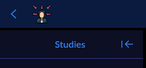

# Viewer: Theming

`OHIF-v3` has introduced the
[`LayoutTemplateModule`](./extensions/modules/layout-template.md) which enables
addition of custom layouts. You can easily design your custom components inside
an extension and consume it via the layoutTemplate module you write.

## Tailwind CSS

[Tailwind CSS](https://tailwindcss.com/) is a utility-first CSS framework for
creating custom user interfaces.

Below you can see a compiled version of the tailwind configs. Each section can
be edited accordingly. For instance screen size break points, primary and
secondary colors, etc.

```js
module.exports = {
  prefix: '',
  important: false,
  separator: ':',
  theme: {
    screens: {
      sm: '640px',
      md: '768px',
      lg: '1024px',
      xl: '1280px',
    },
    colors: {
      overlay: 'rgba(0, 0, 0, 0.8)',
      transparent: 'transparent',
      black: '#000',
      white: '#fff',
      initial: 'initial',
      inherit: 'inherit',

      indigo: {
        dark: '#1f1f1f',
      },
      aqua: {
        pale: '#a3a3a3',
      },

      primary: {
        light: '#a3a3a3',
        main: '#5e5e5e',
        dark: '#1e1e1e',
        active: '#606060',
      },

      secondary: {
        light: '#707070',
        main: '#504f4f',
        dark: '#2a2a2a',
        active: '#2f2f2f',
      },

      common: {
        bright: '#e1e1e1',
        light: '#a19fad',
        main: '#fff',
        dark: '#727272',
        active: '#2e2e2e',
      },

      customgreen: {
        100: '#3F3F3F',
      },

      customblue: {
        100: '#8C8C8C',
        200: '#A0A0A0',
      },
    },
  },
};
```

You can also use the color variable like before. For instance:

```js
primary: {
  default: ‘var(--default-color)‘,
  light: ‘#A0A0A0’,
  main: ‘#606060’,
  dark: ‘#1E1E1E’,
  active: ‘#8C8C8C’,
}
```

## White Labeling

A white-label product is a product or service produced by one company (the
producer) that other companies (the marketers) rebrand to make it appear as if
they had made it -
[Wikipedia: White-Label Product](https://en.wikipedia.org/wiki/White-label_product)

Current white-labeling options are limited. We expose the ability to replace the
"Logo" section of the application with a custom "Logo" component. You can do
this by adding a whiteLabeling key to your configuration file.

```js
window.config = {
  /** .. **/
  whiteLabeling: {
    createLogoComponentFn: function(React) {
      return React.createElement(
        'a',
        {
          target: '_blank',
          rel: 'noopener noreferrer',
          className: 'text-white underline',
          href: 'http://radicalimaging.com',
        },
        React.createElement('h5', {}, 'RADICAL IMAGING')
      );
    },
  },
  /** .. **/
};
```

> You can simply use the stylings from tailwind CSS in the whiteLabeling

In addition to text, you can also add your custom logo

```js
window.config = {
  /** .. **/
  whiteLabeling: {
    createLogoComponentFn: function(React) {
      return React.createElement(
        'a',
        {
          target: '_self',
          rel: 'noopener noreferrer',
          className: 'text-purple-600 line-through',
          href: '/',
        },
        React.createElement('img', {
          src: './customLogo.svg',
          // className: 'w-8 h-8',
        })
      );
    },
  },
  /** .. **/
};
```

The output will look like



<!--
  Links
  -->

<!-- prettier-ignore-start -->
[wikipedia]: https://en.wikipedia.org/wiki/White-label_product
<!-- prettier-ignore-end -->
