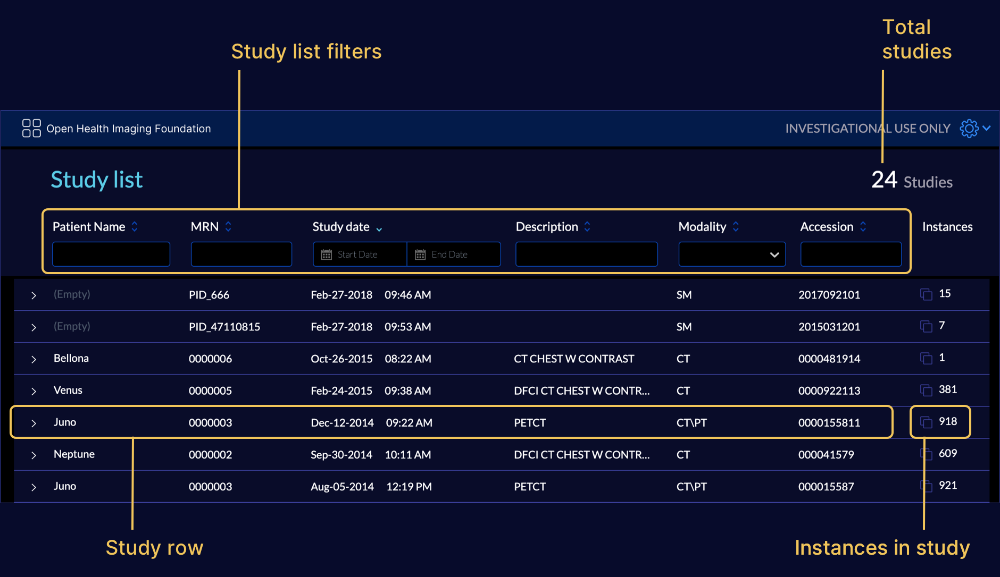
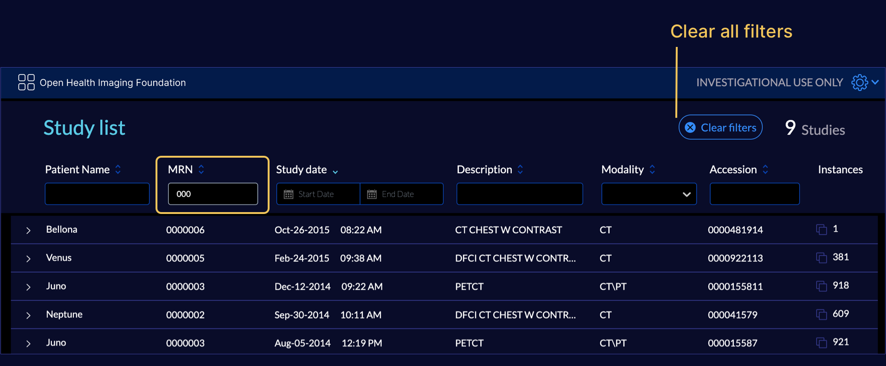
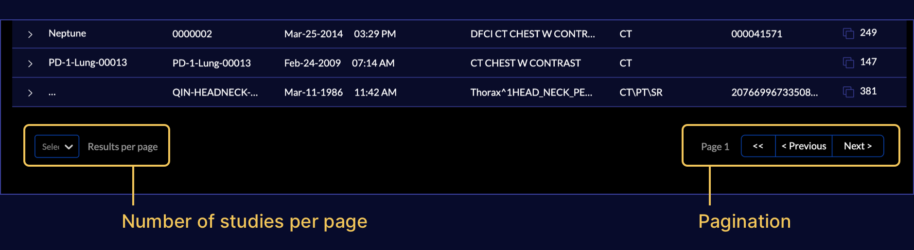
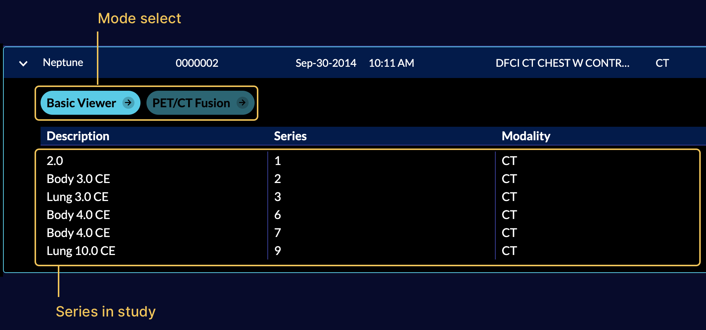
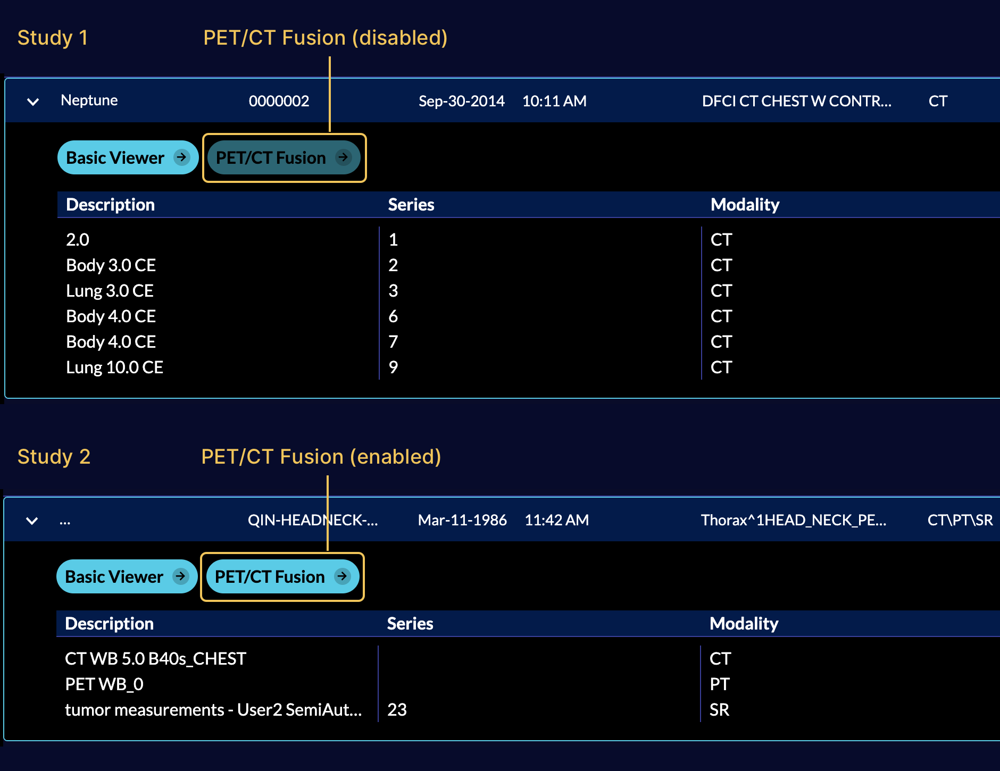
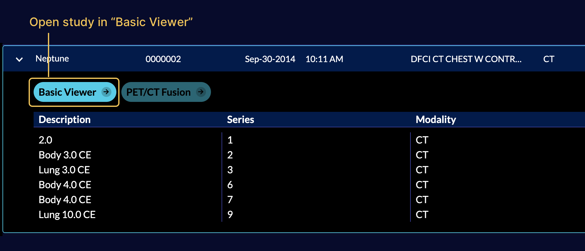

# Study List

## Overview

The first page you will see when the viewer is loaded is the `Study List`. In
this page you can explore all the studies that are stored on the configured
server for the `OHIF Viewer`.

## Sorting

When the Study List is opened, the application queries the PACS for 101 studies
by default. If there are greater than 100 studies returned, the default sort for
the study list is dictated by the image archive that hosts these studies for the
viewer and study list sorting will be disabled. If there are less than or equal
to 100 studies returned, they will be sorted by study date (most recent to
oldest) and study list sorting will be enabled. Whenever a query returns greater
than 100 studies, use filters to narrow results below 100 studies to enable
Study List sorting.

## Filters

There are certain filters that can be used to limit the study list to the
desired criteria.

- Patient Name: Searches between patients names
- MRN: Searches between patients Medical Record Number
- Study Date: Filters the date of the acquisition
- Description: Searches between study descriptions
- Modality: Filters the modalities
- Accession: Searches between patients accession number

An example of using study list filter is shown below:

Below the study list are pagination options for 25, 50, or 100 studies per page.

## Study Summary

Click on a study to expand the study summary panel.

A summary of series available in the study is shown, which contains the series
description, series number, modality of the series, instances in the series, and
buttons to launch viewer modes to display the study.

## Study Specific Modes

All available modes are seen in the study expanded view. Modes can be enabled or
disabled for a study based on the modalities contained within the study.

In the screenshot below, there are two modes shown for the selected study

- Basic Viewer: Default mode that enables rendering and measurement tracking

- PET/CT Fusion: Mode for visualizing the PET CT study in a 3x3 format.

Based on the mode configurations (e.g., available modalities), PET/CT mode is
disabled for studies that do not contain PET AND CT images.

<!-- This should be a screenshot that show an expanded study with multiple modalities (CT, MRI) but not PET. -->

The previous screenshot shows a study containing PET and CT images and both
Basic Viewer and PET/CT Mode are available.

## View Study

The `Basic Viewer` mode is available for all studies by default. Click on the
mode button to launch the viewer.

