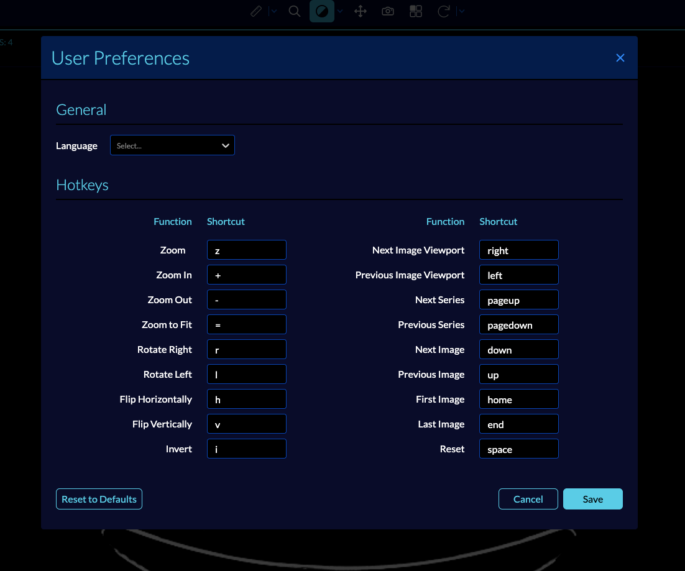

# Hotkeys

To open the hotkey assignment panel, you can click on the Preferences gear on the
top right side of the viewer.

Below, you can see the default hotkeys key bindings:

Hotkeys can be assigned to custom bindings that persist for the duration of the browser session.
